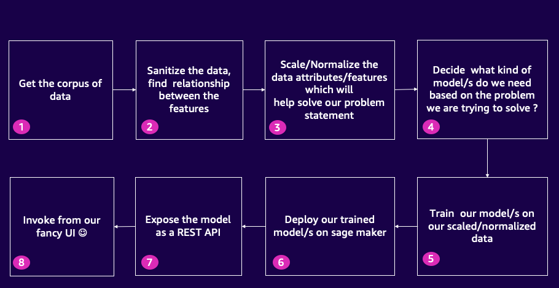

There's a point in every developer's journey when they realize that building machine learning models in isolation isn't enough. They need to integrate those models into their full-stack applications to create real-world value. But when it comes to recommendation engines, that can be easier said than done. The process can be daunting, especially if you're trying to build a streaming platform from scratch. For instance, imagine building a streaming platform lets call it “MyFLix” that provides personalized content recommendations to its users.You need to complete the project quickly, but you don't know where to start.This tutorial will help solve the challenge that developers face when it comes to building recommendation engines and integrating them into their full stack applications. In this tutorial, **you will learn**:

- How to get started with using jupyter notebooks and python code to sanitize your raw data and perform data visualizations 
- How to find relationships between various features in your data set and convert the relevant features into numerical features
- How to scale the numerical features in your raw data to bring all the features on the same scale for comparison purposes
- How to build, train and deploy your custom and native machine learning models on sagemaker.
- How to expose the deployed models as a REST API using AWS Lambda and AWS API Gateway using Open Source Chalice framework (https://github.com/aws/chalice)
- How to integrate the REST API's with a fronting User Interface (In our case this UI will represent our custom streaming platform clone called Myflix but you can use the skills you learn in this tutorial for building your own full stack applications with ML Models)


| Attributes             |                                                                 |
|------------------------|-----------------------------------------------------------------|
| ✅ AWS experience      | 200 - Intermediate                                                        |
| ⏱ Time to complete    | 60 minutes                                                      |
| 💰 Cost to complete    | Free tier eligible                                               |
| 🧩 Prerequisites       | - [AWS Account](https://aws.amazon.com/resources/create-account/?sc_channel=el&sc_campaign=devopswave&sc_content=obsvbltjv&sc_geo=mult&sc_country=mult&sc_outcome=acq)|
| 

| ToC |
|-----|

## Introduction

In this tutorial we will be building a recommendation engine for a streaming platform clone called Myflix. Initially we will go through the process of analyzing, cleaning, and selecting features from our raw movie data, setting the foundation for a robust recommendation engine for our streaming platform clone. Next we will build a custom scaling model to ensure accurate comparisons of our wrangled movie data features. Then we will utilize these scaled values to train and construct our k means clustering algorithm for movie recommendations. Additionally, we will learn how to deploy our models on SageMaker to achieve maximum efficiency. Finally we will build fronting API’s for  our ML models for real time predictions. We will learn how to use the open-source Chalice framework (https://github.com/aws/chalice) as a one click build and deploy tool for building our API’s. Chalice will even expose the API as a lambda and create the API gateway endpoint out of the box with exceptional ease! By the end through this tutorial we would have learnt how to bridge the gap between our ML models and Front end. The skills learnt through this tutorial can be used in to integrate your own full stack applications with API's and ML Models.

### Diagrammatic flow of our entire process



## Getting started with the existing code

1. We will use AWS CLI and Cloudformation nested stacks to build the infrastructure resources needed for this tutorial. We can create these resources by downloading the [Cloudformation Templates from this folder](https://github.com/pkamra/recommendation-engine-full-stackapp/tree/main/infrastructure). Here is how I execute the AWS CLI Commands to deploy the Cloudformation Nested stacks. This is how my directory structure looks like after I download the Cloudformation templates:-
```bash
-rw-r--r--     1 XXXXX  XXXX   6582 Jul  5 22:07 customresource-stack.yaml
-rw-r--r--     1 XXXXX  XXXX    269 Jul  7 21:23 glue-stack.yaml
-rw-r--r--     1 XXXXX  XXXX   3091 Jul  4 02:24 instance-stack.yaml
-rw-r--r--     1 XXXXX  XXXX   2550 Jul  7 13:11 main-stack.yaml
-rw-r--r--     1 XXXXX  XXXX   2942 Jul  7 14:09 packaged.yaml
-rw-r--r--     1 XXXXX  XXXX   6438 Jul  5 12:43 sagemaker-stack-working.yaml
-rw-r--r--     1 XXXXX  XXXX   2141 Jul  5 14:45 sagemaker-stack.yaml
-rw-r--r--     1 XXXXX  XXXX   6877 Jul  7 00:57 vpc-stack.yaml
```
2.The below command is used to package the CloudFormation template in "main-stack.yaml" and output the packaged template as "packaged.yaml" to an S3 bucket named "placeholder-cloudformation-s3-bucket" in the "us-east-2" region. Create your own S3 bucket in your account and use it in the command below  
``` bash
aws cloudformation package --template-file main-stack.yaml --output-template packaged.yaml --s3-bucket placeholder-cloudformation-s3-bucket --region us-east-2
```
3. Next use execute the "aws cloudformation deploy" command to deploy the above generated CloudFormation template named package.yaml. To override the default values for the parameters provided in the main-stack.yaml for S3BucketName, SageMakerDomainName, GitHubRepo, VpcStackName, and VpcRegion you can include the --parameter-overrides option followed by the parameter key-value pairs. Here's an example of how it can be done:
```bash
aws cloudformation deploy \
  --template-file <Absolute path>/packaged.yaml \
  --stack-name buildonaws-pk1 \
  --capabilities CAPABILITY_NAMED_IAM \
  --region us-east-2 \
  --parameter-overrides S3BucketName=myfamousbucket \ 
  SageMakerDomainName=mydomain \ 
  GitHubRepo=myrepo \
  VpcStackName=myvpc \
  VpcRegion=us-east-2
```
  Replace the values (myfamousbucket, mydomain, myrepo, myvpc, us-east-2) with your desired default parameter values.

2. Next Login to the AWS console in which the tutorial setup will be done and validate that everything has been created properly. Look at all the Infrastructure resources that have been created for our tutorial. Go to the S3 bucket that has been created as part of this.
3. Take a quick look at the folder structure inside the S3 bucket. Here is how the folder structure should look like :-

4. Now we will click on the Sagamker IDE url and open Sagemker studio where we will analyze our raw movie data , perform visualizations and come up with the right set of features for our movie data set.
5. Once the Sagemaker Studio opens, 
    - Go to File -> New Terminal
    - Execute the following on the terminal to download the python notebook from the S3 bucket. Replace the S3 bucket name with the S3 bucklet name from the Cloudformation Output.
```bash
aws s3 cp s3://awesome2023-xxxxx/python_notebook/AWSWomenInEngineering2023_V3.ipynb .
```
6. Double clicking the Jupyter Notebook will start the kernel. This process takes about 5 mins. The Jupyter notebook has a table of centents at the beginning of the notebook and every cell has detailed explanation of the steps being executed but I will call out some of the important cells of the notebook over here which will help provide an overview of the setup in the Jupyter Notebook. 
    - We start our data preparation process by downloading our data set from S3 and build a pandas data frame to start analyzing the data in cell#5. This is how the initial data structure in the pandas dataframe looks :-
   
    - In order to find the distribution of the releaseYears for movie we draw a box plot in Cell#10 and to find the Interquartile ranges of the release years we draw a box plot in Cell#11. the Interquartile ranges (IQR) are a statistical measure used in data preparation and analysis to understand the spread and distribution of data. They help identify and analyze the variability within a dataset. The IQR can be used to identify outliers in a dataset. Outliers are data points that fall significantly outside the range of most other data points. By calculating the IQR and applying a threshold, you can identify observations that are potential outliers. On execition of Cell #11 , here is how you can visualize the IQR and the outliers which are then filtered out in the subsequent cells. :-    
   
    - Next in Cell #14 we look at Binning Visualization Technique. By applying binning and creating specific bins or categories for different runtime ranges, we are able to identify movies with runtimes of more than 3 hours as outliers. These movies fall outside the majority of the dataset and represent extreme values. After identifying the outliers, we make the decision to remove movies with runtimes exceeding 3 hours from the dataset. By doing so, we eliminate the influence of these extreme values on the analysis and create a more representative dataset with a narrower range of runtimes. After removing the outliers, we observe a more symmetrical and bell curve-shaped distribution of movie runtimes.

5. Deploy K Means Algorithm on Sagemaker for Real time inferencing
5. Now open Cloud 9 to deploy the Custom scaling model
6. Open Cloud 9. Cloud 9 is a browser based Integrated Development environment on AWS which makes Code devlopment super easy.Once you are logged into the AWS Cloud 9 Environment, open a new terminal and execute the following command to clone the repository using the main branch
```bash
git clone https://github.com/build-on-aws/recommendation-engine-full-stack 
sudo yum install git-lfs
cd recommendation-engine-full-stack
git lfs fetch origin main
git lfs pull origin
```
7. Open AWS Console and check the 2 API's that have been deployed in Sagemaker.
8. Use Cloud 9 to build the REST API's using Chalice 
9. Integrate the Local UI with the REST API's.
10. Following command to delete the stack. 

🎥 Here is a video containing a hands-on implementation about this section.


