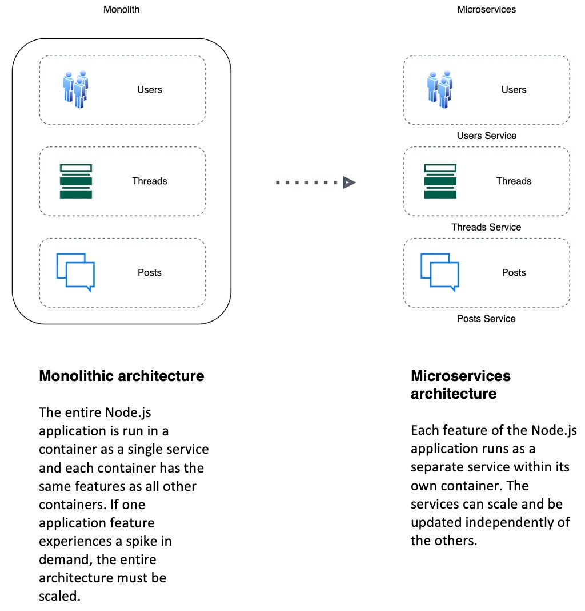
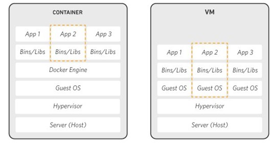
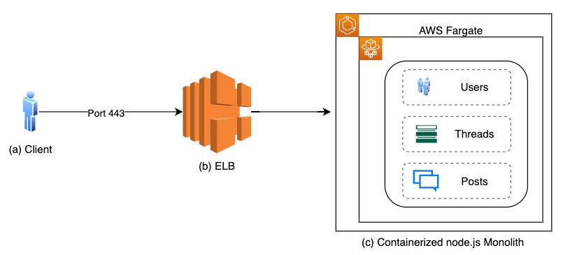
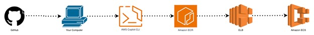
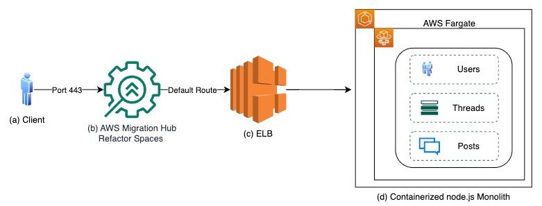
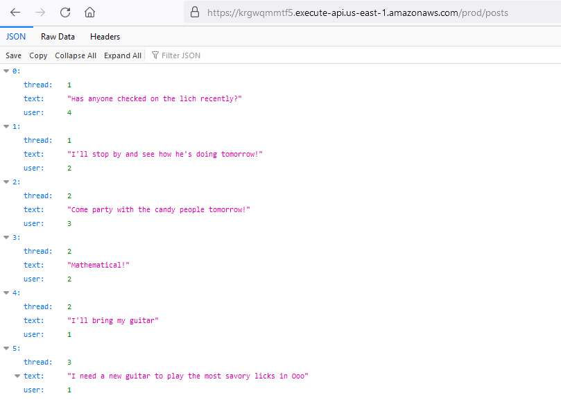
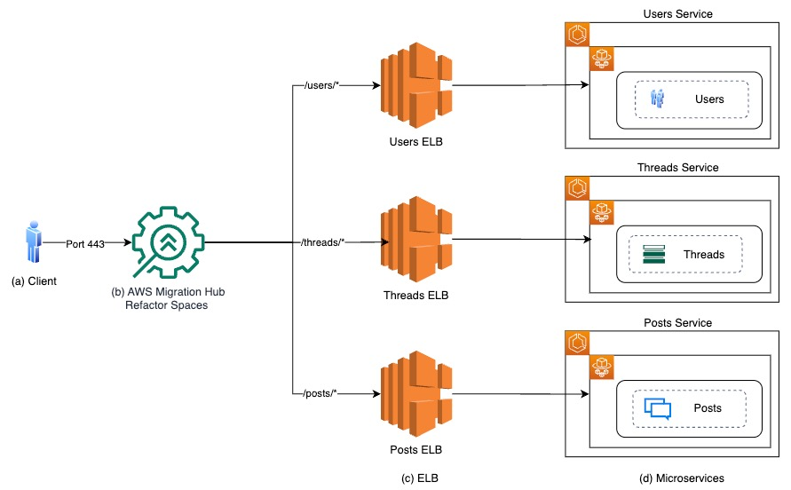
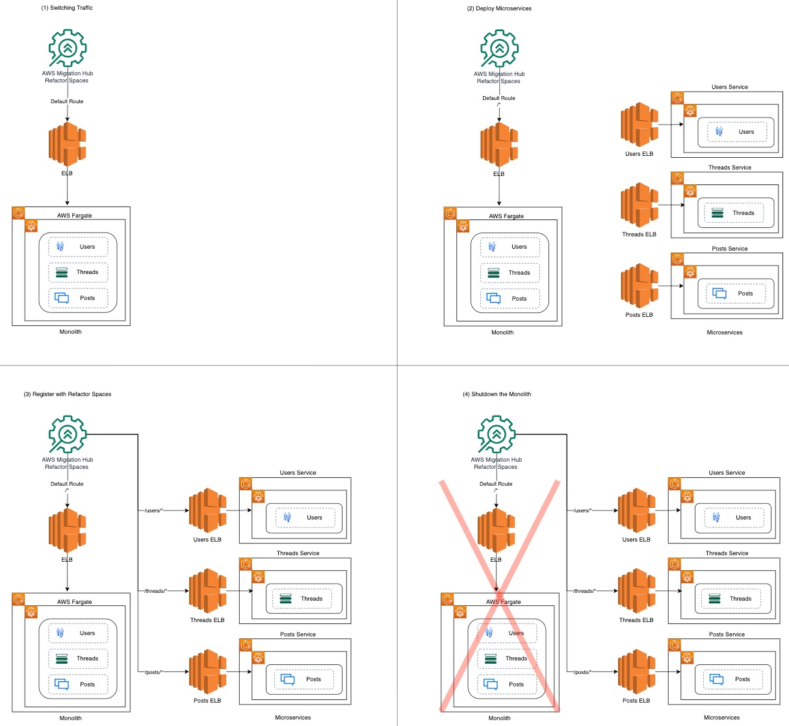
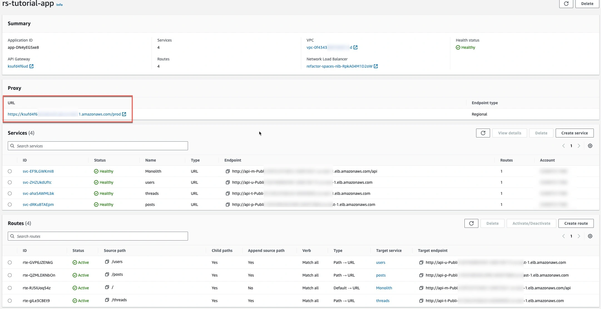

| ToC |
|-----|

## Introduction

Traditional monolithic architectures are challenging to scale. As an application's code base grows, it can become complex to update and maintain. Introducing new features, languages, frameworks, and technologies can become challenging to manage. This in turn limits innovation and new ideas. You can use [AWS Migration Hub Refactor Spaces](https://docs.aws.amazon.com/migrationhub-refactor-spaces/latest/userguide/what-is-mhub-refactor-spaces.html?sc_channel=el&sc_campaign=appswave&sc_content=refactor-spaces-copilot-cli&sc_geo=mult&sc_country=mult&sc_outcome=acq) to provision a refactor environment to automate the AWS infrastructure needed. There are several approaches to decompose the monolithic application into microservices. You could consider the `strangler fig` pattern, `leave and layer` pattern, or refactor using a `multi-account strategy`. Each of these approaches helps your business to improve the application efficacy by reducing the change risk for the application consumers.

Within a microservices architecture, each application component runs as its own service and communicates with other services via a well-defined API. Microservices are built around business capabilities, and each service performs a single function. Programmers are able to use Polyglot or multi-language microservices, which can be written using different frameworks and programming languages. You can then deploy them independently, as a single service, or as a group of services.

In this tutorial I will walk you through the process of decomposing a monolith to microservices leveraging the [strangler fig pattern](https://docs.aws.amazon.com/prescriptive-guidance/latest/modernization-aspnet-web-services/fig-pattern.html?sc_channel=el&sc_campaign=appswave&sc_content=refactor-spaces-copilot-cli&sc_geo=mult&sc_country=mult&sc_outcome=acq) using Refactor Spaces and AWS Copilot. These AWS offerings will do a lot of undifferentiated heavy lifting while allowing you to focus on what matters: innovation.

### What You Will Accomplish

You will start by deploying a monolithic Node.js application to a Docker container, then decompose the application to microservices. You will use Refactor Spaces to provision a refactor environment to incrementally refactor to microservices. Refactor Spaces will do this by shielding application consumers from the infrastructure changes as you decompose the application. In this example, the Node.js application hosts a message board with threads and messages between users. After you are done, you can use this tutorial as a reference to build and deploy your own containerized microservices on AWS.



| Attributes                |                                   |
| ------------------- | -------------------------------------- |
| ✅ AWS Level        | Intermediate - 200                         |
| ⏱ Time to complete  | 140 minutes                             |
| 🧩 Prerequisites    | - An AWS account: If you don't already have an account, follow the [Setting Up Your AWS Environment](https://aws.amazon.com/getting-started/guides/setup-environment/?sc_channel=el&sc_campaign=appswave&sc_content=refactor-spaces-copilot-cli&sc_geo=mult&sc_country=mult&sc_outcome=acq) tutorial for a quick overview. <br> - [Install](https://docs.aws.amazon.com/cli/latest/userguide/getting-started-install.html?sc_channel=el&sc_campaign=appswave&sc_content=refactor-spaces-copilot-cli&sc_geo=mult&sc_country=mult&sc_outcome=acq) and configure the AWS CLI. <br> - [Install](https://docs.aws.amazon.com/AmazonECS/latest/developerguide/AWS_Copilot.html#copilot-install?sc_channel=el&sc_campaign=appswave&sc_content=refactor-spaces-copilot-cli&sc_geo=mult&sc_country=mult&sc_outcome=acq) and configure AWS Copilot. <br>  - [Install](https://docs.docker.com/get-docker/) and configure Docker.<br> - A text editor. For this tutorial, we will use [VS Code](https://code.visualstudio.com/download), but you  can use your preferred IDE. |
| 💻 Code Sample         | - Code sample for application on [GitHub](https://github.com/awslabs/amazon-ecs-nodejs-microservices) <br> - AWS CloudFormation scripts for Refactor Services on [AWS Samples](https://github.com/aws-samples/aws-migration-hub-refactor-spaces-samples/tree/main/rs-tutorial/rs-copilot-tutorial)                             |
| 📢 Feedback            | <a href="https://pulse.buildon.aws/survey/DEM0H5VW" target="_blank">Any feedback, issues, or just a</a> 👍 / 👎 ?    |
| ⏰ Last Updated     | 2023-11-16                             |

### Prerequisites

- **An AWS account:** If you don't already have an account, follow the [Setting Up Your AWS Environment](https://aws.amazon.com/getting-started/guides/setup-environment/?sc_channel=el&sc_campaign=appswave&sc_content=refactor-spaces-copilot-cli&sc_geo=mult&sc_country=mult&sc_outcome=acq) tutorial for a quick overview.

- [Install](https://docs.aws.amazon.com/cli/latest/userguide/getting-started-install.html?sc_channel=el&sc_campaign=appswave&sc_content=refactor-spaces-copilot-cli&sc_geo=mult&sc_country=mult&sc_outcome=acq) and configure the AWS CLI.

- [Install](https://docs.aws.amazon.com/AmazonECS/latest/developerguide/AWS_Copilot.html#copilot-install?sc_channel=el&sc_campaign=appswave&sc_content=refactor-spaces-copilot-cli&sc_geo=mult&sc_country=mult&sc_outcome=acq) and configure AWS Copilot.

- [Install](https://docs.docker.com/get-docker/) and configure Docker.

- A text editor. For this tutorial, we will use VS Code, but you can use your preferred IDE.

- Check that sufficient quota is available for all required services. For example, this tutorial uses five Virtual Private Clouds (VPCs) and there is a default quota of five VPCs per Region.

### Modules

This tutorial is divided into the following modules. Complete each module before moving to the next one.

1. **Setup** (20 minutes): In this module, you will install and configure the AWS CLI, install AWS Copilot, and install Docker.

2. **Containerize and deploy the monolith** (30 minutes): In this module, you will containerize the application. You will instantiate a managed cluster of Fargate on Amazon ECS compute instances using AWS Copilot. You will also deploy your image as a container running on the cluster.

3. **Deploy the refactor environment** (20 minutes): In this module, you will deploy a Refactor Spaces environment. This will set up the infrastructure to incrementally refactor your application. You will then register the monolith from the previous step as a default route in Refactor Spaces.

4. **Break the monolith** (20 minutes): In this module, you will break the Node.js application into several interconnected services. Then you will push each service's image to an Amazon Elastic Container Registry (Amazon ECR) repository.

5. **Deploy microservices** (30 minutes): In this module, you will deploy your Node.js application as a set of interconnected services behind an Application Load Balancer. Then, you will use Refactor Spaces to re-route traffic from the monolith to the microservices.

6. **Clean up** (10 minutes): In this module, you will terminate the resources you created during the tutorial. You will stop the services running on Amazon ECS, delete the Application Load Balancer, and delete the AWS CloudFormation stack to terminate all underlying resources.

## Module One: Setup

### Overview Module One

In this module, you will use the AWS command line to install the tools required to complete and configure your environment for the tutorial.

**Module Details**
- ⏱ Time to complete: 20 minutes

### Implementation Module One

For this tutorial, you will build the Docker container image for your monolithic Node.js application and push it to Amazon Elastic Container Registry (Amazon ECR).

#### **Step 1:** Install Software

In the next few steps, you are going to be using Docker, GitHub, Amazon ECS, and Amazon ECR to deploy code into containers. To complete these steps, you will need the following tools.

1. **An AWS account:** If you don't have an account with AWS, [sign up here](https://portal.aws.amazon.com/gp/aws/developer/registration/index.html?sc_channel=el&sc_campaign=appswave&sc_content=refactor-spaces-copilot-cli&sc_geo=mult&sc_country=mult&sc_outcome=acq). All the exercises in this tutorial are designed to be covered under the [AWS Free Tier](https://aws.amazon.com/free/?sc_channel=el&sc_campaign=appswave&sc_content=refactor-spaces-copilot-cli&sc_geo=mult&sc_country=mult&sc_outcome=acq). **Note:** Some of the services you will be using may require your account to be active for more than 12 hours. If you have a newly created account and encounter difficulty provisioning any services, wait a few hours and try again.

2. **Docker:** You will use Docker to build the image files that will run as containers. Docker is an open-source project. You can download it for [macOS](https://docs.docker.com/docker-for-mac/install/) or for [Windows](https://docs.docker.com/docker-for-windows/install/). After Docker is installed, verify it is running by entering *Docker --version* in the terminal. The version number should display, for example: *Docker version 19.03.5, build 633a0ea.*

3. **AWS CLI:**
    - You will use the AWS Command Line Interface (AWS CLI) to push the images to Amazon ECR. To learn about and download the AWS CLI, see [Getting started with the AWS CLI.](https://docs.aws.amazon.com/cli/latest/userguide/cli-chap-getting-started.html?sc_channel=el&sc_campaign=appswave&sc_content=refactor-spaces-copilot-cli&sc_geo=mult&sc_country=mult&sc_outcome=acq)
    - After AWS CLI is installed, verify it is running by entering *aws --version* in the terminal. The version number should display, for example: `aws-cli/1.16.217 Python/2.7.16 Darwin/18.7.0 botocore/1.12.207`.
    - If you already have AWS CLI installed, run the following command in the terminal to validate you are using the latest version: `pip install awscli --upgrade --user`.
    - If you have not used AWS CLI before, you can [configure your credentials](https://docs.aws.amazon.com/cli/latest/userguide/cli-chap-configure.html?sc_channel=el&sc_campaign=appswave&sc_content=refactor-spaces-copilot-cli&sc_geo=mult&sc_country=mult&sc_outcome=acq).
4. **AWS Copilot:** AWS Copilot is an open-source command line interface that helps developers to build, release, and operate production-ready containerized applications. This can be done on AWS App Runner, Amazon ECS, and AWS Fargate. On macOS, you can use brew to install AWS Copilot.

```bash
brew install aws/tap/copilot-cli
```

For other platforms, use [curl](https://curl.se/) or [PowerShell](https://learn.microsoft.com/en-us/powershell/) to download the release.

* macOS
    ```bash
    curl -Lo copilot https://github.com/aws/copilot-cli/releases/latest/download/copilot-darwin && chmod +x copilot && sudo mv copilot /usr/local/bin/copilot && copilot --help
    ```
* Linux x86 (64-bit)
    ```bash
    curl -Lo copilot https://github.com/aws/copilot-cli/releases/latest/download/copilot-linux && chmod +x copilot && sudo mv copilot /usr/local/bin/copilot && copilot --help
    ```
* Linux (ARM)
    ```bash
    curl -Lo copilot https://github.com/aws/copilot-cli/releases/latest/download/copilot-linux-arm64 && chmod +x copilot && sudo mv copilot /usr/local/bin/copilot
    ```
* Windows
    ```powershell
    Invoke-WebRequest -OutFile  'C:\\Program Files\\copilot.exe' https://github.com/aws/copilot-cli/releases/latest/download/copilot-windows.exe
    ```

#### **Step 2:** Download and Open the Project

**Download the code from GitHub:** Navigate to [AWS Labs](https://github.com/awslabs/amazon-ecs-nodejs-microservices) and select **Clone** or **Download** to download the GitHub repository to your local environment. You can also use [GitHub Desktop](https://desktop.github.com/) or [Git](https://git-scm.com/) to clone the repository.

## Module Two: Containerize and Deploy the Monolith

### Overview Module Two

Containers are lightweight packages of your application's code, configurations, and dependencies. Containers deliver environmental consistency, operational efficiency, developer productivity, and version control. Containers can help applications deploy quickly, reliably, and consistently, regardless of deployment environment.



### Why Use Containers?

Launching a container with a new release of code can be done without significant deployment overhead. Code built in a container on a developer's local machine can be moved to a test instance by moving the container without requiring recompiling. This increases the operational development speed. At build time, this container can be linked to other containers required to run the application stack.

#### Dependency Control and Improved Pipeline

A Docker container image is a point-in-time capture of an application's code and dependencies. This helps an engineering organization create standard pipelines for the application lifecycle. For example:

- Developers build and run the container locally.

- Continuous integration server runs the same container and runs integration tests to make sure it passes expectations.

- The same container is shipped to a staging environment where its runtime behavior can be checked using load tests or manual QA.

- The same container is shipped to production.

Building, testing, moving, and running the exact same container through all stages of the integration and deployment pipeline can increase quality and reliability.

#### Density and Resource Efficiency

Containers facilitate enhanced resource efficiency by having multiple heterogeneous processes run on a single system. Resource efficiency is a natural result of the isolation and allocation techniques used by containers. Containers can be restricted to consume certain amounts of a host's CPU and memory. Understanding what resources a container needs, and what resources are available from the underlying host server, will help you address right-sizing your instances. This is done by either smaller hosts, by increasing the density of processes running on a single host, or by optimizing resource consumption and availability.

#### Flexibility

The flexibility of Docker containers is based on their portability, ease of deployment, and small size. This is different from the installation and configuration required on a VM. For instance, packaging services inside of containers helps moving them between hosts. This in turn isolates them from failure of adjacent services and protects them from errant patches or software upgrades to the host system.

### Application Overview



1. **Client** The client makes a request over port 443 to the refactor proxy URL.

2. **Elastic Load Balancer (ELB)** AWS Copilot creates an ELB and registers the monolith to the target group.

3. **Containerized Node.js Monolith** The Node.js cluster parent is responsible for distributing traffic to the workers within the monolithic application. This architecture is containerized, but still monolithic because each container has all the same features of the rest of the containers.

### What is Amazon ECS?

Amazon Elastic Container Service (Amazon ECS) is a fully managed container orchestration service that simplifies your deployment, management, and scaling of containerized applications. Amazon ECS will launch, monitor, and scale your application across flexible compute options with automatic integrations to other supporting AWS offerings that your application needs. Amazon ECS supports Docker containers. With API calls, you can launch and stop Docker-enabled applications, query the complete state of your cluster, and access many familiar features. These include security groups, Elastic Load Balancing, EBS volumes, and AWS Identity and Access Management (IAM) roles.

You can use Amazon ECS to schedule the placement of containers across your cluster based on your resource needs and availability requirements. You can also integrate your own scheduler or third-party schedulers to meet business or application-specific requirements.

There is no additional charge for Amazon ECS. You pay for the AWS resources (for example, EC2 instances or EBS volumes) you create to store and run your application.

### What You Will Accomplish in Module Two

In this module, you instantiate a managed cluster of EC2 compute instances using Amazon ECS. You then deploy your image as a container running on the cluster.



**Module Details**

- ⏱ Time to complete: 30 minutes

**Services used**

- [AWS Copilot](https://aws.amazon.com/containers/copilot/?sc_channel=el&sc_campaign=appswave&sc_content=refactor-spaces-copilot-cli&sc_geo=mult&sc_country=mult&sc_outcome=acq)
- [Amazon Elastic Container Service](https://aws.amazon.com/ecs/?sc_channel=el&sc_campaign=appswave&sc_content=refactor-spaces-copilot-cli&sc_geo=mult&sc_country=mult&sc_outcome=acq)
- [Amazon Elastic Container Registry](https://aws.amazon.com/ecr/?sc_channel=el&sc_campaign=appswave&sc_content=refactor-spaces-copilot-cli&sc_geo=mult&sc_country=mult&sc_outcome=acq)
- [Amazon Elastic Load Balancer](https://aws.amazon.com/elasticloadbalancing/?sc_channel=el&sc_campaign=appswave&sc_content=refactor-spaces-copilot-cli&sc_geo=mult&sc_country=mult&sc_outcome=acq)
- [Amazon Internet Gateway](https://docs.aws.amazon.com/vpc/latest/userguide/VPC_Internet_Gateway.html?sc_channel=el&sc_campaign=appswave&sc_content=refactor-spaces-copilot-cli&sc_geo=mult&sc_country=mult&sc_outcome=acq)

### Implementation Module Two

Follow these step-by-step instructions to deploy the Node.js application using AWS Copilot.

#### **Step 1:** Create an AWS Copilot Application

An AWS Copilot Application is a group of services and environments. Think of it as a label for what you are building. In this example, it's an API built as a monolithic Node.js application. In this step, you will create a new empty application. In the terminal or command prompt, enter the following and name the Application api.

```bash
cd ./amazon-ecs-nodejs-microservices/
copilot app init
```

An AWS Copilot Application creates an empty application that consists of roles to administrate StackSets, Amazon ECR repositories, KMS keys, and S3 buckets. It also creates a local directory in your repository to hold configuration files for your application and services. The output should looks something like this after it finishes:

```bash
Application name: monolith
✔ Proposing infrastructure changes for stack monolith-infrastructure-roles
- Creating the infrastructure for stack monolith-infrastructure-roles                           [create complete]  [46.2s]
  - A StackSet admin role assumed by CloudFormation to manage regional stacks                   [create complete]  [18.9s]
  - An IAM role assumed by the admin role to create ECR repositories, KMS keys, and S3 buckets  [create complete]  [20.5s]
✔ The directory copilot will hold service manifests for application monolith.
```

#### **Step 2**: Create the Environment

Copilot Environments are infrastructure where applications run. AWS Copilot provisions a secure VPC, an Amazon ECS cluster, a Load Balancer, and all the other resources required by the application. To use your AWS credentials, Enter `copilot env init` and choose `profile default`. Name the Environment `monolith`.

```bash
$ copilot env init
Environment name: monolith

Which credentials would you like **to** use **to** create api?  [Use
arrows **to** move, type **to** filter, ? **for** more help]
    Enter temporary credentials
  > [profile default]
```

Choose `Yes, use default`.

 ```bash
Environment name: monolith
Credential source: [profile default]

  Would you like to use the default configuration for a new environment?
    - A new VPC with 2 AZs, 2 public subnets and 2 private subnets 
    - A new ECS Cluster
    - New IAM Roles to manage services and jobs in your environment
  [Use arrows to move, type to filter]
  > Yes, use default.
    Yes, but I'd like configure the default resources (CIDR ranges, AZs).
    No, I'd like to import existing resources (VPC, subnets).
```

It will now start creating the infrastructure needed. AWS Copilot creates a `manifest.yml` that is used to configure the environment. Once the creation is done, you should see similar output to this:

```bash
Environment name: monolith
Credential source: [profile default]
Default environment configuration? Yes, use default.
✔ Wrote the manifest for environment api at copilot/environments/api/manifest.yml
- Update regional resources with stack set "api-infrastructure"  [succeeded]  [0.0s]
- Update regional resources with stack set "api-infrastructure"  [succeeded]        [130.8s]
  - Update resources in region "us-east-1"                       [create complete]  [130.4s]
    - ECR container image repository for "monolith"              [create complete]  [2.5s]
    - KMS key to encrypt pipeline artifacts between stages       [create complete]  [124.5s]
    - S3 Bucket to store local artifacts                         [create complete]  [2.4s]
✔ Proposing infrastructure changes for the api-api environment.
- Creating the infrastructure for the api-api environment.  [create complete]  [56.0s]
  - An IAM Role for AWS CloudFormation to manage resources  [create complete]  [22.4s]
  - An IAM Role to describe resources in your environment   [create complete]  [25.0s]
✔ Provisioned bootstrap resources for environment api in region us-east-1 under application api.
```

#### **Step 3**: Deploy the Environment

The next step is to deploy the environment and provision the services for the application. To deploy, enter `copilot env deploy --name monolith` in the terminal.

```bash
$ copilot env deploy --name monolith

✔ Proposing infrastructure changes for the api-api environment.
- Creating the infrastructure for the api-api environment.                    [update complete]  [78.3s]
  - An ECS cluster to group your services                                     [create complete]  [7.5s]
  - A security group to allow your containers to talk to each other           [create complete]  [1.4s]
  - An Internet Gateway to connect to the public internet                     [create complete]  [16.0s]
  - Private subnet 1 for resources with no internet access                    [create complete]  [1.7s]
  - Private subnet 2 for resources with no internet access                    [create complete]  [1.7s]
  - A custom route table that directs network traffic for the public subnets  [create complete]  [10.9s]
  - Public subnet 1 for resources that can access the internet                [create complete]  [3.1s]
  - Public subnet 2 for resources that can access the internet                [create complete]  [6.0s]
  - A private DNS namespace for discovering services within the environment   [create complete]  [46.3s]
  - A Virtual Private Cloud to control networking of your AWS resources       [create complete]  [11.6s]
```

#### **Step 4**: Create the Monolith AWS Copilot Service

A Copilot [Service](https://aws.github.io/copilot-cli/docs/concepts/services/) runs containers. Internet-facing services can be a **Request-Driven Web Service** that uses [AWS App Runner](https://aws.amazon.com/apprunner/?sc_channel=el&sc_campaign=appswave&sc_content=refactor-spaces-copilot-cli&sc_geo=mult&sc_country=mult&sc_outcome=acq). They can run on [Amazon ECS](https://aws.amazon.com/ecs/?sc_channel=el&sc_campaign=appswave&sc_content=refactor-spaces-copilot-cli&sc_geo=mult&sc_country=mult&sc_outcome=acq) or [Fargate](https://aws.amazon.com/fargate/?sc_channel=el&sc_campaign=appswave&sc_content=refactor-spaces-copilot-cli&sc_geo=mult&sc_country=mult&sc_outcome=acq), with a **Load Balanced Web Service** that provisions an [Application or Network Load Balancer](https://aws.amazon.com/elasticloadbalancing/?sc_channel=el&sc_campaign=appswave&sc_content=refactor-spaces-copilot-cli&sc_geo=mult&sc_country=mult&sc_outcome=acq) with appropriate security groups.

Other Service types include a **Backend Service** that lets AWS services communicate within the application but not to the internet. A **Worker Service** is used for asynchronous service-to-service messaging with [Amazon Simple Queue Service (Amazon SQS)](https://docs.aws.amazon.com/AWSSimpleQueueService/latest/SQSDeveloperGuide/welcome.html?sc_channel=el&sc_campaign=appswave&sc_content=refactor-spaces-copilot-cli&sc_geo=mult&sc_country=mult&sc_outcome=acq).

This tutorial uses a **Load Balanced Web Service** for the Internet-facing monolith. To create the monolithic service, enter `copilot svc init` and choose `Load Balanced Web Service`.

```bash
$ copilot svc init

Note: It's recommended to run this command in the root of your Git repository.
Welcome to the Copilot CLI! We're going to walk you through some questions
to help you get set up with a containerized application on AWS. An application is a collection of
containerized services that operate together.


  Which workload type represents your architecture?  [Use arrows to move, type to filter, ? for more help]
    Request-Driven Web Service  (App Runner)
  > Load Balanced Web Service   (Internet to ECS on Fargate)
    Backend Service             (ECS on Fargate)
    Worker Service              (Events to SQS to ECS on Fargate)
    Scheduled Job               (Scheduled event to State Machine to Fargate)
```

Name the service `monolith`.

```bash
Workload type: Load Balanced Web Service

What do you want to name this service? [? for help] monolith

Choose Enter custom path for your Dockerfile.

Workload type: Load Balanced Web Service
Service name: monolith

  Which Dockerfile would you like to use for monolith?  [Use arrows to move, type to filter, ? for more help]
  > Enter custom path for your Dockerfile
```

Enter the path to `2-containerized/services/api/Dockerfile`

```bash
Service type: Load Balanced Web Service
Service name: monolith
Dockerfile: Enter custom path for your Dockerfile
Dockerfile: 2-containerized/services/api/Dockerfile

✔ Wrote the manifest for service monolith at copilot/monolith/manifest.yml
```

Change directory to `./amazon-ecs-nodejs-microservices/copilot/monolith` and examine `manifest.yml` to see how the service is configured. Note that the parameter `http` defines the path for the app. The Node.js application, `server.js`, defines the base route as `/` .

```bash
The manifest for the "monolith" service.
Read the full specification for the "Load Balanced Web Service" type at:
 https://aws.github.io/copilot-cli/docs/manifest/lb-web-service/
Your service name will be used in naming your resources like log groups, ECS services, etc.
name: monolith
type: Load Balanced Web Service

Distribute traffic to your service.
http:
  # Requests to this path will be forwarded to your service.
  # To match all requests you can use the "/" path.
  path: '/'
  # You can specify a custom health check path. The default is "/".
  # healthcheck: '/'
```

To deploy the monolith Service, enter `copilot svc deploy --name monolith` in the terminal. When you deploy the service, the container is built locally by Docker and pushed to your Elastic Container Registry. The service pulls the container from the registry and deploys it in the environment. The `monolith` application is running when the deployment is complete.

```bash
$ copilot svc deploy --name monolith
Only found one service, defaulting to: monolith
Only found one environment, defaulting to: monolith
Building your container image: docker build -t 837028011264.dkr.ecr.us-east-1.amazonaws.com/api/monolith --platform linux/x86_64 /Users/sparaaws/github/spara/amazon-ecs-nodejs-microservices/2-containerized/services/api -f /Users/sparaaws/github/spara/amazon-ecs-nodejs-microservices/2-containerized/services/api/Dockerfile
[+] Building 43.3s (10/10) FINISHED
=> [internal] load build definition from Dockerfile 0.0s
=> => transferring dockerfile: 36B 0.0s
=> [internal] load .dockerignore 0.0s
=> => transferring context: 2B 0.0s
=> [internal] load metadata for docker.io/mhart/alpine-node:7.10.1 5.6s
=> [auth] mhart/alpine-node:pull token for registry-1.docker.io 0.0s
=> [internal] load build context 0.0s
=> => transferring context: 392B 0.0s
=> [1/4] FROM docker.io/mhart/alpine-node:7.10.1@sha256:d334920c966d440676ce9d1e6162ab544349e4a4359c517300391c877bcffb8c 0.0s
=> => resolve docker.io/mhart/alpine-node:7.10.1@sha256:d334920c966d440676ce9d1e6162ab544349e4a4359c517300391c877bcffb8c 0.0s
=> CACHED [2/4] WORKDIR /srv 0.0s
=> [3/4] ADD . . 0.0s
=> [4/4] RUN npm install 37.1s
=> exporting to image 0.3s
=> => exporting layers 0.2s
=> => writing image sha256:26ea1872922a12bd3a297c2dd003d1fc71de93e0e5895d2264acca4db3963fbb 0.0s
=> => naming to 837028011264.dkr.ecr.us-east-1.amazonaws.com/api/monolith 0.0s

Use 'docker scan' to run Snyk tests against images to find vulnerabilities and learn how to fix them
Login Succeeded

Logging in with your password grants your terminal complete access to your account.
For better security, log in with a limited-privilege personal access token. Learn more at https://docs.docker.com/go/access-tokens/
Using default tag: latest
The push refers to repository [837028011264.dkr.ecr.us-east-1.amazonaws.com/api/monolith]
bc590299ddf7: Pushed
947736d9bac9: Pushed
5f70bf18a086: Pushed
3e893534526a: Pushed
040fd7841192: Pushed
latest: digest: sha256:721adc83096c12f21d61bb73d7ea6d296269cce607178676492aaa1f6cdad6bc size: 1365
```

#### **Step 5**: Confirm the Deployment

When deployment completes, AWS Copilot prints the URL to the service in the output.

```bash
✔ Proposing infrastructure changes for stack api-api-monolith
- Creating the infrastructure for stack api-api-monolith [create complete] [360.8s]
- Service discovery for your services to communicate within the VPC [create complete] [0.0s]
- Update your environment's shared resources [update complete] [149.9s]
- A security group for your load balancer allowing HTTP traffic [create complete] [5.9s]
- An Application Load Balancer to distribute public traffic to your services [create complete] [123.0s]
- A load balancer listener to route HTTP traffic [create in progress] [198.5s]
- An IAM role to update your environment stack [create complete] [23.5s]
- An IAM Role for the Fargate agent to make AWS API calls on your behalf [create complete] [19.9s]
- A HTTP listener rule for forwarding HTTP traffic [create complete] [3.5s]
- A custom resource assigning priority for HTTP listener rules [create complete] [5.1s]
- A CloudWatch log group to hold your service logs [create complete] [1.5s]
- An IAM Role to describe load balancer rules for assigning a priority [create complete] [23.5s]
- An ECS service to run and maintain your tasks in the environment cluster [create complete] [117.0s]
Deployments
Revision Rollout Desired Running Failed Pending
PRIMARY 1 [completed] 1 1 0 0
- A target group to connect the load balancer to your service [create complete] [15.0s]
- An ECS task definition to group your containers and run them on ECS [create complete] [0.0s]
- An IAM role to control permissions for the containers in your tasks [create complete] [23.5s]
✔ Deployed service monolith.
Recommended follow-up action:
- You can access your service at http://api-a-Publi-DU44D9VOSXLA-792918025.us-east-1.elb.amazonaws.com over the internet.
```

You can test the application deployment by entering queries in a browser, such as:

[http://<application-string>.us-east-1.elb.amazonaws.com/api/users/3](http://api-a-publi-du44d9vosxla-792918025.us-east-1.elb.amazonaws.com/api/users/3)

```json
{"id":3,"username":"pb","name":"Bonnibel Bubblegum","bio":"Scientist, bearer of candy power, ruler of the candy kingdom"}
```

[http://<application-string>.us-east-1.elb.amazonaws.com/api/threads/2](http://api-a-publi-du44d9vosxla-792918025.us-east-1.elb.amazonaws.com/api/threads/2)

```json
{"id":2,"title":"Party at the candy kingdom tomorrow","createdBy":3}
```

[http://<application-string>.us-east-1.elb.amazonaws.com/api/posts/](http://api-a-publi-du44d9vosxla-792918025.us-east-1.elb.amazonaws.com/api/posts/)

```json
[{"thread":1,"text":"Has anyone checked on the lich recently?","user":4},{"thread":1,"text":"I'll stop by and see how he's doing tomorrow!","user":2},{"thread":2,"text":"Come party with the candy people tomorrow!","user":3},{"thread":2,"text":"Mathematical!","user":2},{"thread":2,"text":"I'll bring my guitar","user":1},{"thread":3,"text":"I need a new guitar to play the most savory licks in Ooo","user":1}]
```

[http://<application-string>.us-east-1.elb.amazonaws.com/api/posts/in-thread/1](http://api-a-publi-du44d9vosxla-792918025.us-east-1.elb.amazonaws.com/api/posts/in-thread/1)

```json
[{"thread":1,"text":"Has anyone checked on the lich recently?","user":4},{"thread":1,"text":"I'll stop by and see how he's doing tomorrow!","user":2}]
```

## Module Three: Deploy the Refactor Environment

### Overview Module Three

A Refactor Spaces environment provides the infrastructure, multi-account networking, and routing needed to incrementally modernize applications. Refactor Spaces environments include an application proxy that models the Strangler Fig pattern. This helps you transparently add new services to an external HTTPS endpoint, and incrementally route traffic to the new services. Refactor Spaces optionally bridges networking across AWS accounts to allow legacy and new services communicate while maintaining the independence of separate AWS accounts.

### Why Refactor Spaces?

Migration Hub Refactor Spaces simplifies application refactoring by:

- Reducing the time to set up a refactor environment.

- Reducing the complexity for iteratively extracting capabilities as new microservices and re-routing traffic.

- Simplifying management of existing apps and microservices as a single application with flexible routing control, isolation, and centralized management.

- Helping dev teams achieve and accelerate tech and deployment independence by simplifying development, management, and operations while apps are changing.

- Simplifies refactoring to multiple AWS accounts. Refer to the following [architecture reference](https://aws.amazon.com/blogs/aws/new_deployment_pipelines_reference_architecture_and_-reference_implementations/?sc_channel=el&sc_campaign=appswave&sc_content=refactor-spaces-copilot-cli&sc_geo=mult&sc_country=mult&sc_outcome=acq) for additional details.

### What You Will Accomplish in Module Three

In this module, you will deploy a Refactor Spaces environment along with a Refactor Spaces application using AWS CloudFormation.



1. **Client** The client makes a request over port 443 to the refactor proxy URL.

2. **AWS Migration Hub Refactor Spaces** Refactor Spaces provides an application that models the Strangler Fig pattern for incremental refactoring.

3. **Elastic Load Balancer (ELB)** AWS Copilot creates an ELB and registers the monolith to the target group.

4. **Containerized Node.js Monolith** The Node.js cluster parent is responsible for distributing traffic to the workers within the monolithic application. This architecture is containerized, but still monolithic because each container has all the same features of the rest of the containers.

**Module Details**

- ⏱ Time to complete: 30 minutes

**Services used**

- [AWS Migration Hub Refactor Spaces](https://aws.amazon.com/migration-hub/features/#incremental-app-refactoring?sc_channel=el&sc_campaign=appswave&sc_content=refactor-spaces-copilot-cli&sc_geo=mult&sc_country=mult&sc_outcome=acq)
- [AWS CloudFormation](https://aws.amazon.com/cloudformation/?sc_channel=el&sc_campaign=appswave&sc_content=refactor-spaces-copilot-cli&sc_geo=mult&sc_country=mult&sc_outcome=acq)
- [AWS CLI](https://aws.amazon.com/cli/?sc_channel=el&sc_campaign=appswave&sc_content=refactor-spaces-copilot-cli&sc_geo=mult&sc_country=mult&sc_outcome=acq)

### Implementation Module Three

#### **Step 1**: Download Templates

Navigate to [AWS Samples](https://github.com/aws-samples/aws-migration-hub-refactor-spaces-samples/tree/main/rs-tutorial/rs-copilot-tutorial) and select **Clone** or **Download** to download the GitHub repository to your local environment. Copy the `rs.yaml` and `rs-service-op.yaml` files into the repository that you downloaded in Module 1. You can also do this with `curl` / `Invoke-WebRequest` without cloning the whole repository:

* macOS / Linus
    ```bash
    curl -O https://raw.githubusercontent.com/aws-samples/aws-migration-hub-refactor-spaces-samples/main/rs-tutorial/rs-copilot-tutorial/rs-service-op.yaml
    curl -O https://raw.githubusercontent.com/aws-samples/aws-migration-hub-refactor-spaces-samples/main/rs-tutorial/rs-copilot-tutorial/rs.yaml
    ```
* Windows
    ```powershell
    Invoke-WebRequest -Uri https://raw.githubusercontent.com/aws-samples/aws-migration-hub-refactor-spaces-samples/main/rs-tutorial/rs-copilot-tutorial/rs-service-op.yaml -OutFile rs-service-op.yaml
    Invoke-WebRequest -Uri https://raw.githubusercontent.com/aws-samples/aws-migration-hub-refactor-spaces-samples/main/rs-tutorial/rs-copilot-tutorial/rs.yaml -OutFile rs.yaml
    ```

#### **Step 2**: Deploy Refactor Spaces

In this step, you deploy an AWS CloudFormation template to create a Refactor Spaces environment, application, and register the monolith as a default service and route.

- Run the following command at the root directory for this project to deploy a refactor environment. Replace the `<<Stack Name>>` with a name of your choice, and `<<MonolithUrl>>` with the Copilot CLI output from the last module with `/api` appended since the monolith listens on the `/api`. For example, `[http://api-m-Publi-5SPO2C-558916521.us-east-1.elb.amazonaws.com/api](http://api-m-Publi-5SPOLPJTUB2C-558916521.us-east-1.elb.amazonaws.com/api)`

```bash
aws cloudformation deploy --template-file rs.yaml --stack-name <<Stack Name>> --parameter-override MonolithUrl=<<MonolithUrl>>
```

This will take some time, you should see the following output while it is running (with a different URL):

```bash
o6rvhiz-1055935381.us-west-2.elb.amazonaws.com/api

Waiting for changeset to be created..
Waiting for stack create/update to complete
```

Once done, you will see `Successfully created/updated stack - monolith-tutorial`.

#### **Step 3**: Test Your Monolith

In the previous step, you created resources for the refactor environment using CloudFormation. Now, run the following command to access the outputs from the deployment.

**NOTE:** Save this output to a text file for later use.

Command:

```bash
aws cloudformation describe-stacks --stack-name <<Stack Name>> --query "Stacks[].Outputs"
```

Response:

```json
[
    [
        {
        "OutputKey": "rsProxyURL",
        "OutputValue": "https://zx8lisag1a.execute-api.us-east-1.amazonaws.com/prod",
        "Description": "The API Gateway Proxy URL for the Refactor Spaces Application"
        },
        {
        "OutputKey": "VPCId",
        "OutputValue": "vpc-05d73902a4d92",
        "Description": "The ID of the VPC that this stack is deployed in"
        },
        {
        "OutputKey": "appId",
        "OutputValue": "env-xA8QIyk4|app-1b8Omyo2",
        "Description": "The ID of Refactor Spaces App"
        },
        {
        "OutputKey": "envId",
        "OutputValue": "env-xA8QIyk4",
        "Description": "The ID of Refactor Spaces Env"
        },
        {
        "OutputKey": "rsServiceId",
        "OutputValue": "svc-3yXgDEnW9",
        "Description": "The ID of Refactor Spaces Monolith"
        }
    ]
]
```

To see the output in JSON format, copy the `rsProxyURL` value from the output above, append `/users`, or `/threads`, or `/posts` and paste into a web browser. The following screenshot is from Firefox optimized to see JSON format.



## Module Four: Break the Monolith

### Overview Module Four

The final application architecture uses Refactor Spaces, Amazon ECS, and the Application Load Balancer.



1. **Client** The client makes traffic requests over port 80.

2. **Load Balancer** The Application Load Balancer routes external traffic to the correct service. The Application Load Balancer inspects the client request and uses routing rules to direct the request to an instance and port for the target group.

3. **Target Groups** Each service has a target group that tracks the instances and ports of each container running for that service.

4. **Microservices** Amazon ECS deploys each service into a container across an EC2 cluster. Each container only handles a single feature.

### Why Microservices?

#### Isolation of Crashes

Engineering organizations can and do have fatal crashes in production. Because they are isolated by nature, microservices can limit the impact of such crashes. Best practice microservices architecture is decoupled by default. This means that if one microservice crashes, the rest of your application can continue to work as expected.

#### Isolation for Security

In a monolithic application, the blast radius is limited to the application boundaries. If one feature or function is compromised, it can be assumed the full application is to some extent also vulnerable. For example, if the vulnerability included remote code execution, you can assume that an attacker could have gained horizontal access to other system features. However, when microservice best practices are followed, you will limit the blast radius to the one feature or function the microservice supports. Separating features into microservices using Amazon ECS helps to secure access to AWS resources by giving each service its own AWS Identity and Access Management (IAM) role.

#### Independent Scaling

When features are broken into microservices, the amount of infrastructure and number of instances for each microservice can be scaled independently. This helps to measure and optimize the total cost of ownership by feature. If one particular feature requires scale changes, other features are not be impacted. Using an ecommerce example, when customers browse your website at a higher rate than they purchase, you can scale the microservices separately. The scale for the catalog browsing or search can be set higher than the scale for the checkout function.

#### Development Velocity

In a monolith, when the application has tight coupling, adding a new feature requires full regression and validation of other features in the application. Microservice architectures that follow loose coupling best practices, allow for independent feature changes. Developers can be confident that any code they write will only impact other features when they explicitly write a connection between two microservices. This independence in microservices lower risks in development, and help a team to build faster.

### What You Will Accomplish in Module Four

In this module, you will break the Node.js application into several interconnected services and create an AWS Copilot Environment and Service for each microservice.

**Module Details**

- ⏱ Time to complete: 20 minutes

**Services used**

- [AWS Copilot](https://aws.amazon.com/containers/copilot/?sc_channel=el&sc_campaign=appswave&sc_content=refactor-spaces-copilot-cli&sc_geo=mult&sc_country=mult&sc_outcome=acq)

### Implementation Module Four

Follow these step-by-step instructions to break apart the monolith to microservices.

#### **Step 1**: Create the Environments

In the previous module, you created and deployed the `api` Application. You can reuse the application to deploy new environments for the microservices. In this module, the code for the application has been divided into three microservices: posts, threads, and users. Each one will be deployed as a service in a new environment. The `monolith` environment and service was deployed using the CLI menu. In this module, you can deploy services by specifying the [flags](https://aws.github.io/copilot-cli/docs/commands/svc-init/) for the `copilot env init` command. Create the `posts` microservice first.

```bash
$ copilot env init --name posts --profile default

Would you like to use the default configuration for a new environment?
    - A new VPC with 2 AZs, 2 public subnets and 2 private subnets
    - A new ECS Cluster
    - New IAM Roles to manage services and jobs in your environment
  [Use arrows to move, type to filter]
  > Yes, use default.
    Yes, but I'd like configure the default resources (CIDR ranges, AZs).
    No, I'd like to import existing resources (VPC, subnets).
```

Select `Yes, use default`.

```bash
Default environment configuration? Yes, use default.
✔ Wrote the manifest for environment posts at copilot/environments/posts/manifest.yml
- Update regional resources with stack set "api-infrastructure" [succeeded] [10.7s]
✔ Proposing infrastructure changes for the api-posts environment.
- Creating the infrastructure for the api-posts environment. [create complete] [35.5s]
 - An IAM Role for AWS CloudFormation to manage resources [create complete] [14.3s]
 - An IAM Role to describe resources in your environment  [create complete] [15.2s]
✔ Provisioned bootstrap resources for environment posts in region us-east-1 under application api.
Recommended follow-up actions:
 - Update your manifest copilot/environments/posts/manifest.yml to change the defaults.
 - Run `copilot env deploy --name posts` to deploy your environment.
```

Deploy the Environment using `copilot env deploy —-name posts`, you will see similar output to this:

```bash
✔ Proposing infrastructure changes for the api-posts environment.
- Creating the infrastructure for the api-posts environment. [update complete] [74.2s]
 - An ECS cluster to group your services  [create complete] [2.7s]
 - A security group to allow your containers to talk to each other  [create complete] [4.1s]
 - An Internet Gateway to connect to the public internet  [create complete] [14.4s]
 - Private subnet 1 for resources with no internet access [create complete] [1.3s]
 - Private subnet 2 for resources with no internet access [create complete] [1.3s]
 - A custom route table that directs network traffic for the public subnets [create complete] [8.6s]
 - Public subnet 1 for resources that can access the internet [create complete] [1.3s]
 - Public subnet 2 for resources that can access the internet [create complete] [1.3s]
 - A private DNS namespace for discovering services within the environment  [create complete] [48.9s]
 - A Virtual Private Cloud to control networking of your AWS resources  [create complete] [12.8s]
```

Repeat for `users`, `threads` environments.

```bash
copilot env init --name users

copilot env deploy --name users

copilot env init --name threads

copilot env deploy --name threads
```

#### **Step 2**: Create the Services

Create a service for `Posts` using the flags.

```bash
$ copilot svc init --name posts --app api --dockerfile 3-microservices/services/posts/Dockerfile --svc-type "Load Balanced Web Service"

Note: It's best to run this command in the root of your workspace.
Note: Architecture type arm64 has been detected. We will set platform 'linux/x86_64' instead. If you'd rather build and run as architecture type arm64, please change the 'platform' field in your workload manifest to 'linux/arm64'.
✔ Wrote the manifest for service posts at copilot/posts/manifest.yml
Your manifest contains configurations like your container size and port (:3000).


- Update regional resources with stack set "api-infrastructure" [succeeded] [9.1s]
 - Update resources in region "us-east-1"  [update complete] [6.8s]
 - ECR container image repository for "posts"  [create complete] [4.1s]
Recommended follow-up actions:
 - Update your manifest copilot/posts/manifest.yml to change the defaults.
 - Run `copilot svc deploy --name posts --env test` to deploy your service to a test environment.
```

Repeat for `users`, `threads` microservices.

```bash
copilot svc init --app api --dockerfile 3-microservices/services/users/Dockerfile --name users --svc-type "Load Balanced Web Service"

copilot svc init --app api --dockerfile 3-microservices/services/threads/Dockerfile --name threads --svc-type "Load Balanced Web Service"
```

#### **Step 3**: Edit the Path in the `manifest.yml` for Each Microservice

AWS Copilot sets the path to a Service based on the Service name. However, the route to the microservice in  `server.js` is `api/<<service name>>`. Edit the path in each microservice manifest, and add `api/` to the path.

```javascript
# Distribute traffic to your service.
http:
  # Requests to this path will be forwarded to your service.
  # To match all requests you can use the "/" path.
  path: 'api/posts'
```

## Module Five: Deploy Microservices

### Overview Module Five

This is the process to deploy the microservices and safely transition the application's traffic away from the monolith.



1. **Switch the Traffic** This is the starting configuration. The monolithic Node.js app running in a container on Amazon ECS.

2. **Deploy Microservices** Using the three container images built and pushed to Amazon ECR by AWS Copilot, you will deploy three microservices.

3. **Register with Refactor Spaces** Register the microservices' load balancer DNS with Refactor Spaces to route traffic from the monolith transparently.

4. **Shut down the Monolith** Shut down the monolith by deleting the Copilot environment. Refactor Spaces routes traffic to the running microservices for the respective endpoints.

### What You Will Accomplish in Module Five

In this module, you will deploy your Node.js application as a set of interconnected services using AWS Copilot. Then, you will stop the monolith service and shift traffic from the monolith to the microservices.

**Module Details**

- ⏱ Time to complete: 20 minutes

**Services used**

- [Amazon Elastic Container Service](https://aws.amazon.com/ecs/?sc_channel=el&sc_campaign=appswave&sc_content=refactor-spaces-copilot-cli&sc_geo=mult&sc_country=mult&sc_outcome=acq)
- [Amazon Elastic Container Registry](https://aws.amazon.com/ecr/?sc_channel=el&sc_campaign=appswave&sc_content=refactor-spaces-copilot-cli&sc_geo=mult&sc_country=mult&sc_outcome=acq)
- [Elastic Load Balancing](https://aws.amazon.com/elasticloadbalancing/?sc_channel=el&sc_campaign=appswave&sc_content=refactor-spaces-copilot-cli&sc_geo=mult&sc_country=mult&sc_outcome=acq)
- [AWS Migration Hub Refactor Spaces](https://aws.amazon.com/migration-hub/features/#Incremental_app_refactoring?sc_channel=el&sc_campaign=appswave&sc_content=refactor-spaces-copilot-cli&sc_geo=mult&sc_country=mult&sc_outcome=acq)

### Implementation Module Five

Follow these step-by-step instructions to deploy the microservices.

#### **Step 1**: Deploy the Microservices

For each microservice, enter `copilot svc deploy --name <microservice> --env <microservice>`. Similar to the `monolith service`, AWS Copilot builds a container for the microservice, pushes to a repository, and deploys on an Amazon ECS cluster running on Fargate.

```bash
$ copilot svc deploy --name posts --env posts
Building your container image: docker build -t 929897017989.dkr.ecr.us-east-1.amazonaws.com/api/posts:latest --platform linux/x86_64 --label com.aws.copilot.image.builder=copilot-cli --label com.aws.copilot.image.container.name=posts --label com.aws.copilot.image.version=v1.27.0 /Users/theheman/Library/CloudStorage/WorkDocsDrive-Documents/Downloads/amazon-ecs-nodejs-microservices-master/3-microservices/services/posts -f /Users/theheman/Library/CloudStorage/WorkDocsDrive-Documents/Downloads/amazon-ecs-nodejs-microservices-master/3-microservices/services/posts/Dockerfile
[+] Building 16.5s (9/9) FINISHED docker:desktop-linux
 => [internal] load build definition from Dockerfile  0.0s
 => => transferring dockerfile: 238B  0.0s
 => [internal] load .dockerignore 0.0s
 => => transferring context: 2B 0.0s
 => [internal] load metadata for docker.io/mhart/alpine-node:7.10.1 1.2s
 => [1/4] FROM docker.io/mhart/alpine-node:7.10.1@sha256:d334920c966d440676ce9d1e6162ab544349e4a4359c517300391c877bcffb8c 0.0s
 => [internal] load build context 0.0s
 => => transferring context: 617B 0.0s
 => CACHED [2/4] WORKDIR /srv 0.0s
 => [3/4] ADD . . 0.0s
 => [4/4] RUN npm install  15.2s
 => exporting to image  0.0s
 => => exporting layers 0.0s
 => => writing image sha256:c31c780560d4ab8e347fac4671e56731ee5dd1065936a4bfbf5f161bf633fed3  0.0s 
 => => naming to 929897017989.dkr.ecr.us-east-1.amazonaws.com/api/posts:latest  0.0s 
 
What's Next?  
 View summary of image vulnerabilities and recommendations → docker scout quickview
Login Succeeded
The push refers to repository [929897017989.dkr.ecr.us-east-1.amazonaws.com/api/posts]
1ea095e3a223: Pushed 
9918c01046a5: Pushed 
5f70bf18a086: Pushed 
3e893534526a: Pushed 
040fd7841192: Pushed 
latest: digest: sha256:fbf6aa25561868de53b06421b68350561d36f3dfe230e5ed51189f6262bbf60a size: 1365
✔ Proposing infrastructure changes for stack api-posts-posts
- Creating the infrastructure for stack api-posts-posts [create complete] [370.0s]
 - Service discovery for your services to communicate within the VPC [create complete] [2.5s]
 - Update your environment's shared resources  [update complete] [146.1s]
 - A security group for your load balancer allowing HTTP traffic [create complete] [3.8s]
 - An Application Load Balancer to distribute public traffic to your services  [create complete] [123.4s]
 - A load balancer listener to route HTTP traffic  [create in progress] [197.9s]
 - An IAM role to update your environment stack  [create complete] [13.0s]
 - An IAM Role for the Fargate agent to make AWS API calls on your behalf  [create complete] [13.0s]
 - An HTTP listener rule for path `posts` that forwards HTTP traffic to your tasks [create complete] [1.3s]
 - A custom resource assigning priority for HTTP listener rules  [create complete] [3.7s]
 - A CloudWatch log group to hold your service logs  [create complete] [0.0s]
 - An IAM Role to describe load balancer rules for assigning a priority  [create complete] [13.0s]
 - An ECS service to run and maintain your tasks in the environment cluster  [create complete] [163.7s]
 Deployments  
 Revision Rollout Desired Running Failed Pending  
 PRIMARY 1  [completed] 1 1 0  0  
 - A target group to connect the load balancer to your service on port 3000  [create complete] [15.8s]
 - An ECS task definition to group your containers and run them on ECS [create complete] [0.0s]
 - An IAM role to control permissions for the containers in your tasks [create complete] [15.9s]
✔ Deployed service posts.
Recommended follow-up action:
 - You can access your service at http://api-p-Publi-YINASE2asgfadgYW-659747790.us-east-1.elb.amazonaws.com/posts over the internet.
```

Repeat for `Users` and `Threads` microservices

```bash
copilot svc deploy --name threads --env threads
copilot svc deploy --name users --env users
```

#### **Step 2**: Register Your Microservice With Refactor Spaces

Register the microservice as a service in the Refactor Spaces application we created in the earlier module. Now you can configure routing for the URI based endpoints. Refactor Spaces sets the URI paths in the proxy and automates the cut-over.

- To register service and create a route in Refactor Spaces, replace the `ApplicationID` and `EnvironmentId` parameters with appropriate values from the output of Module 3. Then pass the `Application Load Balancer URLs` for all three services from the Copilot commands in the previous step.

- This command registers all three microservices deployed previously and registers them as services with Refactor Spaces.

```bash
aws cloudformation deploy \
  --template-file rs-service.yaml \
  --stack-name <<stackname>> 
  --parameter-override EnvironmentId=<<14 digit envID env-xxxxxxxxxx>> ApplicationID=<<14 digit appId app-xxxxxxxxxx>> PostsUrl=http://<<PostsUrl>>.elb.amazonaws.com UsersUrl=http://<<UsersUrl>>.elb.amazonaws.com ThreadsUrl=http://<<ThreadsUrl>>.elb.amazonaws.com \
  --output table
```

#### **Step 3**: Shut Down the Monolith

To shut down the monolith service, delete the `monolith` Service. Enter `copilot svc delete --name monolith` in the terminal.

```bash
$ copilot svc delete --name monolith
Sure? Yes
✔ Delete stack api-monolith-monolith
- Update regional resources with stack set "api-infrastructure" [succeeded] [8.7s]
 - Update resources in region "us-east-1"  [update complete] [8.5s]


✔ Deleted service monolith from application api.
Recommended follow-up action:
 - Run `copilot pipeline deploy` to update the corresponding pipeline if it exists.
```

#### **Step 4**: Test Your Microservices

Navigate to the [Refactor Spaces console](https://us-east-1.console.aws.amazon.com/migrationhub/refactor-spaces/home) and open the environment rs-tutorial-env and open the rs-tutorial-app. You should see the four services and their corresponding routes.



Copy the ProxyURL and paste in a new browser tab. Append /users or /threads or /posts to view the output. NOTE: DNS updates take some time and you may see a not found or internal server error. In this case, wait and refresh until you see it completed.


## Module Six: Clean Up

### Overview Module Six

It is a best practice to delete resources when the tutorial is completed to avoid ongoing charges for running services. However, this step is optional. You can also keep the resources and services deployed for a detailed examination of the infrastructure, or as template for future deployments.

### What You Will Accomplish in Module Six

In this module, you will terminate the resources you created during this tutorial. You will stop the services running on Amazon ECS. You will delete the Application Load Balancer. You will also delete the AWS CloudFormation stack to terminate the Amazon ECS cluster, including all the underlying EC2 instances.

**Module Details**

- ⏱ Time to complete: 20 minutes

**Services used**

- [AWS Copilot](https://aws.amazon.com/containers/copilot/?sc_channel=el&sc_campaign=appswave&sc_content=refactor-spaces-copilot-cli&sc_geo=mult&sc_country=mult&sc_outcome=acq)
- [AWS CLI](https://aws.amazon.com/cli/?sc_channel=el&sc_campaign=appswave&sc_content=refactor-spaces-copilot-cli&sc_geo=mult&sc_country=mult&sc_outcome=acq)

#### **Step 1**: Delete the Application

You can delete all services and infrastructure by entering:

```bash
copilot app delete --name api
```

#### **Step 2**: Delete Refactor Spaces

You can delete the Refactor Spaces environment and services by deleting the CloudFormation stacks created in previous modules. First delete the services stack and then delete the environment stack by passing the `<<stackname>>` to the following command.

```bash
aws cloudformation delete-stack --stack-name <<stackname>>
```

## Conclusion

Congratulations! You have completed the tutorial. You learned how to run a monolithic application in a Docker container. You deployed the same application as microservices, and then switched the traffic to the microservices without incurring downtime. Refer to links below for additional learning.

Happy refactoring!

[**Get an overview of running and managing large-scale applications as microservices using Amazon ECS**](https://youtu.be/El64yANTmIA)

[**Deep Dive on an AWS Migration Hub Refactor Spaces Environment.**](https://aws.amazon.com/blogs/mt/deep-dive-on-an-aws-migration-hub-refactor-spaces-environment/?sc_channel=el&sc_campaign=appswave&sc_content=refactor-spaces-copilot-cli&sc_geo=mult&sc_country=mult&sc_outcome=acq)

Learn more about using Amazon ECS to build and operate containerized architectures on AWS. [**See Amazon ECS resources.**](https://aws.amazon.com/ecs/resources/?sc_channel=el&sc_campaign=appswave&sc_content=refactor-spaces-copilot-cli&sc_geo=mult&sc_country=mult&sc_outcome=acq)

Integrate Refactor Spaces resources directly into Copilot using Overrides. [**Learn about CDK Overrides.**](https://aws.github.io/copilot-cli/docs/developing/overrides/cdk/?sc_channel=el&sc_campaign=appswave&sc_content=refactor-spaces-copilot-cli&sc_geo=mult&sc_country=mult&sc_outcome=acq)

Learn best practices for building and running microservices on AWS to speed up deployment cycles, foster innovation, and improve scalability. [**Read the whitepaper.**](https://docs.aws.amazon.com/pdfs/whitepapers/latest/microservices-on-aws/microservices-on-aws.pdf?sc_channel=el&sc_campaign=appswave&sc_content=refactor-spaces-copilot-cli&sc_geo=mult&sc_country=mult&sc_outcome=acq)
