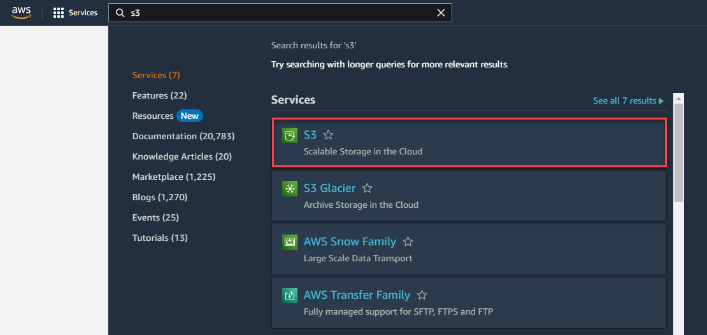
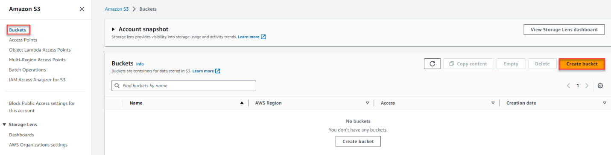

<!-- Update with the appropriate values -->
<!-- Please ensure tutorials are flagged as level 200 (intermediate) or higher -->
| Attributes                |                                   |
| ------------------- | -------------------------------------- |
| ✅ AWS Level        | Intermediate - 200                         |
| ⏱ Time to complete  | 15 minutes                             |
| 💰 Cost to complete | Free when using the AWS Free Tier or USD 1.01      |
| 🧩 Prerequisites    | - [AWS Account](https://aws.amazon.com/resources/create-account/) - [CodeCatalyst Account](https://codecatalyst.aws)   - If you have more than one requirement, add it here using the ` ` html tag|
| 💻 Code Sample         | Code sample used in tutorial on [GitHub](<link if you have a code sample associated with the post, otherwise delete this line>)                             |
| 📢 Feedback            | <a href="https://pulse.buildon.aws/survey/DEM0H5VW" target="_blank">Any feedback, issues, or just a</a> 👍 / 👎 ?    |
| ⏰ Last Updated     | YYYY-MM-DD                             |

| ToC |
|-----|
<!-- Use the above to auto-generate the table of content. Only build out a manual one if there are too many (sub) sections. -->

| AWS experience	| Beginner	|
|---	|---	|
|
Time to complete	|
40 minutes	|
|---	|---	|
|
Cost to complete	|
Less than $1, see the [_Amazon S3 pricing page_](https://aws.amazon.com/s3/pricing/) for more details	|
|
Requires	|
AWS account	|
|
Services used	|
[_Amazon S3_](https://aws.amazon.com/s3/) and [_AWS Identity and Access Management (IAM)_](https://aws.amazon.com/iam/)	|
|
Last updated	|8/10/2023	|

**Overview**

[Amazon S3 Batch Operations](https://aws.amazon.com/s3/features/batch-operations/) is a managed solution for performing storage actions like copying and tagging objects at scale, whether for one-time tasks or for recurring, batch workloads. S3 Batch Operations can perform actions across billions of objects and petabytes of data with a single request. To perform work in S3 Batch Operations, you create a job. The job consists of the list of objects, the action to perform, and the set of parameters you specify for that type of operation. You can create and run multiple jobs at a time in S3 Batch Operations or use job priorities as needed to define the precedence of each job and ensures the most critical work happens first. S3 Batch Operations also manages retries, tracks progress, sends completion notifications, generates reports, and delivers events to [_AWS CloudTrail_](https://aws.amazon.com/cloudtrail/) for all changes made and tasks executed. This getting started guide shows you how to use S3 Batch Operations to initiate restore requests for objects stored in Amazon S3 Glacier storage classes.

For more information on S3 Batch Operations, visit the [Using Batch Operations](https://docs.aws.amazon.com/AmazonS3/latest/userguide/batch-ops.html) section in the Amazon S3 User Guide, and for additional step-by-step guides on how to use S3 Batch Operations, check out these tutorials focused on [Using S3 Batch Operations to encrypt objects with S3 Bucket Keys](https://docs.aws.amazon.com/AmazonS3/latest/userguide/batch-ops-copy-example-bucket-key.html) and [_Batch-transcoding videos with S3 Batch Operations, AWS Lambda, and AWS Elemental MediaConvert](https://docs.aws.amazon.com/AmazonS3/latest/userguide/tutorial-s3-batchops-lambda-mediaconvert-video.html). By the end of this tutorial, you will be able to use S3 Batch Operations to initiate restore requests for S3 objects in Amazon S3 Glacier storage classes.

In this tutorial, you will:

* Configure a S3 Batch Operations restore job to restore objects from the Amazon S3 Glacier Flexible Retrieval storage class.
    * **Create an Amazon S3 bucket**
    * **Archive objects into the S3 Glacier Flexible Retrieval storage class**
    * **Create an S3 Batch Operations manifest**
    * **Create, confirm, and run an S3 Batch Operations job**
    * **Monitor the progress of an S3 Batch Operations job**
    * **View S3 Batch Operations completion report**
    * **Clean up resources**

**Prerequisites**

Before starting this tutorial, you will need:

* **An AWS account:** If you don't already have an account, follow the [_Setting Up Your Environment_](https://aws.amazon.com/getting-started/guides/setup-environment/) getting started guide for a quick overview.

**Implementation:** 

**Step 1: Create an Amazon S3 bucket**

 a. Log in to the [_AWS Management Console_](https://console.aws.amazon.com/) using your account information. In the search bar, enter **S3**, then select **S3** from the results.

 1. In the left navigation pane on the S3 console, choose Buckets, and then choose **Create bucket**.
 
  

    1. Enter a descriptive, globally unique name for your source bucket. Select the **AWS Region** you want your bucket created in. In this example, the **EU (Frankfurt) eu-central-1 region** is selected.

.png)

    1. You can leave the remaining options as defaults. Navigate to the bottom of the page and choose **Create bucket**.

1. **Archive objects into the Glacier Flexible Retrieval storage class** 

2.1 On your workstation, create a text file that contains sample text and save it to your workstation. To create these files, you can leverage the command prompt and the sample command shown below. You can also use any of your existing files for the purpose of this tutorial.

echo “sample file 1” > testfile-1.txt

echo “sample file 2” > testfile-2.txt

echo “sample file 3” > testfile-3.txt

 1. From the [_Amazon S3 console_](https://s3.console.aws.amazon.com/s3/home), search for the bucket that you created in Step 1, and select the bucket name.

.png)

    1. Next, select the **Objects** tab. Then, from within the **Objects** section, choose **Upload**.

.png)
    1. Then, in the **Upload** section, choose **Add files**. Navigate to your local file system to locate the test file that you created above. Select the appropriate file, and then choose **Open**. Your file will be listed in the **Files and folders** section. 
 .png)       

    1. Since this tutorial is focused on restoring objects from the S3 Glacier Flexible Retrieval storage class, expand the **Properties** tab to select the **Glacier Flexible Retrieval** storage class, then select **Upload**.
        

.png)

.png)
    1. After the file upload operations have completed, you will be presented with a status message indicating if the upload was successful or not. Upon successful upload of the files, choose **Close**.
        
.png)

    1. You should now see the objects in the S3 Console and their respective storage class.

.png)
1. **Create a S3 Batch Operations manifest**

    a. A manifest is an Amazon S3 object that contains object keys that you want Amazon S3 to act upon. If you supply a user-generated manifest it must be in the form of an [_Amazon S3 Inventory report_](https://docs.aws.amazon.com/AmazonS3/latest/userguide/storage-inventory.html) or CSV file. When performing S3 Batch Replication, Amazon S3 generates a manifest based on your replication configuration. While Amazon S3 Inventory may be a suitable fit when performing batch operations at scale, it takes up to 48 hours for the first S3 inventory report to be delivered. For the purpose of this tutorial, we will be leveraging a **CSV** manifest.

* Using Excel or your editor of choice, create a CSV with a list of “Bucket,Key“ pairs for each object you wish to restore.
* In this example the manifest is:

.png)
* S3 Batch Operations CSV manifests can include an optional version ID as a third column of the CSV. If using a versioned bucket, we recommend that you supply the version ID of each object in your manifest. Batch Operations will perform the operation on the latest version if no version ID is specified.
* Save the file as “manifest.csv”.

    1. Upload the S3 Batch Operations manifest to the S3 bucket. Leave the options on the default settings, and choose the **Upload** button.

.png)
1. **Create and run an S3 Batch Operations job**

    1. On the left navigation pane of the Amazon S3 console home page, choose **Batch Operations**, and then choose **Create Job**.

.png)
    1. On the **Create job** page, select the **AWS Region** where you want to create your S3 Batch Operations job. You must create the job in the same AWS Region in which the source S3 bucket is located.

.png)
    1. Specify the manifest type to be **CSV** and browse to the manifest file uploaded to the bucket in Step 3

.png)
    1. Choose **Next** to go to the **Choose operation** page.

1. Select the **Restore** operation. The Restore operation initiates restore requests for the archived Amazon S3 objects that are listed in your manifest.

.png)
    1. Select the restore source as **Glacier Flexible Retrieval or Glacier Deep Archive** and the number of days that the restore copy is available as **1 day**.

* This means that once the restore is completed, Amazon S3 restores a temporary copy of the object only for the specified duration. After that, it deletes the restored object copy.
* S3 Batch Operations supports STANDARD and BULK retrieval tiers. Select the **Retrieval tier** to be **Standard retrieval**. With S3 Batch Operations, [_restores in the Standard retrieval tier now typically begin to return objects to you within minutes_](https://aws.amazon.com/blogs/aws/new-improve-amazon-s3-glacier-flexible-restore-time-by-up-to-85-using-standard-retrieval-tier-and-s3-batch-operations/), down from 3–5 hours, so you can easily speed up your data restores from archive. For more information about the differences between the retrieval tiers, see [_Archive retrieval options_](https://docs.aws.amazon.com/AmazonS3/latest/userguide/restoring-objects-retrieval-options.html).

.png)
    1. Configure additional options:
1. Enter a **Description** to best define the purpose of the job.

* Select a **Priority** to indicate the relative priority of this job to others running in your account. A higher number indicates higher priority. For example, a job with Priority 2 will be prioritized over a job with priority 1. S3 Batch Operations prioritizes jobs according to priority numbers, but strict ordering isn't guaranteed. Therefore, you shouldn't use job priorities to ensure that any one job starts or finishes before any other job. If you need to ensure strict ordering, wait until one job has finished before starting the next.

.png)
    1. Generate an S3 Batch Operations completion report

Next, you will have the option to request a [_completion report_](https://docs.aws.amazon.com/AmazonS3/latest/userguide/batch-ops-job-status.html) for your S3 Batch Operations job as shown in the screenshot below. As long as S3 Batch Operations successfully processes at least one object, Amazon S3 generates a completion report after the S3 Batch Operations job completes, fails, or is cancelled. You have the option to include all tasks or only failed tasks in the completion report. The completion report contains additional information for each task, including the object key name and version, status, error codes, and [_descriptions of any errors_](https://docs.aws.amazon.com/AmazonS3/latest/userguide/replication-failure-codes.html). Completion reports provide an easy way to view the status of each object restored using the S3 Batch Operations job and identify failures, if any. In this example, we chose to **Generate completion report** for **All tasks** so that we can review the status of all objects within this job. Alternatively, you can also choose to view the status of objects that failed to restore only by choosing the** ****Failed ****tasks**** only **option. We have provided the destination bucket as the destination for the completion report. For additional examples of completion reports, see [_Examples: S3 Batch Operations completion reports_](https://docs.aws.amazon.com/AmazonS3/latest/userguide/batch-ops-examples-reports.html).
.png)
    1. Creating an [_Identity and Access Management (IAM) role_](https://aws.amazon.com/iam/) for S3 Batch Operations
1. Amazon S3 must have permissions to perform S3 Batch Operations on your behalf. You grant these permissions through an IAM role.
2. S3 Batch Operations provides a template of the **IAM role policy** and the **IAM trust policy** that should be attached to the IAM role.
3. To create an IAM policy in the AWS Console, see [_Creating policies using the JSON editor_](https://docs.aws.amazon.com/IAM/latest/UserGuide/access_policies_create-console.html). On step 5, copy and paste the “IAM Role Policy” template shown in the S3 batch operations page. You must replace the **Target Resource** in the IAM policy with the bucket name. Once the IAM policy is successfully created, create an IAM role and attach the policy to the IAM role.
4. To create an IAM role in the AWS Management Console, see [_Creating a role for an AWS service_](https://docs.aws.amazon.com/IAM/latest/UserGuide/id_roles_create_for-service.html). On step 4, choose the service as S3 in the search bar and select the **S3 Batch Operation** option. On step 5, Select the IAM policy created in the previous section and attach it to the IAM role. Upon successful creation of the IAM role, it should have a trust policy identical to the **IAM trust policy** template and a permissions policy identical to the **IAM role policy** template attached to it.
5. Coming back to the **S3 Batch Operations** page, use the **refresh** icon and select the newly created IAM role from the drop-down.

.png)
    1. Optional – You can label and control access to your S3 Batch Operations jobs by adding tags. Tags can be used to identify who is responsible for a Batch Operations job. Add **Job tags** to your S3 Batch Operations job, and then choose **Next** to review your job configuration.

.png)
    1. On the **Review** page, validate the configuration and, choose **Edit** to make changes if required, then choose **Next** to save your changes and return to the **Review** page. When your job is ready, choose **Create job**.

.png)
    1. After the S3 Batch Operations job is created, you will be redirected to the **Batch Operations** home page as shown in the following screenshot. Here, you can review the job configuration by selecting the **Job ID** which will take you to the Job details page. When the job is successful, a banner displays at the top of the Batch Operations page.

.png)
    1. Upon creation of the job, Batch Operations processes the manifest. If successful, it will change the job status to **Awaiting your confirmation to run**. You must confirm the details of the job and select **Run job**.

.png)
    1. You should then see a notification of successful confirmation for the job displayed in the banner at the top of the Batch Operations page.

.png)
1. **Monitor the progress of a S3 Batch Operations job**

    1. Select the job which was just created on the S3 Batch Operations console page.
1. After an S3 Batch Operations job is created and run, it progresses through a series of statuses. You can track the progress of an S3 Batch Operations job by referring to these statuses on the Batch Operations home page.
2. For example, a job is in the **New** state when it is created, moves to the **Preparing** state when Amazon S3 is processing the manifest and other job parameters, then moves to the **Ready** state when it is ready to run, **Active** when it is in progress, and finally **Completed** when the processing completes. For a full list of job statuses, see [_S3 __Batch Operations job statuses_](https://docs.aws.amazon.com/AmazonS3/latest/userguide/batch-ops-job-status.html).

* Here, you can view information about the job’s progress such as Job **Status, Total succeeded,** and **Total failed**. Once the job has completed executing, it will generate a report and transition to the **Completed** state.

.png)
    1. Verify that the restore is successful.
1. Once the job is successfully completed, go to the [_Amazon S3__ console__ home page_](https://s3.console.aws.amazon.com/s3/home), select the bucket, and choose an object in the Glacier Flexible Retrieval storage class.
2. The banner shows that the **Restoration status** of the object is **In-progress**. The **download** option is greyed out as the object is not yet accessible to download.

.png)
* Standard retrievals initiated [_by using S3 Batch Operations restore operation typically start within minutes and finish within 3-5 hours_](https://aws.amazon.com/blogs/aws/new-improve-amazon-s3-glacier-flexible-restore-time-by-up-to-85-using-standard-retrieval-tier-and-s3-batch-operations/) for objects stored in the S3 Glacier Flexible Retrieval storage class.
* After the time elapses, verify the restore status and you can see that the object has been restored. You should also be able to download the object until the **Restoration Expiry date**.

.png)
1. **View S3 Batch Operations completion reports**
    1. S3 Batch Operations generates a report for jobs that have completed, failed, or cancelled. Select the path you’ve configured to save the completion reports.

.png)
    1. Download the completion report to analyze the status of each task.
1. In the following example, all the objects have been successfully restored.
2. The description of errors for each failed task can be used to diagnose issues that occur during job creation, such as permissions.

.png)
1. **Clean up resources**

    1. Empty the bucket.
1. If you have logged out of your AWS Management Console session, log back in. Navigate to the **S3** console and select the **Buckets** menu option. First, you will need to delete the test object from your test bucket. Select the name of the bucket you have been working with for this tutorial.
2. Select the radio button to the left of the source bucket you created for this tutorial, and choose the **Empty** button.
3. Select **Empty**. Review the warning message. If you desire to continue emptying this bucket, enter the bucket name into the Empty bucket confirmation box, and choose **Empty bucket.**

Note: Objects that are archived to the S3 Glacier Flexible Retrieval storage class are charged for a minimum storage duration of 90 days. Objects deleted prior to the minimum storage duration incur a pro-rated charge equal to the storage charge for the remaining days. Objects that are deleted, overwritten, or transitioned to a different storage class before the minimum storage duration will incur the normal storage usage charge plus a pro-rated storage charge for the remainder of the minimum storage duration. For more information, refer to the [_S3 Pricing page_](https://aws.amazon.com/s3/pricing/).
.png)
    1. Delete the bucket.
1. Return to the Amazon S3 home page.
2. Select the radio button to the left of the bucket you created for this tutorial, and choose the **Delete** button.
3. Review the warning message. If you desire to continue deletion of this bucket, enter the bucket name into the **Delete bucket** confirmation box, and choose **Delete bucket** **** button.

    1. Delete the IAM role and the IAM policy.
1. If you have logged out of your AWS Management Console session, log back in. Navigate to the [_IAM console_](https://console.aws.amazon.com/iam/) and select **Roles** from the left menu options.
2. Delete the role created for this tutorial.
3. Navigate to **Policies** from the left menu options.
4. Delete the IAM policy that was created for this tutorial.

**Conclusion**

Congratulations! You have learned how to use S3 Batch Operations to restore archived objects. You can customize the restore tier and expiration time depending on your access needs. You can also use S3 Batch Operations to perform other types of requests such as replication, Lambda invocation, replacing object ACLs, tagging and enabling object lock.

**Next Steps**

To learn more about S3 Batch Operations, visit the following resources.

1. [_S3 Batch Operations product page_](https://aws.amazon.com/s3/features/batch-operations/)
2. [_S3 Batch Operations documentation_](https://docs.aws.amazon.com/AmazonS3/latest/userguide/batch-ops.html)
3. [_S3 Batch Operations FAQs_](https://aws.amazon.com/s3/faqs/)
4. [_Large scale migration of encrypted objects in Amazon S3 using S3 Batch Operations_](https://aws.amazon.com/blogs/storage/large-scale-migration-of-encrypted-objects-in-amazon-s3-using-s3-batch-operations/)
5. [_Updating Amazon S3 object ACLs at scale with S3 Batch Operations_](https://aws.amazon.com/blogs/storage/updating-amazon-s3-object-acls-at-scale-with-s3-batch-operations/)

