As an application builder you have many types of data to store to provide not only the core application functionality but also logging of telemetry and traces so that application performance can be monitored. The data required to be captured can often change over time with new types of metrics being available as new versions of your application are implemented. It could become a challenge for the application builder to use a traditional relational database, incorporate frequent schema changes and also allow for efficient retrieval and search of this data, the size of which becomes enormous over time. This is where Amazon OpenSearch can help - it provides your application with scalable data storage which can be both simple relational data or complex JSON documents for a number of use cases including Website search, Enterprise search, Log analytics, Application performance monitoring and Security analytics. 

In this tutorial you'll get hands on with using SQL with Amazon OpenSearch using the familiar SQL query syntax including aggregations, group by, and where clauses to investigate your data. You can read data as JSON documents or CSV tables so you have the flexibility to use the format that works best for you. You will walk through setting up a new Amazon OpenSearch Serverless domain in the AWS console. You'll explore the different types of search queries available. You also learn how to create and search for a document in Amazon OpenSearch Service. When you add data to an index in the form of a JSON document the OpenSearch Service creates an index around the first document that you add. In addition to the familiar SQL query syntax you also have access to the rich set of search capabilities such as fuzzy matching, boosting, phrase matching and more.

| Attributes             |                                                                 |
|------------------------|-----------------------------------------------------------------|
| ✅ AWS experience      | 200 - Intermediate                                                        |
| ⏱ Time to complete    | 60 minutes                                                      |
| 💰 Cost to complete    | [Free tier](https://aws.amazon.com/free/) eligible                                               |
| 🧩 Prerequisites       | - [AWS account](https://aws.amazon.com/resources/create-account/?sc_channel=el&sc_campaign=datamlwave&sc_content=cicdcdkpthnec2aws&sc_geo=mult&sc_country=mult&sc_outcome=acq)<br>-CDK installed: Visit [Get Started with AWS CDK](https://aws.amazon.com/getting-started/guides/setup-cdk/) to learn more.  |
| 💻 Code Sample         | Code sample used in tutorial on [GitHub](https://github.com/build-on-aws/sample-python-web-app)                             |
| 📢 Feedback            | <a href="https://pulse.buildon.aws/survey/DEM0H5VW" target="_blank">Any feedback, issues, or just a</a> 👍 / 👎 ?    |
| ⏰ Last Updated        | 2023-07-24                                                      |

| ToC |
|-----|

## What is Amazon OpenSearch? 

It is important to understand the capabilities of OpenSearch so that you can fully utilize the benefits based on your application requirements. OpenSearch is a scalable, flexible, and extensible open-source software suite for search, analytics, and observability applications licensed under Apache 2.0. Powered by Apache Lucene and driven by the OpenSearch Project community. With OpenSearch you can capture, store, and analyze your business, operational, and security data from a variety of sources. You can use your preferred data collector and enrich your analytics pipeline with integrated ML tools like anomaly detection. OpenSearch also provides full-text search, automated anomaly detection and vector database capabilities for implementing semantic search and Retrieval Augmented Generation (RAG) for generative AI applications. 

Amazon OpenSearchis also bundled with a dashboard visualization tool, OpenSearch Dashboards, which helps visualize not only log and trace data, but also machine-learning powered results for anomaly detection and search relevance ranking.

Now that you have a good understanding of the benefits of using Amazon OpenSearch, let us setup the service in AWS.

> **Note**: This tutorial uses a domain with open access. For the highest level of security, we recommend that you put your domain inside a virtual private cloud (VPC).

## Step 1 - Create an Amazon OpenSearch Service domain
To experience the capability of using SQL with OpenSearch, we will setup an OpenSearch service domain which is synonymous with an OpenSearch cluster. Domains are clusters with the settings, instance types, instance counts, and storage resources that you specify. You can create an OpenSearch Service domain by using the console, the AWS CLI, or the AWS SDKs. 

To create an OpenSearch Service domain using the console
The list of steps below show how you can use the AWS console to create an OpenSearch Service domain so that you can begin loading sample data and trying out SQL queries against that data.
1. Go to [https://aws.amazon.com](https://aws.amazon.com/) and choose **Sign In to the Console**.
2. Under **Analytics**, choose **Amazon OpenSearch Service**.
3. Under the "Get Started" choice dialog, select "Managed Clusters" then click on **Create domain**.
4. Provide a name for the domain. The examples in this tutorial use the name *movies*.
5. For the domain creation method, choose **Standard create**. (*Note: To quickly configure a production domain with best practices, you can choose **Easy create**. For the development and testing purposes of this tutorial, we'll use **Standard create**.)*
6. For templates, choose **Dev/test**.
7. For the deployment option, choose **Domain with standby**.
8. For **Version**, choose the latest version.
9. For now, ignore the **Data nodes**, **Warm and cold data storage**, **Dedicated master nodes**, **Snapshot configuration**, and **Custom endpoint** sections.
10. For simplicity in this tutorial, use a public access domain. Under **Network**, choose **Public access**.
11. In the fine-grained access control settings, keep the **Enable fine-grained access control** check box selected. Select **Create master user** and provide a username and password.
12. For now, ignore the **SAML authentication** and **Amazon Cognito authentication** sections.
13. For **Access policy**, choose **Only use fine-grained access control**. In this tutorial, fine-grained access control handles authentication, not the domain access policy.
14. Ignore the rest of the settings and choose **Create**. New domains typically take 15–30 minutes to initialize, but can take longer depending on the configuration. After your domain initializes, select it to open its configuration pane. Note the domain endpoint under **General information** (for example, `https://search-my-domain.us-east-1.es.amazonaws.com`), which you'll use in the next step.

## Step 2 - Ingest Sample data into your OpenSearch domain

### This step covers the ingestion of sample data into OpenSearch so that you can test sample SQL queries on that data. 
1. Navigate to your OpenSearch service on the AWS console. On the Dashboard section, your domain should be listed under the header “Name”. Click on any of your domains.
  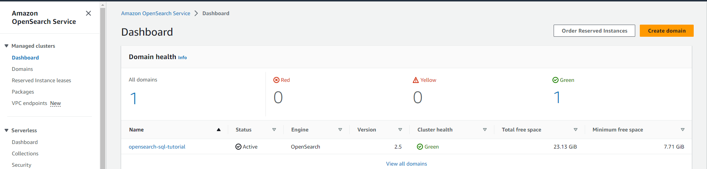
1. Click on the OpenSearch Dashboard URL link for this domain.
  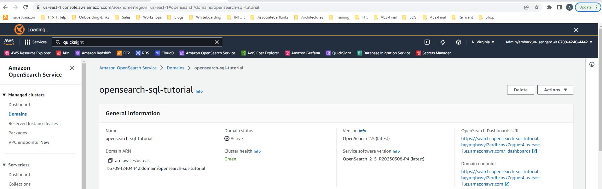
1. Login into OpenSearch Dashboards with the username and password you created in Step 1.11
  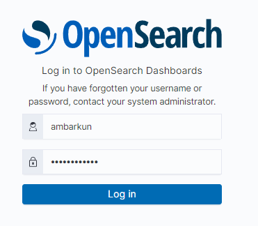
1. After login is successful, you will see the screens below in sequence - click “Add data”, Select “Global” tenant and click on the “Add data” button under “Sample eCommerce orders”. That will ingest the sample data comprising of e-commerce orders, into this OpenSearch domain, which you will query using SQL for the rest of this tutorial.


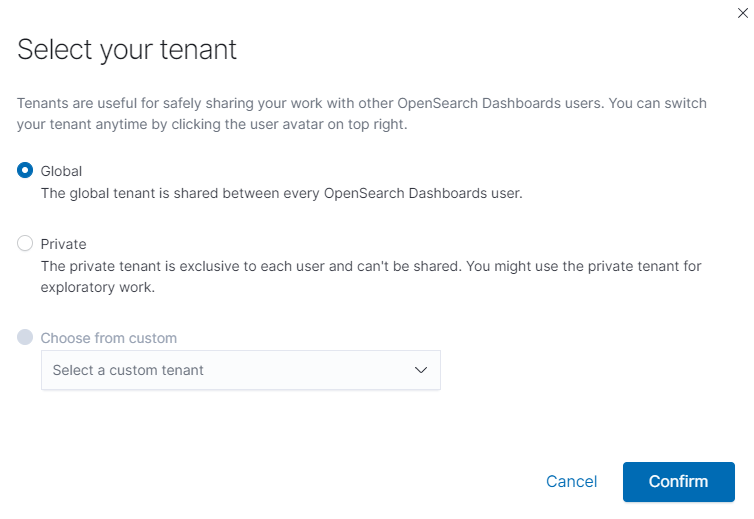

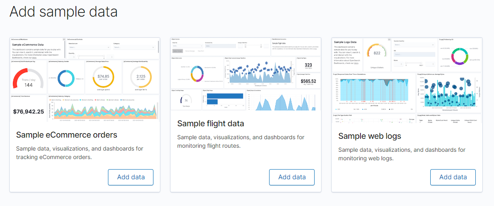

> Note: If the Sample eCommerce Orders was already ingested you will see “View data” instead, you can skip the step above in that case.**

5. Click the Hamburger Icon (the icon top lef under "Open Search Dashboards" - it looks like 3 horizontal lines above each other) to expand the menu, and then click on “Query Workbench”. This will open up the “Query Editor” where you can enter your SQL queries, with the results showing in the “Output” pane below that.

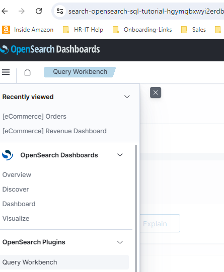

Mapping concepts across SQL and OpenSearch

In this section we map concepts across SQL and OpenSearch so that you can use SQL more effectively to search data in your OpenSearch domain. While SQL and OpenSearch have different terms for the way the data is organized (and different semantics), essentially their purpose is the same. So let’s start from the bottom; these roughly are:

|**SQL**|**OpenSearch**|**Description**|
|---|---|---|
|`column`|`field`|In both cases, at the lowest level, data is stored in *named* entries, of a variety of data types, containing *one* value. SQL calls such an entry a *column* while OpenSearch a *field*. Notice that in OpenSearch a field can contain *multiple* values of the same type (essentially a list) while in SQL, a *column* can contain *exactly* one value of said type. OpenSearch SQL will do its best to preserve the SQL semantic and, depending on the query, reject those that return fields with more than one value.|
|`row`|`document`|`Column`s and `field`s do *not* exist by themselves; they are part of a `row` or a `document`. The two have slightly different semantics: a `row` tends to be *strict* (and have more enforcements) while a `document` tends to be a bit more flexible or loose (while still having a structure).|
|`table`|`index`|The target against which queries, whether in SQL or OpenSearch get executed against.|
|`schema`|*implicit*|In RDBMS, `schema` is mainly a namespace of tables and typically used as a security boundary. OpenSearch does not provide an equivalent concept for it. However when security is enabled, OpenSearch automatically applies the security enforcement so that a role sees only the data it is allowed to (in SQL jargon, its *schema*).|
|`catalog` or `database`|`cluster` instance or domain|In SQL, `catalog` or `database` are used interchangeably and represent a set of schemas that is, a number of tables. In OpenSearch the set of indices available are grouped in a `cluster`` or domain`. The semantics also differ a bit; a `database` is essentially yet another namespace (which can have some implications on the way data is stored) while an OpenSearch `cluster` is a runtime instance, or rather a set of at least one OpenSearch instance (typically running distributed). In practice this means that while in SQL one can potentially have multiple catalogs inside an instance, in OpenSearch one is restricted to only *one*.|
|`cluster`|`cluster` (federated)|Traditionally in SQL, *cluster* refers to a single RDMBS instance which contains a number of `catalog`s or `database`s (see above). While RDBMS tend to have only one running instance, on a single machine (*not* distributed), OpenSearch goes the opposite way and by default, is distributed and multi-instance. <br> <br>Further more, an OpenSearch `cluster` can be connected to other `cluster`s in a *federated* fashion thus `cluster` means:<br>`single cluster`: Multiple Elasticsearch instances typically distributed across machines, running within the same namespace.<br>`multiple clusters`:: Multiple clusters, each with its own namespace, connected to each other in a federated setup.<br><br>Cross-cluster search in Amazon OpenSearch Service lets you perform queries and aggregations across multiple connected domains. It often makes more sense to use multiple smaller domains instead of a single large domain, especially when you're running different types of workloads.|

## Step 3 - Running Basic SQL Queries

### We are starting with running a basic set of SQL queries to help understand the key concepts.
1. To list all your indexes in your current domain, run the SQL query below in the Query Workbench:

```sql
SHOW TABLES LIKE %
```

Sample Results (The table of sample data ingested is `opensearch_dashboards_sample_data_ecommerce`)

|TABLE_NAME|
|---|
|.kibana_1|
|.opendistro_security|
|fruit|
|opensearch_dashboards_sample_data_ecommerce|
|opensearch_dashboards_sample_data_flights|
|opensearch_dashboards_sample_data_logs|
|.kibana|

2. Retrieve a limited set of documents (5) from the sample e-commerce table (sample results follow the SQL query below)

```sql
SELECT *
FROM opensearch_dashboards_sample_data_ecommerce
limit 5
```


> Note: the (+) sign next to “order” indicates that there are nested JSON documents which we can see when we expand it. Later we will see how we can query nested JSON document fields using SQL.

Click on (+) next to the first order - it will show the expanded results (level 1) - there are products, event and `geoip` entities attached (related to) this order.

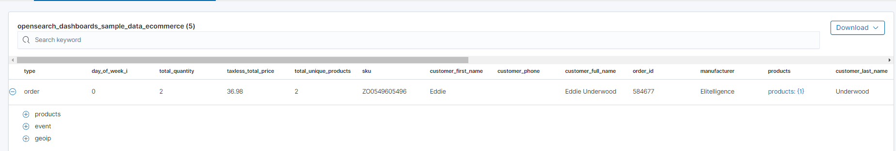

Click on (+) next to the products, event and `geoip` headings (for order id 584677). Under `geoip` click on (+) next to Africa and (+) next to location. This will display all nested data related to this order.

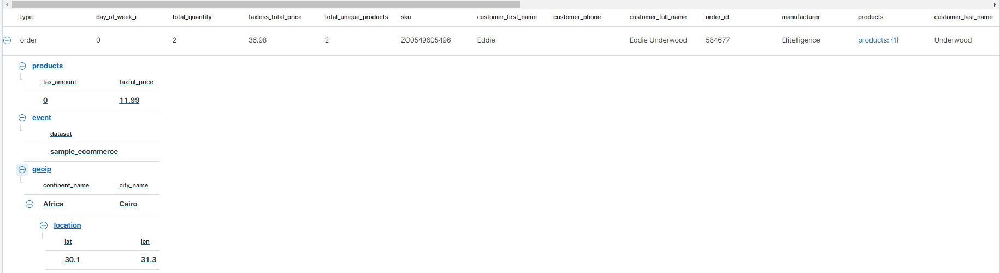

3. We want retrieve a specific order, so we need to get the datatypes of all the columns in this table, using the SQL query below, and scrolling through the results to find the datatype of the column order_id.

```sql
DESCRIBE TABLES LIKE opensearch_dashboards_sample_data_ecommerce
```

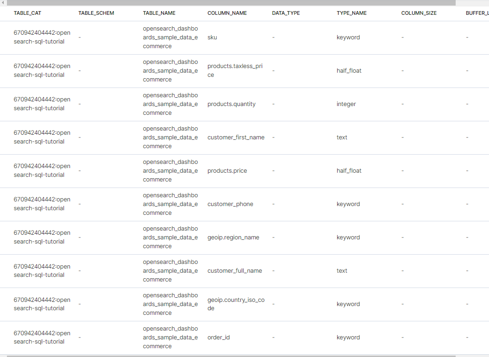

4. Since the datatype of the column `order_id` is keyword, we need to enclose the search in quotes (updated).

```sql
SELECT *
FROM opensearch_dashboards_sample_data_ecommerce
WHERE order_id = '584677'
```

5. Use the SQL `SELECT` clause, along with `FROM`, `WHERE`, `GROUP BY`, `HAVING`, `ORDER BY`, and `LIMIT` to search and aggregate data. Among these clauses, `SELECT` and `FROM` are required, as they specify which fields to retrieve and which indexes to retrieve them from. All other clauses are optional.

The complete syntax for searching and aggregating data is as follows (refer to the [link](https://opensearch.org/docs/latest/search-plugins/sql/sql/basic/) for details):

```sql
SELECT [DISTINCT] (* | expression) [[AS] alias] [, ...]
FROM index_name
[WHERE predicates]
[GROUP BY expression [, ...]
[HAVING predicates]]
[ORDER BY expression [IS [NOT] NULL] [ASC | DESC] [, ...]]
[LIMIT [offset, ] size]
```
We want to run a SQL query with a complex filter to get a limited set of results from the ecommerce sample table. Here is an example of the SQL which uses parenthesis to bind components of where clauses, i.e., If the query has multiple and or conditions, then it's necessary to use parentheses to ensure the correct order of operations. In short for complex queries, it is necessary to use a round Bracket and for a simple query, you can avoid a round bracket. This example shows how a combination of >, OR, BETWEEN, AND, =, NOT and a SQL Function can be used in a single statement.  

```sql
SELECT type, day_of_week_i, total_quantity, taxless_total_price 
FROM opensearch_dashboards_sample_data_ecommerce
where (total_quantity > 3 or taxless_total_price between 200 and 300) 
and day_of_week = 'Friday' 
and customer_gender is not 'MALE' 
and MATCHQUERY(category, 'ACCESSORIES')
limit 5
```
|type|day_of_week_i|total_quantity|taxless_total_price|
|---|---|---|---|
|order|4|4|133.96|
|order|4|4|86.96|
|order|4|4|112.96|
|order|4|4|121.96|
|order|4|4|70.96|

6. Use the `DISTINCT` clause to get back only unique field values. You can specify one or more field names:

```sql
SELECT DISTINCT manufacturer
FROM opensearch_dashboards_sample_data_ecommerce
```

|manufacturer|
|---|
|Angeldale|
|Champion Arts|
|Crystal Lighting|
|Elitelligence|
|Gnomehouse|
|Gnomehouse mom |

7. To use an aggregate function like SUM - enclose a single field name/column or expression as a parameter. If you specify a list of one or more fields before the aggregate function, you must specify the same list as part of the `GROUP BY` clause otherwise the aggregate function will calculate the expression over all the documents in the index. Run the query below to calculate the sum of total_quantity by manufacturer.

Use the `GROUP BY` clause to define subsets of a result set. You can specify the field name (column name) to aggregate on in the `GROUP BY` clause. For example, the following query returns the department numbers and the total sales for each department:

```sql
SELECT manufacturer, sum(total_quantity)
FROM opensearch_dashboards_sample_data_ecommerce
group by manufacturer
```

|manufacturer|sum(total_quantity)|
|---|---|
||102|
|Angeldale|1220|
|Champion Arts|556|
|Crystal Lighting|50|
|Elitelligence|3076|
|Gnomehouse|1046|
|Gnomehouse mom|60|
|Karmanite|34|
|Low Tide Media|3507|
|Microlutions|799|
|Oceanavigations|2743|
|Primemaster|152|
|Pyramidustries|2142|
|Pyramidustries active|328|
|Spherecords|958|
|Spherecords Curvy|122|
|Spherecords Maternity|128|
|Spritechnologies|616|
|Tigress Enterprises|2388|
|Tigress Enterprises Curvy|138|
|Tigress Enterprises MAMA|148|

8. You can use an expression in the GROUP BY clause. For example, the following query returns the average sales or total_price and count of records for each year and month:

```sql
SELECT year(order_date), month(order_date), avg(taxless_total_price), count(*)
FROM opensearch_dashboards_sample_data_ecommerce 
GROUP BY year(order_date),month(order_date);
```

|year(order_date)|month(order_date)|avg(taxless_total_price)|count(*)|
|---|---|---|---|
|2023|6|74.69634|1338|
|2023|7|75.19941|3337|

OpenSearch supports the following aggregate functions:

|Function|Description|
|---|---|
|`AVG`|Returns the average of the results.|
|`COUNT`|Returns the number of results.|
|`SUM`|Returns the sum of the results.|
|`MIN`|Returns the minimum of the results.|
|`MAX`|Returns the maximum of the results.|
|`VAR_POP` or `VARIANCE`|Returns the population variance of the results after discarding nulls. Returns 0 when there is only one row of results.|
|`VAR_SAMP`|Returns the sample variance of the results after discarding nulls. Returns null when there is only one row of results.|
|`STD` or `STDDEV`|Returns the sample standard deviation of the results. Returns 0 when there is only one row of results.|
|`STDDEV_POP`|Returns the population standard deviation of the results. Returns 0 when there is only one row of results.|
|`STDDEV_SAMP`|Returns the sample standard deviation of the results. Returns null when there is only one row of results.|

9. Use aggregate expressions as part of larger expressions in SELECT. The following query calculates the average commission for each manufacturer as 5% of the average sales:

```sql
SELECT manufacturer, avg(taxless_total_price) * 0.05 as avg_commission 
FROM opensearch_dashboards_sample_data_ecommerce 
GROUP BY manufacturer;
```

|manufacturer|avg_commission|
|---|---|
||10.1878|
|Angeldale|5.70938|
|Champion Arts|3.46576|
|Crystal Lighting|4.1681|
|Elitelligence|3.42215|
|Gnomehouse|4.50266|
|Gnomehouse mom|4.33275|
|Karmanite|7.10333|
|Low Tide Media|4.22025|
|Microlutions|3.64217|
|Oceanavigations|4.53148|
|Primemaster|7.92308|
|Pyramidustries|3.38982|
|Pyramidustries active|3.2559|
|Spherecords|3.09347|
|Spherecords Curvy|3.22758|
|Spherecords Maternity|3.54196|
|Spritechnologies|3.83885|
|Tigress Enterprises|3.60001|
|Tigress Enterprises Curvy|3.53235|
|Tigress Enterprises MAMA|3.85656|

### Using `WHERE` and `HAVING` clauses in SQL

1. Both ``WHERE`` and ``HAVING`` are used to filter results. The ``WHERE`` filter is applied before the ``GROUP BY`` phase, so you cannot use aggregate functions in a ``WHERE`` clause. However, you can use the ``WHERE`` clause to limit the rows to which the aggregate is then applied. Below is a list of operators you can use with the WHERE clause to specify a condition to filter the results.

|Operators|Behavior|
|---|---|
|‘=|Equal to.|
|---|---|
|`<>`|Not equal to.|
|`>`|Greater than.|
|`<`|Less than.|
|`>=`|Greater than or equal to.|
|`<=`|Less than or equal to.|
|`IN`|Specify multiple `OR` operators.|
|`BETWEEN`|Similar to a range query. For more information about range queries, see [Range query](https://opensearch.org/docs/latest/opensearch/query-dsl/term#range).|
|`LIKE`|Use for full-text search. For more information about full-text queries, see [Full-text queries](https://opensearch.org/docs/latest/opensearch/query-dsl/full-text/index).|
|`IS NULL`|Check if the field value is `NULL`.|
|`IS NOT NULL`|Check if the field value is `NOT NULL`.|

You can combine comparison operators (`=`, `<>`, `>`, `>=`, `<`, `<=`) with boolean operators `NOT`, `AND`, or `OR` to build more complex expressions.

Enter the query below

```sql
SELECT order_id
FROM opensearch_dashboards_sample_data_ecommerce
where total_quantity > 3
limit 5
```

|order_id|
|---|
|723055|
|727462|
|727269|
|727381|
|718424|

2. The ``HAVING`` filter is applied after the ``GROUP BY`` phase, so you can use the ``HAVING`` clause to limit the groups that are included in the results.

The following query returns the list of manufacturers along with the sum of total_quantity where the sum exceeds 1,000.

```sql
SELECT manufacturer, sum(total_quantity)
FROM opensearch_dashboards_sample_data_ecommerce
group by manufacturer
having sum(total_quantity)> 1000
```

|manufacturer|sum(total_quantity)|
|---|---|
|Angeldale|1220|
|Elitelligence|3076|
|Gnomehouse|1046|
|Low Tide Media|3507|
|Oceanavigations|2743|
|Pyramidustries|2142|
|Tigress Enterprises|2388|

3. Use an alias for an aggregate expression in the `HAVING` clause. The following query uses an alias to return the total quantity by manufacturer where the sum exceeds 2,000.

```sql
SELECT manufacturer, sum(total_quantity) tot_qty
FROM opensearch_dashboards_sample_data_ecommerce
group by manufacturer
having tot_qty > 2000
```

|manufacturer|tot_qty|
|---|---|
|Elitelligence|3076|
|Low Tide Media|3507|
|Oceanavigations|2743|
|Pyramidustries|2142|
|Tigress Enterprises|2388|

4. The ``DELETE`` statement deletes documents that satisfy the predicates in the ``WHERE`` clause. If you don’t specify the ``WHERE`` clause, all documents are deleted. It is disabled by default. To enable the ``DELETE`` functionality in SQL, you need to update the configuration by sending the following request using the console in Dev Tools.

Click the hamburger icon (top left) and “Dev Tools” menu option (at the bottom) - as seen in the screenshot below.

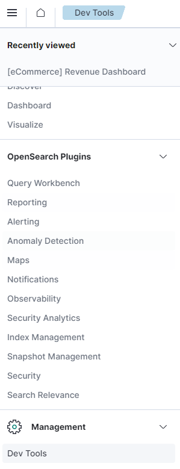

In the “Dev Tools” console, enter the code below into the console left pane, and send the request by clicking the triangle icon on the top right corner of the left pane. The response from the request is displayed on the right pane below.

```json
PUT _plugins/_query/settings

{
  "transient": {
    "plugins.sql.delete.enabled": "true"
  }
}
```

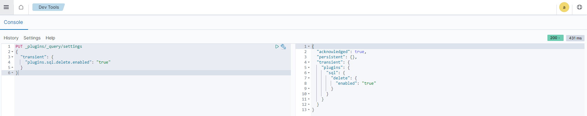

Then run the following query:

```sql
DELETE
FROM opensearch_dashboards_sample_data_ecommerce
WHERE total_quantity > 4
```

The `deleted_rows` field shows the number of documents deleted.

## Step 4 - Running Complex SQL queries on multiple indexes or tables
Now that we have covered the basics of SQL querying, in this section we run more complex SQL queries to understand how they work. 
Let’s insert some data related to employees and accounts (into separate indexes). Navigate to DevTools and bulk insert via the following statements. Enter these on the left pane of the console and the results will be shown on the right side of the console.

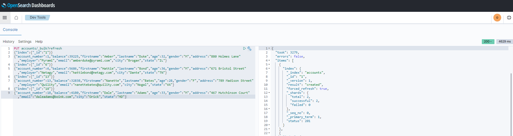

Statement for inserting into employees_nested:

```json
POST employees_nested/_bulk?refresh

{"index":{"_id":"1"}}
{"id":3,"name":"Bob Smith","title":null,"projects":[{"name":"SQL Spectrum querying","started_year":1990},{"name":"SQL security","started_year":1999},{"name":"OpenSearch security","started_year":2015}]}
{"index":{"_id":"2"}}
{"id":4,"name":"Susan Smith","title":"Dev Mgr","projects":[]}
{"index":{"_id":"3"}}
{"id":6,"name":"Jane Smith","title":"Software Eng 2","projects":[{"name":"SQL security","started_year":1998},{"name":"Hello security","started_year":2015,"address":[{"city":"Dallas","state":"TX"}]}]}
```

Statement for inserting into accounts:

```sql
PUT accounts/_bulk?refresh

{"index":{"_id":"1"}}
{"account_number":1,"balance":39225,"firstname":"Amber","lastname":"Duke","age":32,"gender":"M","address":"880 Holmes Lane","employer":"Pyrami","email":"amberduke@pyrami.com","city":"Brogan","state":"IL"}
{"index":{"_id":"6"}}
{"account_number":6,"balance":5686,"firstname":"Hattie","lastname":"Bond","age":36,"gender":"M","address":"671 Bristol Street","employer":"Netagy","email":"hattiebond@netagy.com","city":"Dante","state":"TN"}
{"index":{"_id":"13"}}
{"account_number":13,"balance":32838,"firstname":"Nanette","lastname":"Bates","age":28,"gender":"F","address":"789 Madison Street","employer":"Quility","email":"nanettebates@quility.com","city":"Nogal","state":"VA"}
{"index":{"_id":"18"}}
{"account_number":18,"balance":4180,"firstname":"Dale","lastname":"Adams","age":33,"gender":"M","address":"467 Hutchinson Court","email":"daleadams@boink.com","city":"Orick","state":"MD"}
```

OpenSearch SQL supports complex queries such as subquery, join, union, and minus. These queries operate on more than one OpenSearch index. Since OpenSearch is not a relational database, there are limitations with joins and the performance could be a bottleneck. OpenSearch SQL supports inner joins, cross joins, and left outer joins.

1. Using Inner join

Inner join creates a new result set by combining columns of two indexes based on your join predicates. It iterates the two indexes and compares each document to find the ones that satisfy the join predicates. You can optionally precede the `JOIN` clause with an `INNER` keyword. The join predicate(s) is specified by the ON clause.

SQL query:

```sql
SELECT
  A.account_number, 
  A.firstname, 
  A.lastname,
  E.id, 
  E.name
FROM accounts A
  JOIN employees_nested E
    ON A.account_number = E.id
```

Result set:

|**a.account****_number**|**a.firstname**|**a.lastname**|**e.id**|**e.name**|
|---|---|---|---|---|
|6|Hattie|Bond|6|Jane Smith|

2. Use Cross join, also known as cartesian join, to combine each document from the first index with each document from the second. The result set is the the cartesian product of documents of both indexes. This operation is similar to the inner join without the `ON` clause that specifies the join condition.

> **Note:** It’s risky to perform a cross join on two indexes of large or even medium size. It might trigger a circuit breaker that terminates the query to avoid running out of memory.

```sql
SELECT
  a.account_number, a.firstname, a.lastname,
  e.id, e.name
FROM accounts a
JOIN employees_nested e
```

Result set:

|a.account_number|a.firstname|a.lastname|e.id|e.name|
|---|---|---|---|---|
|1|Amber|Duke|3|Bob Smith|
|1|Amber|Duke|4|Susan Smith|
|1|Amber|Duke|6|Jane Smith|
|6|Hattie|Bond|3|Bob Smith|
|6|Hattie|Bond|4|Susan Smith|
|6|Hattie|Bond|6|Jane Smith|
|13|Nanette|Bates|3|Bob Smith|
|13|Nanette|Bates|4|Susan Smith|
|13|Nanette|Bates|6|Jane Smith|
|18|Dale|Adams|3|Bob Smith|
|18|Dale|Adams|4|Susan Smith|
|18|Dale|Adams|6|Jane Smith|

3. Use left outer join to retain rows from the first index if it does not satisfy the join predicate. The keyword `OUTER` is optional.

```sql
SELECT
a.account_number, a.firstname, a.lastname,
e.id, e.name
FROM accounts a
LEFT JOIN employees_nested e
ON a.account_number = e.id
```

Result set:

|**a.account****_number**|**a.firstname**|**a.lastname**|**e.id**|**e.name**|
|---|---|---|---|---|
|1|Amber|Duke|null|null|
|6|Hattie|Bond|6|Jane Smith|
|13|Nanette|Bates|null|null|
|18|Dale|Adams|null|null|

4. Use subquery which is a complete `SELECT` statement used within another statement and enclosed in parenthesis:

```sql
SELECT 
  a1.firstname, 
  a1.lastname, 
  a1.balance
FROM accounts a1
WHERE a1.account_number IN (
  SELECT a2.account_number
  FROM accounts a2
  WHERE a2.balance > 10000
)
```

Result set:

|**a1.firstname**|**a1.lastname**|**a1.balance**|
|---|---|---|
|Amber|Duke|39225|
|Nanette|Bates|32838|


## Step 5 - Using SQL Functions
In this step we cover the rich set of SQL Functions which can help the application builder leverage more search and analytics capabilities of OpenSearch. 
For a list of functions supported, [see the documentation here](https://opensearch.org/docs/latest/search-plugins/sql/functions/).

1. Use the MATCH function in SQL for full-text search (a subset of full-text queries available in OpenSearch is supported). You can search documents that match a `string`, `number`, `date`, or `boolean` value for a given field. The `MATCHQUERY` and `MATCH_QUERY` functions are synonyms for the [`MATCH`](https://opensearch.org/docs/2.8/search-plugins/sql/full-text#match) relevance function.
Syntax:

```sql
match(field_expression, query_expression[, option=<option_value>]*)
```

You can specify the following options in any order:

* `analyzer`
* `boost`

*SQL query:*

```sql
SELECT address FROM accounts where match(address,"Street")
```

|address|
|---|
|789 Madison Street|
|671 Bristol Street|

```sql
SELECT address FROM accounts where match(address,"Street Lane",operator='or')
```

|address|
|---|
|789 Madison Street|
|671 Bristol Street|
|880 Holmes Lane|

The above results contain addresses that contain “Lane” or “Street”.

2. To search for text in multiple fields, use `MULTI_MATCH` function. This function maps to the `multi_match` query used in search engine, to returns the documents that match a provided text, number, date or boolean value with a given field or fields. eg. To search for `Dale` **in either the** `firstname` **or** `lastname` fields could be called from *SQL* using `multi_match` function. The `MATCHQUERY` and `MATCH_QUERY` functions are synonyms for the [`MATCH`](https://opensearch.org/docs/2.8/search-plugins/sql/full-text#match) relevance function.

```sql
SELECT firstname, lastname
FROM accounts
WHERE multi_match(['*name'], 'Dale')
```

|firstname|lastname|
|---|---|
|Dale|Adams|

2. To return a relevance score along with every matching document, use the `SCORE`, `SCOREQUERY`, or `SCORE_QUERY` functions.

Syntax:

The `SCORE` function expects two arguments. The first argument is the [`MATCH_QUERY`](https://opensearch.org/docs/latest/search-plugins/sql/sql/functions/) expression. The second argument is an optional floating-point number to boost the score (the default value is 1.0):

```sql
SCORE(match_query_expression, score)
SCOREQUERY(match_query_expression, score)
SCORE_QUERY(match_query_expression, score)
```

The following example uses the `SCORE` function to boost the documents’ scores:

```sql
SELECT 
  account_number, 
  address, 
  _score
FROM 
  accounts
WHERE 
  SCORE(MATCH_QUERY(address, 'Lane'), 0.5) OR
  SCORE(MATCH_QUERY(address, 'Street'), 100)
ORDER BY 
  _score
```

The results contain matches with corresponding scores:

|**account_number**|**address**|**score**|
|---|---|---|
|1|880 Holmes Lane|0.5|
|---|---|---|
|6|671 Bristol Street|100|
|13|789 Madison Street|100|

This concludes the SQL tutorial, and you may delete the OpenSearch domain/ index if you are not utilizing it further. The sections below provide more information about OpenSearch.

**Querying OpenSearch using SQL REST API**
For a complete REST API reference for the SQL plugin, see [SQL/PPL API](https://opensearch.org/docs/latest/search-plugins/sql/sql-ppl-api).

To use the SQL plugin with your own applications, send requests to the `_plugins/_sql` endpoint:

```json
POST _plugins/_sql

{
"query": "SELECT * FROM accounts LIMIT 3,"
}
```

You can query multiple indexes by using a comma-separated list:

```json
POST _plugins/_sql

{
  "query": "SELECT * FROM my-index1,myindex2,myindex3 LIMIT 50"
}
```

You can also specify an index pattern with a wildcard expression:

```json
POST _plugins/_sql

{
  "query": "SELECT * FROM my-index* LIMIT 50"
}
```

To run the above query in the command line, use the [curl](https://curl.haxx.se/) command:

```bash
curl -XPOST https://localhost:9200/_plugins/_sql -u 'admin:admin' -k -H 'Content-Type: application/json' -d '{"query": "SELECT * FROM my-index* LIMIT 50"}'
```

You can specify the [response format](https://opensearch.org/docs/latest/search-plugins/sql/response-formats) as JDBC, standard OpenSearch JSON, CSV, or raw. By default, queries return data in JDBC format. The following query sets the format to JSON:

```json
POST _plugins/_sql?format=json

{
"query": "SELECT * FROM my-index LIMIT 50"
}
```

Another way to query your data in OpenSearch with SQL using a REST API, is to send HTTP requests to `_sql` using the following format:

```json
POST domain-endpoint/_plugins/_sql

{
  "query": "SELECT * FROM my-index LIMIT 50"
}
```

For example - using the Dev Tools console - run the following SQL query (results are shown below)

SQL Query via API

```json
POST /_plugins/_sql

{
  "query" : "SELECT * FROM accounts"
}
```

Results:

```json
{
  "schema": [
    {
      "name": "account_number",
      "type": "long"
    },
    {
      "name": "firstname",
      "type": "text"
    },
    {
      "name": "address",
      "type": "text"
    },
    {
      "name": "balance",
      "type": "long"
    },
    {
      "name": "gender",
      "type": "text"
    },
    {
      "name": "city",
      "type": "text"
    },
    {
      "name": "employer",
      "type": "text"
    },
    {
      "name": "state",
      "type": "text"
    },
    {
      "name": "age",
      "type": "long"
    },
    {
      "name": "email",
      "type": "text"
    },
    {
      "name": "lastname",
      "type": "text"
    }
  ],
  "datarows": [
    [
      13,
      "Nanette",
      "789 Madison Street",
      32838,
      "F",
      "Nogal",
      "Quility",
      "VA",
      28,
      "nanettebates@quility.com",
      "Bates"
    ],
    [
      6,
      "Hattie",
      "671 Bristol Street",
      5686,
      "M",
      "Dante",
      "Netagy",
      "TN",
      36,
      "hattiebond@netagy.com",
      "Bond"
    ],
    [
      1,
      "Amber",
      "880 Holmes Lane",
      39225,
      "M",
      "Brogan",
      "Pyrami",
      "IL",
      32,
      "amberduke@pyrami.com",
      "Duke"
    ],
    [
      18,
      "Dale",
      "467 Hutchinson Court",
      4180,
      "M",
      "Orick",
      null,
      "MD",
      33,
      "daleadams@boink.com",
      "Adams"
    ]
  ],
  "total": 4,
  "size": 4,
  "status": 200
}
```

### Using JDBC with OpenSearch
We will now cover how to use JDBC with OpenSearch so that builders and OpenSearch users can run SQL queries and integrate OpenSearch with your favorite business intelligence (BI) applications.  
The OpenSearch Java Database Connectivity (JDBC) driver comes in the form of a JAR file which can be downloaded as per the information provided in this link *[the SQL repository on GitHub](https://github.com/opensearch-project/sql-jdbc)*. Installing this will let you setup a connection to OpenSearch from a SQL client such as DBeaver, and you can then run SQL queries from that client. Similarly Amazon Quicksight has a connector to OpenSearch for data visualization. However the most common way for visualizing data in OpenSearch is via OpenSearch dashboards which is a fork from Kibana.

> **A note about Query DSL:** OpenSearch provides a search language called *query domain-specific language (DSL)* that you can use to search your data. Query DSL is a flexible language with a JSON interface. With query DSL, you need to specify a query in the `query` parameter of the search. One of the simplest searches in OpenSearch uses the `match_all` query, which matches all documents in an index:

```json
GET testindex/_search
{
"query": {
    "match_all": {
    }
  }
}
```

A query can consist of many query clauses. You can combine query clauses to produce complex queries.
Broadly, you can classify queries into two categories—*leaf queries* and *compound queries*:

**Leaf queries**: Leaf queries search for a specified value in a certain field or fields. You can use leaf queries on their own. They include the following query types:
**Full-text queries**: Use full-text queries to search text documents. For an analyzed text field search, full-text queries split the query string into terms with the same analyzer that was used when the field was indexed. For an exact value search, full-text queries look for the specified value without applying text analysis. To learn more, see [Full-text queries](https://opensearch.org/docs/latest/opensearch/query-dsl/full-text/index).
**Term-level queries**: Use term-level queries to search documents for an exact specified term, such as an ID or value range. Term-level queries do not analyze search terms or sort results by relevance score. To learn more, see [Term-level queries](https://opensearch.org/docs/latest/opensearch/query-dsl/term/).
**Geographic and xy queries**: Use geographic queries to search documents that include geographic data. Use xy queries to search documents that include points and shapes in a two-dimensional coordinate system. To learn more, see [Geographic and xy queries](https://opensearch.org/docs/latest/opensearch/query-dsl/geo-and-xy/index).
**Joining queries**: Use joining queries to search nested fields or return parent and child documents that match a specific query. Types of joining queries include `nested`, `has_child`, `has_parent`, and `parent_id` queries.
**Span queries**: Use span queries to perform precise positional searches. Span queries are low-level, specific queries that provide control over the order and proximity of specified query terms. They are primarily used to search legal documents. To learn more, see [Span queries](https://opensearch.org/docs/latest/opensearch/query-dsl/span-query/).
**Specialized queries**: Specialized queries include all other query types (`distance_feature`, `more_like_this`, `percolate`, `rank_feature`, `script`, `script_score`, `wrapper`, and `pinned_query`).

**Compound queries**: Compound queries serve as wrappers for multiple leaf or compound clauses either to combine their results or to modify their behavior. They include the Boolean, disjunction max, constant score, function score, and boosting query types. To learn more, see [Compound queries](https://opensearch.org/docs/latest/opensearch/query-dsl/compound/index).

## Conclusion
We covered the capabilities, benefits and typical use-cases for Amazon OpenSearch. To gain understanding of how data can be easily searched in OpenSearch using SQL, we ingested sample data in OpenSearch and then ran a set of simple and complex SQL queries on this data.

SQL support is very important in the real-world of OpenSearch application developers and end users because it provides an easy mechansim for application builders and data analysts to query the data in OpenSearch. By using a combination of SQL operators, SQL functions and joins between tables (A Note of Caution: Table Joins are expensive operations from the performance perspective especially for large tables) developers can reduce development times because more complex searches can be accomplished with lesser amount of code. Also it fulfils a key requirement of allowing a non-programmatic way (instead of REST API) of accessing and analyzing OpenSearch data via SQL from BI Query and reporting tools.  

## Next Steps 

> Comment: You can further explore the latest version of OpenSearch by reviewing the documentation on this site [OpenSearch documentation](https://opensearch.org/docs/latest/). To build an application using the OpenSearch SQL API, review this link [OpenSearch SQL API](https://opensearch.org/docs/latest/search-plugins/sql/sql-ppl-api/) and refer to the different SQL functions and operators which you can use depending on your application requirements.
> 

In [this article](https://stackoverflow.com/collectives/aws/articles/76223192/building-a-crud-application-in-go-for-amazon-opensearch), you can learn how to build an CRUD application for Amazon OpenSearch using the [Go](https://go.dev/) programming language. The project includes everything you need to build your own development environment, such as specific distributions like:

1. [Tarball](https://opensearch.org/docs/latest/install-and-configure/install-opensearch/tar/)
1. [RPM](https://opensearch.org/docs/latest/install-and-configure/install-opensearch/rpm/)
1. [Debian](https://opensearch.org/docs/latest/install-and-configure/install-opensearch/debian/)
1. [Windows](https://opensearch.org/docs/latest/install-and-configure/install-opensearch/windows/)
1. [Docker](https://opensearch.org/docs/latest/install-and-configure/install-opensearch/docker/)
1. [Helm](https://opensearch.org/docs/latest/install-and-configure/install-opensearch/helm/)
1. [Ansible playbooks](https://opensearch.org/docs/latest/install-and-configure/install-opensearch/ansible/). 

Alternatively, you can use [Amazon OpenSearch](https://aws.amazon.com/opensearch-service), a fully managed service for OpenSearch that allows you to focus on building applications while the infrastructure and the operations are taken care for you.
