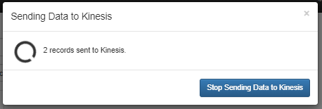
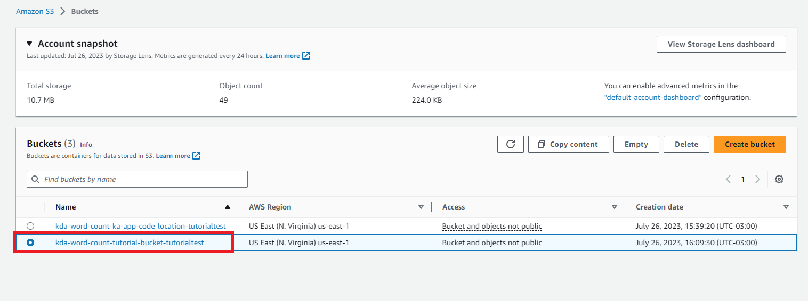
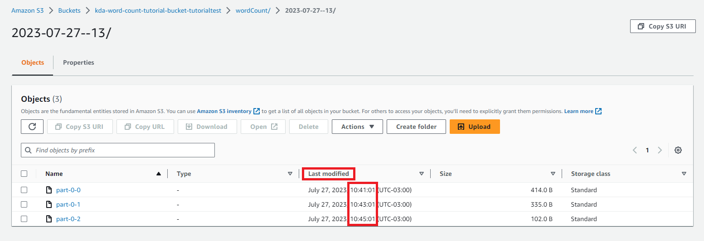
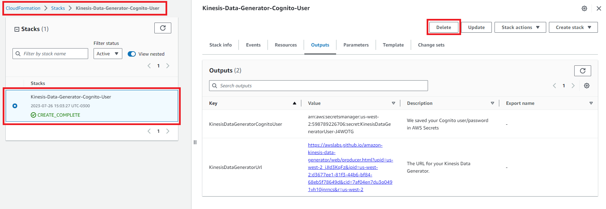

In this tutorial, you will learn how to create an [Amazon Kinesis Data Analytics for Apache Flink](https://aws.amazon.com/kinesis/data-analytics/) application with [Amazon Kinesis Data Streams](https://aws.amazon.com/kinesis/data-streams/) as a source and a [Amazon S3](https://aws.amazon.com/s3/) bucket as a sink.

Specifically, you will learn how to do the following: 
- Create an Amazon Kinesis Data Stream
- Set up an Amazon Kinesis Data Generator
- Send sample data to a Kinesis Data Stream
- Create an Amazon S3 bucket
- Download code for a Kinesis Data Analytics application
- Modify application code
- Compile application code
- Upload Apache Flink Streaming Java code to S3
- Create, configure, and launch a Kinesis Data Analytics application
- Verify results
- Clean up resources

In general, the[Amazon Kinesis Data Generator](https://awslabs.github.io/amazon-kinesis-data-generator/web/help.html) ingests random data. With the Apache Flink application, code performs a word count on the streaming random data using a tumbling window of five minutes. The generated word count is then stored in the specified Amazon S3 bucket. After, Amazon Athena is used to query data generated in the Amazon S3 bucket to validate the end results.


## Table of Contents

| Attributes                |                                   |
| ------------------- | -------------------------------------- |
| ✅ AWS Level        | 200 - Intermediate                          |
| ⏱ Time to complete  | 30 minutes                             |
| 💰 Cost to complete | Less than $17 (assuming all services
 are running for two hours) |
| 🧩 Prerequisites    | [AWS Account](https://aws.amazon.com/resources/create-account/?sc_channel=el&sc_campaign=devopswave&sc_content=cicdcdkpthnec2aws&sc_geo=mult&sc_country=mult&sc_outcome=acq), [Apache Maven](https://maven.apache.org/)       |
| 📢 Feedback            | <a href="https://pulse.buildon.aws/survey/DEM0H5VW" target="_blank">Any feedback, issues, or just a</a> 👍 / 👎 ?    |
| ⏰ Last Updated     | YYYY-MM-DD                             |


| ToC |
|-----|


## Creating an Amazon Kinesis Data Stream

In this step, you will create a Kinesis Data Stream with one shard. Begin by opening the [Amazon Kinesis services console](https://console.aws.amazon.com/kinesis/) and choose the `Region` where you want to create the Kinesis Data Stream resource:


In the `Getting Started` section, choose `Kinesis Data Streams`, and select `Create data stream`:


Next, on the `Create data stream` page, in the `Data stream configuration` section, enter a name for your Data stream:


In the `Data stream capacity` section, choose `Provisioned` for `Capacity mode` and `1` for the number of open shards, and then select Create data stream.

A single shard can ingest up to 1 MB of data per second (including partition keys) or 1,000 records per second for writes. If your application requires higher ingestion capabilities, you can increase the shard count accordingly. The write and read capabilities of the entire stream gets updated dynamically in the Kinesis console under the `Total data stream capacity`. For more information, read our documentation on [Quotas and Limits](https://docs.aws.amazon.com/streams/latest/dev/service-sizes-and-limits.html): 


Finally, in the `Stream details` section, verify that the status updates to `Active`:


Your Amazon Kinesis Data Stream is now successfully created and you’re ready for the next step. 


## Setting up Amazon Kinesis Data Generator

In this step, you will configure Amazon Kinesis Data Generator (KDG) to send sample data to a Kinesis Data Stream. First,  open the [Amazon Kinesis Data Generator home page](https://awslabs.github.io/amazon-kinesis-data-generator/web/help.html) and select `Create a Cognito User with CloudFormation`. You will be redirected to [AWS CloudFormation console](https://console.aws.amazon.com/cloudformation/):


On the `Create stack` page, in the `Specify template` section, verify that there is a valid HTTPS path for the `Amazon S3 URL`, and then choose `Next`:


On the `Specify stack details` page, enter a name for the `Stack`:

In the `Parameters` section, enter a `Username` and `Password` that will be used to log in to the KDG console. Then, choose `Next`:


Next, on the `Configure stack options` page, keep the default settings, and choose `Next`:


On the `Review` page, in the `Capabilities` section, select the checkbox `I acknowledge that AWS CloudFormation might create IAM resources`, and then choose `Create stack`:


On the `Stack details` page, in the `Stacks` section, verify that the status shows `CREATE_COMPLETE`. Then, choose the `Outputs` tab, under `Value` copy the URL. To view the resources deployed by the AWS CloudFormation stack choose the `Resources` tab:


Insert the copied URL in a web browser, enter the `Username` and `Password` created in the **Set up Amazon Kinesis Data Generator** step, and choose `Sign In`:


On the `KDG home page`, for the `Region` drop-down, choose the same region you  created for the Data Stream in the **Create an Amazon Kinesis Data Stream** step. Then, the `Stream/delivery stream` should automatically populate:


Now that you’ve set up your Amazon Kinesis Data Generator, you can move on to the next step. 


## Sending sample data to an Amazon Kinesis Data Stream

In this step, you will use the KDG console to send sample data to the previously created Kinesis Data Stream created at one record per second rate and sustain the ingestion until the end of this tutorial to achieve reasonable data for analysis while performing the remainder of the steps..
From the `KDG home page`, perform the following actions:

- For `Records per second`, choose the `Constant` tab, and change the value to `1`
- For `Record template`, choose the `Template 1` tab, and  insert the following code sample into the text box:

```json
"{{random.arrayElement([
    "Hi",
    "Hello there",
    "How are you",
    "Hi how are you"
])}}"
```

Then, choose `Test Template`:


Verify the structure of the sample JSON records and choose `Close`:


Next, choose `Send data`:


Leave the KDG web page open to ensure sustained streaming of random records into the Kinesis Data Stream. The streaming will continue for the remainder of the steps to provide reasonable data for analysis:



In the meantime, open the [Amazon Kinesis Data streams console](https://console.aws.amazon.com/kinesis/home?region=us-east-1#/streams/list). In the `Data streams` section, choose the previously created `Kinesis data stream`:


Choose the `Monitoring` tab, in the `Stream metrics` section, find the `Put records successful records -average (Percent)` and `Put records – sum (bytes)` metrics to validate record ingestion:


You’ve now successfully sent your sample data and can now move onto creating Amazon S3 buckets. 


## Creating Amazon S3 buckets

In this step, you will create the following Amazon Simple Storage Service (Amazon S3) buckets:

- `kda-word-count-ka-app-code-location-<unique-name>` to store the Amazon Kinesis Data Analytics code
- `kda-word-count-tutorial-bucket-<unique-name>` to store the output word count of Amazon Kinesis Data Analytics application

Keep in mind that Amazon S3 bucket names are required to be globally unique. When creating the S3 bucket, you must add a unique name at the end.

Now open the [Amazon S3 console](https://s3.console.aws.amazon.com/s3/) and choose `Create Bucket`:


On the Create bucket page, in the `General configuration` section, enter the following details:

- For `Bucket Name`, write `kda-word-count-ka-app-code-location-<unique-name>`
- For `AWS Region`, select the AWS Region that was chosen in the previous steps

Then keep the default settings, and choose `Create Bucket`:


Repeat the same steps to create another bucket.  For `Bucket Name`, write `kda-word-count-tutorial-bucket-<unique-name>`, and for `AWS Region`, select the AWS Region that was selected in the previous steps:


With your S3 buckets created, you’re now ready to download the code in the next step. 


## Downloading the code for the Amazon Kinesis Data Analytics application

In this step, you will download example Java application code available in GitHub to use for the Kinesis Data Analytics application.

Additionally, you will need to have the Git client installed. For more information, read more about [Installing Git](https://git-scm.com/book/en/v2/Getting-Started-Installing-Git).

From there, in a terminal window, execute the following command to clone the remote repository and specify the commit `290962c`:

```powershell
git clone https://github.com/aws-samples/amazon-kinesis-data-analytics-java-examples
cd amazon-kinesis-data-analytics-java-examples
git checkout 290962c
```

Note, that by running this command, you will clone the repository and checkout the specific commit with the hash `290962c`:

Next, run the following command to navigate to the directory:

```powershell
cd S3Sink/src/main/java/com/amazonaws/services/kinesisanalytics
```

The code in `S3StreamingSinkJob.java` performs the word count at the following excerpts:

```java
input.flatMap(new Tokenizer())          // Tokenizer for generating words
        .keyBy(0)                   // Logically partition the stream for each word
        .timeWindow(Time.minutes(1))            // Tumbling window definition
        .sum(1)                     // Sum the number of words per partition
        .map(value -> value.f0 + " count: " + value.f1.toString() + "\n")
        .addSink(createS3SinkFromStaticConfig());

public static final class Tokenizer implements FlatMapFunction<String, Tuple2<String, Integer>> {
        @Override
        public void flatMap(String value, Collector<Tuple2<String, Integer>> out) {
            String[] tokens = value.toLowerCase().split("\\W+");
            for (String token : tokens) {
                if (token.length() > 0) {
                    out.collect(new Tuple2<>(token, 1));
                }
            }
        }
    }
```

The incoming stream of records from Kinesis Data Stream converts each record to lowercase and splits the record body at tab or spaces. For each word retrieved after the split, it creates a two dimensional tuple with word string and its count as in the following example: 

```
“Hi” becomes (Hi,1)
“Hi how are you” becomes (Hi,1) (how,1) (are, 1) (you,1)
```

Then, it partitions the stream of tuples using the first key (the word string) and performs a sum on second key (the count) for each partition under a [tumbling window](https://ci.apache.org/projects/flink/flink-docs-release-1.13/docs/dev/datastream/operators/windows/#tumbling-windows) of one minute.

If no new records come up in the stream after one minute, then the output of sum method would be the following:

```
(Hi,2) (how,1) (are, 1) (you,1)
```

Then, a map is created using the sum output and sent to S3Sink. This means that if the record ingestion is sustained, then a file in the `kda-word-count-tutorial-bucket-`<unique-name>` S3 bucket is created every minute with new-line separated character strings in following format:

```
Hi count: 824 


how count: 124 


are count: 210 


you count: 100 
```

Now that you’ve successfully downloaded the code for your application, next you will modify the code.


## Modifying the application code

In this step, you will modify the application code to point to the resources created in previous steps and make the reads start from the very beginning of untrimmed records in Kinesis Data stream.
Then, you update the time window to five minutes and modify the output content within S3 files to `comma-delimited new-line character separated strings` with `<word,count,window time>` schema.
Now open with a file editor to modify the `S3StreamingSinkJob.java` file with the following variables:

- For `region`, write the region that was used in previous steps
- For `inputStreamName`, write the name of the previously created `Stream/delivery stream` in step **Setting up Amazon Kinesis Data Generator**.
- For `s3SinkPath`, write the string `"s3a://bucket-placeholder/wordCount”` where `bucket-placeholder` is the name of S3 bucket created in step **Creating Amazon S3 buckets**.
- For the `STREAM_INITIAL_POSITION`, write `TRIM_HORIZON`

Note that the `STREAM_INITIAL_POSITION` value is set to `TRIM_HORIZON`, which enables the Kinesis Data Analytics application to read from the oldest untrimmed data record. This will ensure all records are ingested in Kinesis Data stream since the setup of KDG in earlier steps are read by the application and stored in the `kda-word-count-tutorial-bucket-<unique-name>` S3 bucket.

Your modification should be similar to the following:


Next, in the `S3StreamingSinkJob.java` file, replace line 52 with the following value:

```java
.map(value -> value.f0 +","+ value.f1.toString() +","+ Timestamp.from(Instant.now()).toString())
```
Then, replace line 50 with the following value:

```java
.timeWindow(Time.minutes(5)) // Tumbling window definition
```

Add the following lines of code after line 16:

```java
import java.sql.Timestamp;
import java.time.Instant;
```

Now, run the following command to navigate to the `S3Sink` directory, edit the `pom.xml` file, and specify that the `Flink` version used in this case is `1.11`:

```powershell
cd amazon-kinesis-data-analytics-java-examples/S3Sink/
```

To modify the file, open a file editor and go to `modify`, then the `pom.xml` file.

Once it’s open, modify the following variables:

- For `${scala.binary.version}` in lines 40 and 46, enter the value `2.11`
- For `${flink.version}` in lines 41 and 47, enter the value `1.11.1`


Now that you’ve modified your code, next you’ll compile it. 


## Compiling the application code

In the step, you will compile the application code to create a `.jar` file of the modified code. This `.jar` is a required input for Kinesis Data Analytics.

First, in a terminal, run the following command to navigate to the `S3Sink` directory:

```powershell
cd amazon-kinesis-data-analytics-java-examples/S3Sink/
```
Then run the following command to compile the application code:

```powershell
mvn clean package
```
Once this is completed, you should receive a `BUILD SUCCESS` message as in the following example:


The previous command creates a `.jar` file of the application at `target/aws-kinesis-analytics-java-apps-1.0.jar`:


With the code compiled and build complete, next you will upload it to an S3 bucket. 


## Uploading the Apache Flink Streaming Java Code to an Amazon S3 bucket

In this step, you will upload the Apache Flink Streaming Java Code to the `kda-word-count-ka-app-code-location-<unique-name>` S3 bucket.

First, navigate to the Amazon S3 console and choose the `kda-word-count-ka-app-code-location-unique-name>` bucket:


On the `kda-word-count-ka-app-code-location-<bucket-name>` page, choose the `Objects` tab, and choose `Upload`:


On the `Upload` page, in the `Files and folders` section, choose `Add files`:


Select the `aws-kinesis-analytics-java-apps-1.0.jar` file that was downloaded in step **Compiling the application code**:


Then, select `Upload`:


Your code is now uploaded and you’re read to start your application in the next step. 


## Creating, configuring, and starting the Kinesis Data Analytics application

In this step, you will create, configure, and execute the Kinesis Data Analytics application.

First, navigate to the [Kinesis Data Analytics console](https://console.aws.amazon.com/kinesisanalytics/home?region=us-east-1#/applications/dashboard). On the `Analytics applications` page, choose `Create application`:


On the `Create streaming application` page, select `Apache Flink- Streaming application` and `Apache Flink version 1.11`.

In the `Application configuration` section, for `Application name`, enter `kda-word-count`, then choose `Create/update IAM role <kinesis-analytics-kda-word-count-region> with required policies`.

In the `Template for application settings` section, in the `Templates` section, choose `Development`. Then, choose `Create application`:


Next, on the `kda-word-count` page, choose `Configure`:


On the `configure kda-word-count` page, in the Application `code location` section make the following changes:

- For `Amazon S3 bucket`, choose `Browse`
- Then choose the `kda-word-count-kda-app-code-location-<unique-name>` bucket, and select `Choose`:


Additionally, make the following selections: 

- For `Path to S3 object`, write aws-kinesis-analytics-java-apps-1.0.jar` to upload the custom code to Kinesis Data Analytics application
- Then, keep the default options, and select `Save changes`:


On the `kda-word-count` page, in the `Application details` section, choose the `IAM role` hyperlink:


In the IAM console for the `kinesis-analytics-kda-word-count-region`, in the `Summary` section, choose the `Permissions tab`. Then, choose the `kinesis-analytics-kda-word-count-region` policy:


In the IAM console for `Policies`, in the `Summary` section, choose the `Permissions` tab, and select `Edit policy`:


 On the `Edit kinesis-analytics-service-kda-word-count-region` page, choose the `JSON tab`, and insert the following code to the `end of the policy`. Then, make the following changes:

For `“Resource”`: replace with your `Region` and `Account ID`. For example: "Resource": `"arn:aws:kinesis:ap-south-1:012345678901:stream/kda-word-count-tutorial"`

For `“Resource”`: replace the `s3 bucket names` with the names of your previously created buckets. For example:
- `"arn:aws:s3:::kda-word-count-tutorial-bucket-*<unique-name>"`,
- `"arn:aws:s3:::kda-word-count-tutorial-bucket-*<unique-name>*/"`
- `"arn:aws:s3:::kda-word-count-kda-app-code-location-*<unique-name>"`
- `"arn:aws:s3:::kda-word-count-kda-app-code-location-*<unique-name>*/"`

Your updated code should be similar to the following: 

```java
{
            "Sid": "ReadInputStream",
            "Effect": "Allow",
            "Action": "kinesis:*",
            "Resource": "arn:aws:kinesis:ap-south-1:012345678901:stream/kda-word-count-tutorial"
            },
            {
            "Sid": "WriteObjects",
            "Effect": "Allow",
            "Action": [
                "s3:Abort*",
                "s3:DeleteObject*",
                "s3:GetObject*",
                "s3:GetBucket*",
                "s3:List*",
                "s3:ListBucket",
                "s3:PutObject"
            ],
            "Resource": [
                "arn:aws:s3:::kda-word-count-tutorial-bucket",
                "arn:aws:s3:::kda-word-count-tutorial-bucket/*",
                "arn:aws:s3:::kda-word-count-kda-app-code-location",
                "arn:aws:s3:::kda-word-count-kda-app-code-location/*"
            ]
        }
```

Once you’re finished making updates, select `Next`, and then `Save changes`:


Next, navigate to [Kinesis streaming application console](https://console.aws.amazon.com/kinesisanalytics/home?region=us-east-1#/applications/dashboard) `kda-word-count` page, and choose `Run`:


Then, choose `Run without snapshot` and choose `Run`:


Once the application starts successfully, the status shows as `Running`. Now, choose `Open Apache Flink dashboard`:


In the `Apache Flink Dashboard`, from the left-hand navigation, select `Running Jobs`. Then, for `Status` verify the `Flink S3` `Streaming Sink Job` is `Running`:


Now that you’ve created, configured, and executed the application, next you will verify the results. 


## Verifying results

Random data ingestion from KDG into Kinesis Data Stream is sustained at one record per second and the Kinesis Data Analytics Application performs word counts on streaming records using a window of two minutes. Therefore, you should expect to see file creation in Amazon S3 every two minutes.

First, navigate to the [Amazon S3 console](https://s3.console.aws.amazon.com/s3/home?region=us-east-1).In the `Bucket` section, select the `kda-word-count-tutorial` bucket:



On the `kda-word-count-tutorial` page, select the `Objects` tab. In the `Last modified` section, you should notice a two minute difference between the creation dates of the three files:



Next, go to [Amazon Athena console](https://console.aws.amazon.com/athena/home?region=us-east-1#/landing-page) and select `Query your data`, and then `Launch query editor`:


Select the `Editor` tab, in the `Data` section. For `Data Source`, select `AwsDataCatalog` from the drop-down. Then, for `Database`, select `default` from the drop-down.

In the `Query` tab, insert the following query to create an external table for data generated by Kinesis data analytics application. Note that you need to replace the `LOCATION S3 bucket` with the bucket created in the step **Creating Amazon S3 buckets**:

```sql
CREATE EXTERNAL TABLE kda_word_count_table (
         word STRING,
         count INT,
         window_time TIMESTAMP 
) ROW FORMAT DELIMITED FIELDS TERMINATED BY ',' LINES TERMINATED BY '\n' LOCATION 's3://kda-word-count-tutorial-bucket/wordCount/';
```

Then, choose `Run`:


In a new `Query editor` tab, insert the following query to list the word count of all available windows. Then, choose `Run`:

```sql
SELECT *
FROM "default"."kda_word_count_table"
order by window_time desc, count desc; 
```


Next, in the new `Query editor` tab, insert the following query to find the total count of words until a defined point. Modify the fourth line of the query to add in a relevant timestamp, based on your use case. Then, choose `Run`:

```sql
SELECT word,
         sum(count) AS total_count
FROM "default"."kda_word_count_table"
WHERE window_time > TIMESTAMP '2021-07-xx xx:xx’
GROUP BY  word
ORDER BY  total_count desc;
```


You’ve now successfully verified the results for the application using Amazon Athena. 


## Cleaning up resources

In this step, you will delete the resources you used in this tutorial. It’s important to delete resources that are not actively being used to reduce costs. Not deleting your resources will result in charges to your account.

Begin in the `opened Kinesis Data Generator web page` used in step **Sending sample data to an Amazon Kinesis Data Stream**, and select `Stop Sending Data to Kinesis`:


In the` AWS CloudFormation console`, select the `Kinesis-Data-Generator-Cogito-User` stack, and select `Delete`. Then, when prompted to confirm, select `Delete stack`:




In the `Amazon Kinesis Data Streams console`, select the `kda-word-count-tutorial` stream, and select `Delete`. Then, when prompted to confirm, write delete in the text box and select `Delete`:


In the `Amazon Kinesis Streaming applications` console, select the `kda-word-count` graph. Then, select `Actions`, and select `Delete`:


In the Amazon S3 console, select the `kda-word-count-ka-app-code-location-<unique-name>` and `kda-word-count-tutorial-bucket-<unique-name>` buckets. Select `Empty`, write delete in the text box and then select `permanently delete`:


Select the `kda-word-count-ka-app-code-location-<unique-name>` and `kda-word-count-tutorial-bucket-<unique-name>` buckets. Then, select `Delete`: 


In the Amazon Athena console, select the ellipsis next to the `kda_word_count_table` that you created in step **Verifying results**, and select `Delete table`. When promoted to confirm, select `Yes`:


You’ve now successfully cleaned up and deleted your resources. 


## Conclusion

In this tutorial, you  created a streaming pipeline and performed ETL on top of it by using Amazon Kinesis ecosystem services. Kinesis Data Analytics for Apache Flink enables you to author and run code against streaming sources to perform time-series analytics, feed real-time dashboards, and create real-time metrics.
