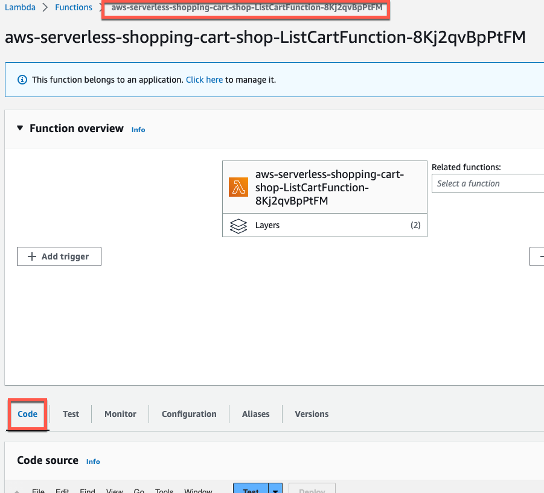

## Introduction

Imagine this:

Imagine this: you’re a cloud engineer for a website built using AWS serverless technologies such as AWS Lambda.  You receive a call from a customer insisting they’re unable to open their shopping cart on your website.  You open the same website and login with your ID and try the same operation and it works fine.  What do you do?

If you’re using AWS X-Ray and Amazon CloudWatch, there are plenty of things that you can do to understand what is happening from this user’s or other users’ perspective.

In this tutorial, I’ll walk through how you can use AWS X-Ray and Amazon CloudWatch to help you improve end user observability.  You will use the [aws-serverless-shopping-cart](https://github.com/aws-samples/aws-serverless-shopping-cart) sample application as the starting point and enhance its AWS X-Ray usage and implementation to include an AWS X-Ray group for registered and anonymous users along with related CloudWatch Metrics and CloudWatch Alarms.  Along the way, you will learn how to use the AWS X-Ray SDK and AWS X-Ray constructs such as segments, subsegments, and annotations. Throughout the tutorial, I’ll point out some potential gotcha’s and how to work around them.

## What you will learn

- How to configure and implement AWS X-Ray in a serverless application that uses Amazon Cognito, Amazon API Gateway, and AWS Lambda
- How to follow and observe your user requests as they flow through Amazon Cognito, Amazon API Gateway, and AWS Lambda
- How to use the AWS X-Ray SDK for python to instrument your python applications with AWS X-Ray.
- How to use AWS X-Ray groups to identify and diagnose applications based on user segmentation.
- How to use AWS X-Ray CloudWatch metrics to alarm on AWS X-Ray groups.

## Prerequisites

Before starting this tutorial, you will need the following:

| Attributes                |                                                                                                                         |
| ------------------- |-------------------------------------------------------------------------------------------------------------------------|
| ✅ AWS Level        | Advanced - 300                                                                                                          |
| ⏱ Time to complete  | 45 minutes                                                                                                              |
| 💰 Cost to complete | Free when using the AWS Free Tier                                                                         |
| 🧩 Prerequisites    | - [AWS Account](https://aws.amazon.com/resources/create-account/)<br>- [Git client](https://git-scm.com/downloads/guis) |
| 💻 Code Sample         | [aws-serverless-shopping-cart](https://github.com/aws-samples/aws-serverless-shopping-cart)                             |
| 📢 Feedback            | <a href="https://pulse.buildon.aws/survey/DEM0H5VW" target="_blank">Any feedback, issues, or just a</a> 👍 / 👎 ?       |
| ⏰ Last Updated     | 2023-09-02                                                                                                              |

| ToC |
|-----|


## Step 1:  Deploy the aws-serverless-shopping-cart sample application

The [aws-serverless-shopping-cart](https://github.com/aws-samples/aws-serverless-shopping-cart) application allows us to quickly deploy a serverless application that uses multiple AWS Lambda functions configured with AWS X-Ray distributed tracing turned on.  This application also integrates with Amazon Cognito which we will leverage to identify and demonstrate user based tracing.

Clone the github repository and deploy the sample application using the [first deployment option](https://github.com/aws-samples/aws-serverless-shopping-cart#option-1---deploy-backend-and-run-frontend-locally).  This will provide you with more control when we make changes, and allow you to develop and test the frontend interface more easily.  Make sure that you set the environment variable **AWS_DEFAULT_REGION** when you initiate the deployment, otherwise you may receive an error.


## Step 2:  Explore the tracing capabilities already implemented in the sample application

The sample application is already instrumented with AWS X-Ray to provide request tracing for the application.  You will be enhancing this capability.  Open the **backend/shopping-cart-service/list_cart.py** file in your cloned GitHub repository.  This is the python code that gets executed when a user lists items in their shopping cart.  You will notice that the code is already using [aws lambda powertools](https://awslabs.github.io/aws-lambda-powertools-python/2.15.0/).  This development toolkit makes it easy for you to instrument your applications with AWS X-Ray.  The sample application includes annotations provided by the [Tracer](https://awslabs.github.io/aws-lambda-powertools-python/2.15.0/core/tracer/) utility class from the **aws_lambda_powertools** python package.  The annotation `@tracer.capture_lambda_handler` is all that is needed to create an [AWS X-Ray annotation](https://docs.aws.amazon.com/xray/latest/devguide/xray-concepts.html#xray-concepts-annotations) named **ColdStart** as well as an annotation identifying your service in X-Ray traces.  It will also capture exceptions generated by your lambda function as AWS X-Ray metadata.

Now, make sure your frontend is started and [running locally](https://github.com/aws-samples/aws-serverless-shopping-cart#run-the-frontend-locally) using the [first deployment option](https://github.com/aws-samples/aws-serverless-shopping-cart#option-1---deploy-backend-and-run-frontend-locally).  Load the frontend user interface by visiting [http://localhost:8080](http://localhost:8080/).  This will generate some requests to your backend AWS lambda functions named **aws-serverless-shopping-cart-shop-ListCartFunction<hash>** and **aws-serverless-shopping-cart-p-GetProductsFunction-<hash>**.


### Brief tour of the frontend code

You will first manually trace the user requests you just made when you accessed the application locally from your code, all the way through to the AWS services that were used to retrieve the product data displayed in your browser.  The sample application is written using the [Vue.js](https://vuejs.org/) frontend framework.  This tutorial skips the details of the overall application functionality and provides some basic high level information for you to orient yourself with the frontend application code so you can focus on the AWS X-Ray integration points.


#### **main.js**

This script creates the Vue application and loads the Vue components that make up the application.  You can see that each component is loaded from a separate file in the **frontend/src/components** directory.  You will focus on the shopping cart (**CartDrawer**) and product listing (**Product**) components.


```javascript
import CartButton from "@/components/CartButton.vue";
import CartDrawer from "@/components/CartDrawer.vue";
import LoadingOverlay from "@/components/LoadingOverlay.vue";
import Product from "@/components/Product.vue";
import CartQuantityEditor from "@/components/CartQuantityEditor.vue"

Vue.config.productionTip = false

Amplify.configure(config)
Vue.use(VueRouter)
Vue.use(Vuelidate)
Vue.use(VueMask);

Vue.component('cart-button', CartButton)
Vue.component('cart-drawer', CartDrawer)

Vue.component('loading-overlay', LoadingOverlay)
Vue.component('product', Product)
Vue.component('cart-quantity-editor', CartQuantityEditor)


new Vue({
  render: h => h(App),
  router,
  vuetify,
  store,
  components: {
    ...components
  }
}).$mount('#app')
```


#### **App.vue**

This file provides the layout for the application.  You can see that the main product content for the application is being loaded from the router in `<router-view />`.  You can also see that the cart drawer (`<cart-drawer />`) remains constant, even if the path and route for the application changes.

*App.vue code snippet*
```vue
        <v-content>
      <v-container fluid>
        <loading-overlay />
        <v-fade-transition mode="out-in">
          <router-view></router-view>
        </v-fade-transition>
      </v-container>
      <v-navigation-drawer
        style="position:fixed; overflow-y:scroll;"
        right
        v-model="drawer"
        temporary
        align-space-around
        column
        d-flex
      >
        <cart-drawer />
      </v-navigation-drawer>
    </v-content>
```

When the page is first loaded (`mounted()`), the shopping cart for the user is retrieved:

```javascript
<script>
import { mapGetters, mapState } from "vuex";

export default {
  name: "app",
  data() {
    return {
      drawer: null
    };
  },
  mounted() {
    this.$store.dispatch("fetchCart");
  },
  computed: {
    ...mapGetters(["cartSize", "currentUser"]),
    ...mapState(["cartLoading"])
  },
  methods: {
    logout() {
      this.$store.dispatch("logout");
    },
    toggleDrawer() {
      this.drawer = !this.drawer;
    }
  }
};
</script>
```


The `fetchCart()` call is defined as an action in **frontend/src/store/actions.js:**

```javascript
const fetchCart = ({
    commit
}) => {
    commit("setLoading", {value: true})
    getCart()
        .then((response) => {
            commit("setUpCart", response.products)
            commit("setLoading", {value: false})
        })
}
```

this makes a call to `getCart()` in **frontend/src/backend/api.js**:


```javascript
export async function getCart() {
    return getHeaders(true).then(
        headers => API.get("CartAPI", "/cart", {
            headers: headers,
            withCredentials: true
        }))
}
```


The `getCart()` function initiates the call to retrieve the cart contents from the **aws-serverless-shopping-cart-shop-ListCartFunction<hash>** AWS Lambda function through API Gateway using the [Amplify JavaScript SDK](https://docs.amplify.aws/lib/restapi/fetch/q/platform/js/).


#### **router.js**

This file defines what views should be loaded based on the URL path.  You can see that the base URL is loading the Home view which displays the product list.  The router determines what will be loaded into the layout defined in your App.js `<router-view></router-view>` position.


#### **Home.vue**

This file initiates the call to retrieve Products from the AWS lambda function named **aws-serverless-shopping-cart-shop-ListCartFunction<hash>** via API Gateway and the Amplify JavaScript SDK.


```vue
<template>
    <v-container grid-list-md fluid class="mt-0" pt-0>
      <v-layout row wrap>
        <v-flex v-for="product in products" :key="product.productId" xs12 lg4 sm6>
            <product :product="product" :key="product.productId" />
        </v-flex>
      </v-layout>
    </v-container>
</template>

<script>
export default {
  computed: {
    products() {
      return this.$store.state.products;
    }
  },
  created() {
    this.$store.dispatch("fetchProducts");
  }
};
</script>
```

You can see that when the component is created, it initiates a call to **fetchProducts** and stores the results in the products object.  It then iterates through the returned products and lays them out using Vue components.

The **fetchProducts()** call is defined as an action in **frontend/src/store/actions.js:**


#### **actions.js**

```javascript
const fetchProducts = ({
    commit
}) => {
    getProducts().then((response) => {
        commit("setUpProducts", response.products);
    });
}
```

This makes a call to getProducts() in **frontend/src/backend/api.js**:


#### **api.js**

```javascript
export async function getProducts() {
    return getHeaders().then(
        headers => API.get("ProductAPI", "/product", {
            headers: headers
        })
    )
}
```


### Onwards, into AWS!

At this point, you may have already experienced an overflow in your mental call stack.  Don’t worry!  All you really need to remember is that the `getProducts()` and `getCart()` calls from our frontend code are what initiate our call to retrieve our products and cart contents from our sample applications AWS Lambda functions using API Gateway with the [Amplify JavaScript SDK](https://docs.amplify.aws/lib/q/platform/js/).

If you are using Google Chrome, you can open the Developer Tools console (View -> Developer Tools) and go to the **Network** tab after the sample application loads.  Click on the **Fetch/XHR** option to filter out all the network requests to only those fetching data.  


Here we can see the API Gateway endpoints that were called using `API.get()` from the Amplify SDK.   These endpoints are defined in the **frontend/src/aws-exports.js** file:


```javascript
const awsmobile = {
  Auth: {
    region: process.env.VUE_APP_AWS_REGION,
    userPoolId: process.env.VUE_APP_USER_POOL_ID,
    userPoolWebClientId: process.env.VUE_APP_USER_POOL_CLIENT_ID
  },
  API: {
    endpoints: [{
        name: "CartAPI",
        endpoint: process.env.VUE_APP_CART_API_URL
      },
      {
        name: "ProductAPI",
        endpoint: process.env.VUE_APP_PRODUCTS_API_URL,
      }
    ]
  }
};
```

When you deployed the aws-serverless-shopping-cart application, the deployment script updated the **frontend/.env.local** environment variables referenced in this file with the endpoints for your deployment.  The use of environment variables allows your endpoints to change between environments while your code stays the same.

### From your browser to API Gateway

Now that you are leaving the confines of your local computer into the AWS cloud, you will journey through your request for product and cart data on the backend.  Proceed to the AWS console where you deployed the AWS Lambda function and open the API Gateway management console.  You should see two APIs listed corresponding to the **product** and **cart** APIs used by your frontend:


Open the **aws-serverless-shopping-cart-shoppingcart-service** API and select the **GET** method.  This method retrieves your shopping cart contents from the AWS lambda function named **aws-serverless-shopping-cart-shop-ListCartFunction<hash>:**


API Gateway makes it easy to integrate with AWS Lambda functions using the [LAMBDA_PROXY](https://docs.aws.amazon.com/apigateway/latest/developerguide/set-up-lambda-proxy-integrations.html) integration type.  Next, click on the **aws-serverless-shopping-cart-shop-ListCartFunction<hash>** link vertically displayed to open the function.

This lambda function is using [AWS Lambda function aliases](https://docs.aws.amazon.com/lambda/latest/dg/configuration-aliases.html).  Aliases enable you to shift traffic between versions of your Lambda function.  The sample application is simply pointing the **live** alias to the latest version of the lambda function.

Click on the function name to return to the main menu for this function and then make your way to the **Code** tab:


You’ve made it!  You are now at the backend code that lists the contents in the shopping cart.  You can now see the code that lists the shopping cart contents in **list_cart.py**.  

Focus on the code related to AWS X-Ray:

```python
@logger.inject_lambda_context(log_event=True)
@tracer.capture_lambda_handler
def lambda_handler(event, context):
"""
List items in shopping cart.
"""
```

Your lambda function handler is instrumented to create AWS X-Ray traces for calls to this AWS Lambda function with the `@tracer.capture_lambda_handler` annotation.


### AWS X-Ray - Your application’s tracing companion

Now that you’ve taken the journey of manually tracing the application call to list shopping cart contents, you’ll see how AWS X-Ray visualizes this journey.

Proceed to the AWS X-Ray console.  The AWS X-Ray console is now a part of the CloudWatch console.  Select **Service map** under the X-Ray traces menu to see a visual representation of our X-ray traces:  


If you don’t see any data, select the **1h** timeframe or longer depending on how long ago you opened and used the front end service for the application in Step 1.  Your visualization should look something like this:


If you account has more services instrumented with AWS X-Ray, your service map may be larger.  For this sample application, you can see that there are three different client calls to three different AWS services depending on the interactions you performed.  These calls were initiated by you when you used the frontend interface.

For this tutorial, you are going to focus on the shopping cart.  Select the node corresponding to the AWS Lambda function execution for **aws-serverless-shopping-cart-shop-ListCartFunction-<hash>**.   Every AWS Lambda function call in X-Ray is represented by two nodes.  The first node represents the call made to AWS Lambda to execute the function (context / entry node) and the second node represents the function execution itself.

The node view enables you to quickly focus on the metrics for an X-Ray instrumented service in the context of other AWS services that it interacts with.  This can help you identify and troubleshoot performance bottlenecks or issues in a particular user experience (such as listing shopping cart items).


Click **View Traces** to view the traces that X-Ray has captured that include this AWS Lambda Function execution.  Now scroll down and click on one the traces captured by AWS X-Ray that includes this function call.  You may have more than one depending on how many times you used the front end user interface and initiated calls:


The trace provides the end-to-end X-Ray instrumented view of your request.  The nodes represent each service that participated in the request:


Click on the Lambda Function node to view its trace details and then click on the **## lambda_handler** subsegment in the Segments timeline.  Function calls are prefixed with “##”.  Click the **Annotations** tab.  The [aws lambda powertools](https://awslabs.github.io/aws-lambda-powertools-python/2.15.0/) integration with X-Ray automatically identifies and annotates AWS Lambda function calls that required a cold start (ColdStart: true / false).  You can see the impact of the cold start in the **Initialization** time before your lambda handler was executed (~1s):


X-Ray annotations are searchable.  As a result, you can search and retrieve all traces that experienced a cold start.  Click on the **Metadata** tab.  Here you can see that the response from the lambda function is also captured by X-Ray.  The response metadata was automatically setup by [aws lambda powertools](https://awslabs.github.io/aws-lambda-powertools-python/2.15.0/).  Metadata isn’t searchable from AWS X-Ray but can provide valuable information such as troubleshooting expected vs. actual responses.

In the next step, you will instrument your sample application so that user ids are captured as annotations.  You will then be able to troubleshoot requests per user by filtering on the user id annotation.

## Step 3:  Update the application to capture the cognito user id in AWS X-Ray

At this point, you have seen some of the benefits of AWS X-Ray in the context of your sample application and the default setup for [aws lambda powertools](https://awslabs.github.io/aws-lambda-powertools-python/2.15.0/).  Next, you will update the AWS X-Ray implementation to also capture the user id.

The sample application uses Amazon Cognito for user registration and authentication.  Before you update the application, create a new user.  Navigate to [http://localhost:8080](http://localhost:8080/) to open the local front end server.  Next, click the **Sign In** button and select the **Create account** link.


After you have registered, sign in with your newly created user.  The sample application persists user shopping carts for registered users using their cognito user id.  If a user isn’t signed in, an anonymous shopping cart is also supported using cookies.  In step 2, you saw that your shopping cart contents were retrieved using the `getCart()` function in **frontend/src/backend/api.js**:

```javascript
export async function getCart() {
    return getHeaders(true).then(
        headers => API.get("CartAPI", "/cart", {
            headers: headers,
            withCredentials: true
        }))
} 
```

The sample application is using the Amplify **API** class to make API Gateway requests.  The Amplify SDK will automatically update your requests with the **Authorization** header for your Amazon Cognito signed in user.   If you open the Network tab for Chrome Developer Tools and select the /Prod/cart request, you will see that your request now includes an Authorization header:


Now, journey back to the AWS API Gateway console to see how API Gateway processes the Authorization header.  Open the **aws-serverless-shopping-cart-shoppingcart-service** and select **Authorizers** from the navigation menu.  You will see that a [Cognito user pool authorizer](https://docs.aws.amazon.com/apigateway/latest/developerguide/apigateway-integrate-with-cognito.html) has been setup for the API and is configured to use the Authorization header.  


If you want to see this in action, click the **Test** button and copy the Authorization header value from your request in the Network Tab of Chrome Developer Tools.  If you did this correctly, you should see the decoded JSON Web Token for your request:


Importantly, you can see that you can identify the users cognito username (`cognito:username`) and cognito user id (`sub`) from the token.

The authorizer is being used in the POST /checkout method.  This means that checkout is accessible only to registered users:  


Select the **GET** method for the **/cart** resource.  The GET method for cart doesn’t require authorization.  However, API Gateway will still include your Cognito user information when it sends your request to the **aws-serverless-shopping-cart-shop-ListCartFunction-<hash>** AWS Lambda Function:


Click on the **aws-serverless-shopping-cart-shop-ListCartFunction-<hash>** link to open it.

Now click on the function name so you can navigate to the Code in the AWS Lambda console:



You will now annotate the AWS Lambda Function to include the username as an annotation.  Annotations allow us to group and search traces in AWS X-Ray.  The [AWS X-Ray SDK includes a setUser() function](https://docs.aws.amazon.com/xray/latest/devguide/xray-sdk-python-segment.html#xray-sdk-python-segment-userid) to annotate a segment with the user id.  However, this can’t be used with AWS Lambda because segment documents created by AWS Lambda are immutable and can’t be annotated.  Instead, you can create a sub segment in your AWS Lambda function and annotate the subsegment with the userid.

In your cloned repository on your local computer, update your **backend/shopping-cart-service/list_cart.py** file to the following:

```python
import json
import os

import boto3
from aws_xray_sdk.core import xray_recorder
from aws_lambda_powertools import Logger, Tracer
from boto3.dynamodb.conditions import Key

from shared import get_cart_id, get_headers, get_user_sub, get_username, handle_decimal_type

logger = Logger()
tracer = Tracer()

dynamodb = boto3.resource("dynamodb")
table = dynamodb.Table(os.environ["TABLE_NAME"])


@logger.inject_lambda_context(log_event=True)
@tracer.capture_lambda_handler
def lambda_handler(event, context):
    """
    List items in shopping cart.
    """
    subsegment = xray_recorder.begin_subsegment('annotations')

    cart_id, generated = get_cart_id(event["headers"])

    if generated:
        subsegment.put_annotation('generated_cart', True)
    else:
        subsegment.put_annotation('generated_cart', False)

    # Because this method can be called anonymously, we need to check there's a logged in user
    jwt_token = event["headers"].get("Authorization")
    if jwt_token:
        user_sub = get_user_sub(jwt_token)
        username = get_username(jwt_token)
        subsegment.put_annotation('username', username)
        key_string = f"user#{user_sub}"
        logger.structure_logs(append=True, cart_id=f"user#{user_sub}")
    else:
        subsegment.put_annotation('username', 'anonymous')
        key_string = f"cart#{cart_id}"
        logger.structure_logs(append=True, cart_id=f"cart#{cart_id}")

    # No need to query database if the cart_id was generated rather than passed into the function
    if generated:
        logger.info("cart ID was generated in this request, not fetching cart from DB")
        product_list = []
    else:
        logger.info("Fetching cart from DB")
        response = table.query(
            KeyConditionExpression=Key("pk").eq(key_string)
            & Key("sk").begins_with("product#"),
            ProjectionExpression="sk,quantity,productDetail",
            FilterExpression="quantity > :val",  # Only return items with more than 0 quantity
            ExpressionAttributeValues={":val": 0},
        )
        product_list = response.get("Items", [])

    for product in product_list:
        product.update(
            (k, v.replace("product#", "")) for k, v in product.items() if k == "sk"
        )
    xray_recorder.end_subsegment()

    return {
        "statusCode": 200,
        "headers": get_headers(cart_id),
        "body": json.dumps({"products": product_list}, default=handle_decimal_type),
    }
```

In this file, you implement the following changes:

* On line 5, you imported the **xray_recorder** function from the Python AWS X-Ray SDK.
* On line 9, you imported the new **get_username** function in shared.py that you will add in the next step.
* On line 24, you create a new subsegment called **annotations** using the X-Ray SDK for Python as soon as your Lambda function handler begins execution.
* On lines 28-32, you create an annotation called **generated_cart** to indicate whether or not the cart id was retrieved from the cookie **cartId** set by the front end user interface.
* On lines 37-38, you retrieve the username and create an annotation called **username** which is set to the Cognito username if an authorized login is detected or set to the value '**anonymous**'.


Next, update the **backend/layers/shared.py** file to the following:

```python
import calendar
import datetime
import os
import uuid
from decimal import Decimal
from http.cookies import SimpleCookie

from aws_lambda_powertools import Tracer

import cognitojwt

tracer = Tracer()

HEADERS = {
    "Access-Control-Allow-Origin": os.environ.get("ALLOWED_ORIGIN"),
    "Access-Control-Allow-Headers": "Content-Type",
    "Access-Control-Allow-Methods": "OPTIONS,POST,GET",
    "Access-Control-Allow-Credentials": True,
}


class NotFoundException(Exception):
    pass


@tracer.capture_method
def handle_decimal_type(obj):
    """
    json serializer which works with Decimal types returned from DynamoDB.
    """
    if isinstance(obj, Decimal):
        if float(obj).is_integer():
            return int(obj)
        else:
            return float(obj)
    raise TypeError


@tracer.capture_method
def generate_ttl(days=1):
    """
    Generate epoch timestamp for number days in future
    """
    future = datetime.datetime.utcnow() + datetime.timedelta(days=days)
    return calendar.timegm(future.utctimetuple())


@tracer.capture_method
def get_user_sub(jwt_token):
    """
    Validate JWT claims & retrieve user identifier
    """
    try:
        verified_claims = cognitojwt.decode(
            jwt_token, os.environ["AWS_REGION"], os.environ["USERPOOL_ID"]
        )
    except (cognitojwt.CognitoJWTException, ValueError):
        verified_claims = {}

    return verified_claims.get("sub")

@tracer.capture_method
def get_username(jwt_token):
    """
    Validate JWT claims & retrieve user identifier
    """
    try:
        verified_claims = cognitojwt.decode(
            jwt_token, os.environ["AWS_REGION"], os.environ["USERPOOL_ID"]
        )
    except (cognitojwt.CognitoJWTException, ValueError):
        verified_claims = {}

    return verified_claims.get("cognito:username")

@tracer.capture_method
def get_cart_id(event_headers):
    """
    Retrieve cart_id from cookies if it exists, otherwise set and return it
    """
    cookie = SimpleCookie()
    try:
        cookie.load(event_headers["cookie"])
        cart_cookie = cookie["cartId"].value
        generated = False
    except KeyError:
        cart_cookie = str(uuid.uuid4())
        generated = True

    return cart_cookie, generated


@tracer.capture_method
def get_headers(cart_id):
    """
    Get the headers to add to response data
    """
    headers = HEADERS
    cookie = SimpleCookie()
    cookie["cartId"] = cart_id
    cookie["cartId"]["max-age"] = (60 * 60) * 24  # 1 day
    cookie["cartId"]["secure"] = True
    cookie["cartId"]["httponly"] = True
    cookie["cartId"]["samesite"] = "None"
    cookie["cartId"]["path"] = "/"
    headers["Set-Cookie"] = cookie["cartId"].OutputString()
    return headers
```

In this file you make the following changes:

* On lines 62-75, you create a new function named **get_username** that takes a Cognito JSON Web Token, validates it, and retrieves the username from the token.

After you make the changes, you can deploy them by executing **make backend**.  You may need to **Control-C** to close your locally hosted frontend interface first.

Once the backend completes deployment of your changes, start the frontend web server again by executing **make frontend-serve**.

Now return to the locally hosted user interface at [http://localhost:8080](http://localhost:8080/).  This will generate a request to list the shopping cart contents from your deployed **aws-serverless-shopping-cart-shop-ListCartFunction-<hash>** AWS Lambda function.

Next, return to the AWS X-Ray console and select **Traces** under the X-Ray traces menu.  You should now be able to filter your traces by username.  You will do this next.

AWS X-Ray allows you to build queries to quickly zero in on traces.  Select the **Refine query by** drop down menu and choose Node.  Next, type **list** to narrow the node list and then select the **aws-serverless-shopping-cart-shop-ListCartFunction-<hash>** AWS Lambda function and select **Add to query**.

Next, select the **Refine query by** drop down menu and select **username** under User annotations:


If you don't see any results, change the timeframe from to a longer period such as **1h** and make sure the text box for filtering data is empty.

From here, select your username and click **Add to query**:


You will notice that X-Ray is providing you with the aggregated response times and requests by username.

Next, click **Run query** to execute the query you just built:


Copy the query that was built for you and save it somewhere you can retrieve later (such as Notepad on Windows or Notes on Mac).  You will use this query when you create an AWS X-Ray group in the next step.

Scroll down to the **Traces** section and select the first one.


In the **Segments Timeline**, select the **annotations** subsegment in the **aws-serverless-shopping-cart-shop-ListCartFunction-<hash>** node.  Select the **Annotations** tab and you should see the annotations that you implemented earlier:


At this point, you have the ability to filter your X-Ray traces by username, see user specific response times, and troubleshoot user specific issues.  Next, you will group your traces by registered and anonymous users so that you can quickly view these groups of users on the AWS X-Ray service map, and create alarms for these user groups.

## Step 4:  Group application requests by registered and anonymous users

You have now implemented annotations that enable you to see X-Ray traces by username.  Next, you will create groups for registered and anonymous users so you can distinctly view them within X-Ray and Amazon CloudWatch.

Proceed to the CloudWatch Settings section and select the **View settings** for Groups in the **Traces** tab.


Next, create a group called **RegisteredUsers** and paste the following query:

```
Annotation.username CONTAINS "" AND Annotation.username != "anonymous"
```

The **Annotation.username CONTAINS ""** part of the query will only return traces where the username annotation exists.  The second part of the query returns all users who are not anonymous.

Also select the **Enable Insights** option and **Enable notifications**.  You’ll cover these features in the next step.  Your selections should look like this:


Next, create another group called **AnonymousUsers** and paste the following query:

```
Annotation.username = "anonymous"
```

This query will only return traces where the username annotation is set to anonymous.  Also **Enable Insights** option and **Enable notifications.**


## Step 5:  View and diagnose issues by registered and anonymous users in the AWS X-Ray console

Now that you have created your groups, proceed to the Service map in the CloudWatch console to see them in action!  It’s probably been some time since you used the frontend user interface so select **3h** or another suitable timeframe until you see your service map show some data:


Now, for the moment of truth.  Select the Filter by X-Ray group box and select **RegisteredUsers.**


Wait...what?  Shouldn’t there be some data here?  Is the query incorrect?

No!  AWS X-Ray Groups only groups data for traces that are created after your group is created.  That’s why it's a good idea to plan and setup your groups before you need to use them.  Let’s confirm this assertion.  Go back to the frontend interface for your sample application and login as the registered user you created in step 3.  

Next, generate some traffic by adding some products to the cart.  **Make sure you add some half-eaten cake to your cart**, you’ll leverage this later and your future self will thank you.  Maybe also add some half left over cheese?  Whatever your fancy!  Now, logout and generate some more traffic as an anonymous user.  Again, make sure you add some half eaten cake to your cart.  Studies show that anonymous users like half-eaten cake (No, not really!).

Now that you have generated some data, go back to the CloudWatch console and reload the Service map page.  Select the **RegisteredUsers** group again and this time you should see something different similar to this:


That’s better!  Now your service map allows you to focus on registered users.

It is important to note that you only implemented the username annotation in the **aws-serverless-shopping-cart-shop-ListCartFunction-<hash>** AWS Lambda function.  Therefore, you will only get traces that include this function in these groups.  You can update your other functions to include this annotation so they will also be included in this group.

When you are trying to decide which groups you should create, consider your user segmentation as well as functional and performance test cases that you may have already defined for your application.  Since grouping and querying in X-Ray is on a trace basis, your query only needs to match one annotation in order to return the end-to-end interaction of all AWS X-Ray instrumented services that participated in the match.  For example, the query **Annotation.username = "anonymous"** presents the following visualization:


You may need to choose a suitable timeframe that includes traces from requests you made when you weren't logged into the application.

Although you only implemented the annotation on your **aws-serverless-shopping-cart-shop-ListCartFunction-<hash>** Lambda function, you still see all the AWS X-Ray instrumented services in the end-to-end request.  This is valuable because you can’t update and annotate the segments created by API Gateway or DynamoDB since their instrumentation and integration with AWS X-Ray is managed by AWS.  However, you can observe and monitor them with X-Ray as a part of an end-to-end trace by annotating a service that participates in the flow, such as the **aws-serverless-shopping-cart-shop-ListCartFunction-<hash>** AWS Lambda Function.

Let’s get back to the original story.  You have a registered user who can’t view their shopping cart when they login.  It turns out, that user is a future version of you!  Your shopping cart is working you say?  Well, it’s time to break it!  It turns out that selling half-eaten cake may not be the best choice for an online store.  You need to remove it.  Open **backend/product-mock-service/product_list.json** and remove the following JSON object:

```json
{
    "category": "sweet",
    "createdDate": "2017-11-24T04:01:33 -01:00",
    "description": "Fugiat sunt in eu eu occaecat.",
    "modifiedDate": "2019-05-19T05:53:56 -02:00",
    "name": "half-eaten cake",
    "package": {
        "height": 337,
        "length": 375,
        "weight": 336,
        "width": 1
    },
    "pictures": [
        "http://placehold.it/32x32"
    ],
    "price": 322,
    "productId": "8c843a54-27d7-477c-81b3-c21db12ed1c9",
    "tags": [
        "officia",
        "proident",
        "officia",
        "commodo",
        "nisi"
    ]
},
```

While you’re there, you might as well remove the leftover cheese:.  That’s too bad, since it was such a good seller!:

```json

{
    "category": "dairy",
    "createdDate": "2018-05-29T11:46:28 -02:00",
    "description": "Aliqua officia magna do ipsum laboris anim magna nulla sit labore nulla qui duis.",
    "modifiedDate": "2019-05-29T05:33:49 -02:00",
    "name": "leftover cheese",
    "package": {
        "height": 267,
        "length": 977,
        "weight": 85,
        "width": 821
    },
    "pictures": [
        "http://placehold.it/32x32"
    ],
    "price": 163,
    "productId": "8d2024c0-6c05-4691-a0ff-dd52959bd1df",
    "tags": [
        "excepteur",
        "ipsum",
        "nulla",
        "nisi",
        "velit"
    ]
},
```

These updates will remove the products from the product list on the website.  However, you still need to do something about customers that may have already added the items to their shopping cart.  Being the code hero that you are, you decide to update the **aws-serverless-shopping-cart-shop-ListCartFunction-<hash>** so this product can no longer be included in carts dynamically.  Make the following change to **backend/shopping-cart-service/list_cart.py**:

Change:

```python
    for product in product_list:
        product.update(
            (k, v.replace("product#", "")) for k, v in product.items() if k == "sk"
        )
    xray_recorder.end_subsegment()
```

to:

```python
    for product in product_list:
        product["sk"] = product["sk"].replace("product#", "")
        if product["sk"] == "8c843a54-27d7-477c-81b3-c21db12ed1c9":
            product.remove()
    xray_recorder.end_subsegment()
```


Now, deploy your changes to the backend with the command:  **make backend**.

Once your backend has finished deploying, restart the frontend web server with the command:  **make frontend-serve**.

Load up the frontend interface in your web browser:  [http://localhost:8080](http://localhost:8080/)


This time you should just get a spin, spin, spin.  Something's wrong.  Let’s start to investigate!  Proceed to the Service map in X-Ray.  The service map should indicate that there is an issue with one of our Lambda functions:


Click on the **ApiGateway Stage** node outlined partially red.  You can see that this node is experiencing an issue.  You can also see that the Lambda function it is calling is experiencing errors from the node graph.  Click on the checkbox in the Metrics tab indicating the **% Faults** for the node.  


Next, click on the **View Filtered traces** button to filter traces to only see the traces experiencing Faults.  Scroll down to the Traces list and open the first one.  The number of traces you have will depend on the number of times you tried to refresh.  Scroll down and take a look at the Segments Timeline:


You can see here that API Gateway returned a 502 error to the client.  A 500 series response is classified as a fault by AWS X-Ray.  You can also see further upstream that your AWS Lambda function that API Gateway called experienced an error but the function responded with a 200 status code.   In this case, the invocation of your AWS Lambda function was successful but the lambda execution resulted in an error.  If AWS Lambda executes your lambda function but your function code produces an error, it will include the [X-Amz-Function-Error](https://docs.aws.amazon.com/lambda/latest/dg/python-exceptions.html#python-exceptions-how) header in the response.  In the Overview tab, you will see that Errors is true but Fault is false.

Next, select the the **aws-serverless-shopping-cart-shop-ListCartFunction-<hash>** AWS::Lambda::Function node in the **Segment Timeline** and then select the first segment:


This is the first segment in the Lambda function execution node and the overview indicates that there was an error.  Next, scroll down further so you can see the logs and click on the **Exceptions** tab in the Segment details drawer window.  AWS X-Ray has captured an exception that occurred in the Lambda function as well as the stack trace in the **Exceptions** tab.  The exception trace points to the update that you just made to filter out the Half Eaten Cake product SKU as the culprit.  AWS X-Ray has provided you with the stack trace and the line number in your code where the issue occurred.


Before you go fix this issue, take a closer look at the logs provided by AWS X-Ray.  One thing to note here is that the logs displayed in X-Ray don’t contain the exception as you would expect it to.  You will notice in the screenshot above that the log statements that are included in X-Ray include the X-Ray trace id.  AWS X-Ray is using [CloudWatch Logs Insights](https://docs.aws.amazon.com/AmazonCloudWatch/latest/logs/AnalyzingLogData.html) to retrieve the logs for the request.  Click on the **View in CloudWatch Logs Insights**.  You should see a query similar to this:

```
fields @log, @timestamp, @message
| filter @message like "05bf2f42-cd3b-4e4b-8876-f97b022525be" or @requestId = "c2eac3ec-d724-496c-9eb0-a112dc2c459d" or @message like "1-6470a77f-746c4b830dc79084524259da"
| sort @timestamp, @message desc
```

You can see that the query is looking for either the API Gateway request id, AWS Lambda Function request id, or the AWS X-Ray trace id in the message.   When you log messages with the **aws_lambda_powertools** logger and you have also instrumented your function to use AWS X-Ray, it will automatically enrich the log messages with the AWS X-Ray trace id.  However, the exception that was thrown was not logged using the logger and therefore didn’t include the X-Ray trace id.  You can confirm this by proceeding to the logs for the **aws-serverless-shopping-cart-shop-ListCartFunction-<hash>** AWS Lambda function and viewing the exception message in the logs:  


Because the exception abruptly ended your AWS Lambda Function execution, you weren’t able to end your **annotations** subsegment with your annotations and therefore your trace didn’t include annotations.  You will also notice that upstream requests such as your call to DynamoDB didn’t show up in your trace as well.

Next, you will fix the error and also improve exception handling so that your X-Ray traces aren’t negatively impacted by exceptions.  Proceed to the **backend/shopping-cart-service/list_cart.py** file and update the following code:

from:

```python
    for product in product_list:
        product["sk"] = product["sk"].replace("product#", "")
        if product["sk"] == "8c843a54-27d7-477c-81b3-c21db12ed1c9":
            product.remove()
    xray_recorder.end_subsegment()
```

to:

```python
    for index, product in enumerate(product_list):
        product["sk"] = product["sk"].replace("product#", "")
        if product["sk"] == "8c843a54-27d7-477c-81b3-c21db12ed1c9":
            del product_list[index]
    xray_recorder.end_subsegment()
```


The exception was caused by incorrectly using the `remove()` python list function on the individual product dictionary.  Next, you will improve the exception handling for the function by wrapping the execution in a try / except block:

from:


```python
import json
import os

import boto3
from aws_xray_sdk.core import xray_recorder
from aws_lambda_powertools import Logger, Tracer
from boto3.dynamodb.conditions import Key

from shared import get_cart_id, get_headers, get_user_sub, get_username, handle_decimal_type

logger = Logger()
tracer = Tracer()

dynamodb = boto3.resource("dynamodb")
table = dynamodb.Table(os.environ["TABLE_NAME"])


@logger.inject_lambda_context(log_event=True)
@tracer.capture_lambda_handler
def lambda_handler(event, context):
    """
    List items in shopping cart.
    """
    subsegment = xray_recorder.begin_subsegment('annotations')

    cart_id, generated = get_cart_id(event["headers"])

    if generated:
        subsegment.put_annotation('generated_cart', True)
    else:
        subsegment.put_annotation('generated_cart', False)

    # Because this method can be called anonymously, we need to check there's a logged in user
    jwt_token = event["headers"].get("Authorization")
    if jwt_token:
        user_sub = get_user_sub(jwt_token)
        username = get_username(jwt_token)
        subsegment.put_annotation('username', username)
        key_string = f"user#{user_sub}"
        logger.structure_logs(append=True, cart_id=f"user#{user_sub}")
    else:
        subsegment.put_annotation('username', 'anonymous')
        key_string = f"cart#{cart_id}"
        logger.structure_logs(append=True, cart_id=f"cart#{cart_id}")

    # No need to query database if the cart_id was generated rather than passed into the function
    if generated:
        logger.info("cart ID was generated in this request, not fetching cart from DB")
        product_list = []
    else:
        logger.info("Fetching cart from DB")
        response = table.query(
            KeyConditionExpression=Key("pk").eq(key_string)
            & Key("sk").begins_with("product#"),
            ProjectionExpression="sk,quantity,productDetail",
            FilterExpression="quantity > :val",  # Only return items with more than 0 quantity
            ExpressionAttributeValues={":val": 0},
        )
        product_list = response.get("Items", [])

    for index, product in enumerate(product_list):
        product["sk"] = product["sk"].replace("product#", "")
        if product["sk"] == "8c843a54-27d7-477c-81b3-c21db12ed1c9":
            del product_list[index]        
   xray_recorder.end_subsegment()
    return {
        "statusCode": 200,
        "headers": get_headers(cart_id),
        "body": json.dumps({"products": product_list}, default=handle_decimal_type),
    }
    
    
```


to:


```python
import json
import os

import boto3
from aws_xray_sdk.core import xray_recorder
from aws_lambda_powertools import Logger, Tracer
from boto3.dynamodb.conditions import Key

from shared import get_cart_id, get_headers, get_user_sub, get_username, handle_decimal_type

logger = Logger()
tracer = Tracer()

dynamodb = boto3.resource("dynamodb")
table = dynamodb.Table(os.environ["TABLE_NAME"])


@logger.inject_lambda_context(log_event=True)
@tracer.capture_lambda_handler
def lambda_handler(event, context):
    """
    List items in shopping cart.
    """
    try:
        subsegment = xray_recorder.begin_subsegment('annotations')

        cart_id, generated = get_cart_id(event["headers"])

        if generated:
            subsegment.put_annotation('generated_cart', True)
        else:
            subsegment.put_annotation('generated_cart', False)

        # Because this method can be called anonymously, we need to check there's a logged in user
        jwt_token = event["headers"].get("Authorization")
        if jwt_token:
            user_sub = get_user_sub(jwt_token)
            username = get_username(jwt_token)
            subsegment.put_annotation('username', username)
            key_string = f"user#{user_sub}"
            logger.structure_logs(append=True, cart_id=f"user#{user_sub}")
        else:
            subsegment.put_annotation('username', 'anonymous')
            key_string = f"cart#{cart_id}"
            logger.structure_logs(append=True, cart_id=f"cart#{cart_id}")

        # No need to query database if the cart_id was generated rather than passed into the function
        if generated:
            logger.info("cart ID was generated in this request, not fetching cart from DB")
            product_list = []
        else:
            logger.info("Fetching cart from DB")
            response = table.query(
                KeyConditionExpression=Key("pk").eq(key_string)
                & Key("sk").begins_with("product#"),
                ProjectionExpression="sk,quantity,productDetail",
                FilterExpression="quantity > :val",  # Only return items with more than 0 quantity
                ExpressionAttributeValues={":val": 0},
            )
            product_list = response.get("Items", [])

        for index, product in enumerate(product_list):
            product["sk"] = product["sk"].replace("product#", "")
            if product["sk"] == "8c843a54-27d7-477c-81b3-c21db12ed1c9":
                del product_list[index]

        json_response = {
            "statusCode": 200,
            "headers": get_headers(cart_id),
            "body": json.dumps({"products": product_list}, default=handle_decimal_type),
        }

        xray_recorder.end_subsegment()
        return json_response

    except Exception as e:
        logger.error("An unhandled error occurred during execution: {}".format(e))
        xray_recorder.end_subsegment()
        raise
```


By adding exception handling, you can gracefully close the subsegment you created for annotations.  You can also log the error message using the **aws_lambda_powertools** logger which includes the X-Ray trace id resulting in the message being displayed in the X-Ray console.

After you make the changes, deploy them by running the command:  **make backend**.

Once your deployment is complete, startup the frontend web server with the command:  **make frontend-serve**.

Now, head back to the frontend user interface with your browser:  [http://localhost:8080](http://localhost:8080/).

This time, your experience should be better!  Check your shopping cart by clicking on the shopping cart icon:


You will notice that you no longer have the half-eaten cake in your shopping cart (although the leftover cheese is still there!).  You’ll also notice that you are no longer selling half-eaten cake or left over cheese (although you are selling half-eaten lettuce and leftover ham!).  The important thing is that you have restored the application to a healthy state for any users who had half-eaten cake in their shopping cart.  Let’s consider this for a moment.  The exception and error was only impacting users who had half-eaten cake in their shopping cart:

```python
    for product in product_list:
        product["sk"] = product["sk"].replace("product#", "")
        if product["sk"] == "8c843a54-27d7-477c-81b3-c21db12ed1c9":
            product.remove()
    xray_recorder.end_subsegment()
```

You can reasonably conclude that not too many people were considering half-eaten cake and had it in their shopping cart.  Errors effecting a small or unique segment of the user population can be much harder to pinpoint.  AWS X-Ray can help you by providing you with tools to query on annotations that classify user requests (e.g. query by username).

Refresh your browser a few times to generate some requests.   Now proceed back to the service map option under the X-Ray menu in the CloudWatch console.  This time your service map should look healthy:


You can also use the **Filter by X-Ray group** and select **Anonymous** and **RegisteredUsers** to see the user requests by user population.  Since you added exception handling to close your annotations' subsegment, your user grouping should also display exceptions and errors that occur during function execution.

Our story began with a cloud support engineer receiving a call from a customer saying the website wasn’t working for them.  This means that you didn’t detect the issue until someone took the effort to call in and point out the problem.  Ideally, you should be alerted when an issue begins to occur.  There are many ways to do this by integrating with CloudWatch.  You can use [CloudWatch Synthetics Canaries](https://docs.aws.amazon.com/AmazonCloudWatch/latest/monitoring/CloudWatch_Synthetics_Canaries.html) and alarm on the [SuccessPercent](https://docs.aws.amazon.com/AmazonCloudWatch/latest/monitoring/CloudWatch_Synthetics_Canaries_metrics.html) published by a canary.  You can also configure alarms on the individual services themselves in your architecture.  For example, you can alarm on the [Errors or Throttles](https://docs.aws.amazon.com/lambda/latest/dg/monitoring-metrics.html#monitoring-metrics-types) metric for your AWS Lambda functions.  For this tutorial, you are going to focus on how you can alarm on X-Ray detected faults, errors, or response times.

Let’s focus on the **RegisteredUsers** group.  Proceed to the AWS X-Ray groups in the CloudWatch settings menu in the Traces tab.  


Click the Create group button to create a new group.  For the query, we will enter:

```
Annotation.username CONTAINS "" AND Annotation.username != "anonymous" and responsetime > 3
```

Call this group **SlowRegisteredUsers** and save the group.  Now, slow down the **aws-serverless-shopping-cart-shop-ListCartFunction-<hash>** AWS Lambda function by updating the **backend/shopping-cart-service/list_cart.py** file and introducing a sleep:

```python
import json
import os

import json
import os

import boto3
from aws_xray_sdk.core import xray_recorder
from aws_lambda_powertools import Logger, Tracer
from boto3.dynamodb.conditions import Key

from shared import get_cart_id, get_headers, get_user_sub, get_username, handle_decimal_type
from time import sleep

logger = Logger()
tracer = Tracer()

dynamodb = boto3.resource("dynamodb")
table = dynamodb.Table(os.environ["TABLE_NAME"])


@logger.inject_lambda_context(log_event=True)
@tracer.capture_lambda_handler
def lambda_handler(event, context):
    """
    List items in shopping cart.
    """
    sleep(3)
    try:
        subsegment = xray_recorder.begin_subsegment('annotations')

        cart_id, generated = get_cart_id(event["headers"])

        if generated:
            subsegment.put_annotation('generated_cart', True)
        else:
            subsegment.put_annotation('generated_cart', False)

        # Because this method can be called anonymously, we need to check there's a logged in user
        jwt_token = event["headers"].get("Authorization")
        if jwt_token:
            user_sub = get_user_sub(jwt_token)
            username = get_username(jwt_token)
            subsegment.put_annotation('username', username)
            key_string = f"user#{user_sub}"
            logger.structure_logs(append=True, cart_id=f"user#{user_sub}")
        else:
            subsegment.put_annotation('username', 'anonymous')
            key_string = f"cart#{cart_id}"
            logger.structure_logs(append=True, cart_id=f"cart#{cart_id}")

        # No need to query database if the cart_id was generated rather than passed into the function
        if generated:
            logger.info("cart ID was generated in this request, not fetching cart from DB")
            product_list = []
        else:
            logger.info("Fetching cart from DB")
            response = table.query(
                KeyConditionExpression=Key("pk").eq(key_string)
                & Key("sk").begins_with("product#"),
                ProjectionExpression="sk,quantity,productDetail",
                FilterExpression="quantity > :val",  # Only return items with more than 0 quantity
                ExpressionAttributeValues={":val": 0},
            )
            product_list = response.get("Items", [])

        for index, product in enumerate(product_list):
            product["sk"] = product["sk"].replace("product#", "")
            if product["sk"] == "8c843a54-27d7-477c-81b3-c21db12ed1c9":
                del product_list[index]

        json_response = {
            "statusCode": 200,
            "headers": get_headers(cart_id),
            "body": json.dumps({"products": product_list}, default=handle_decimal_type),
        }

        xray_recorder.end_subsegment()
        return json_response

    except Exception as e:
        logger.error("An unhandled error occurred during execution: {}".format(e))
        xray_recorder.end_subsegment()
        raise
```

After you make the changes, deploy them with the command:  **make backend**

Now, start the frontend web server on your local machine if it isn’t started already:  **make frontend-serve**.

Next, proceed to the web interface at http://localhost:8080.  Make sure you are logged in and refresh the page a few times.  The page should take a bit longer to load because of your 3-second sleep.

Next, proceed to the AWS X-Ray Service map in the CloudWatch console and select the SlowRegisteredUsers X-Ray group:


You can now see all your traces that took longer than 3 seconds.  You could do some further investigation by looking at these traces by username to see which specific users are impacted.  AWS X-Ray has an [extensive filter expression library](https://docs.aws.amazon.com/xray/latest/devguide/xray-console-filters.html) for you to quickly identify traces that are experiencing faults, errors, and slow response times.


AWS X-Ray publishes the [Approximate number of traces for each X-Ray group](https://docs.aws.amazon.com/xray/latest/devguide/xray-console-groups.html#xray-console-group-cloudwatch) every minute as an Amazon CloudWatch metric named **ApproximateTraceCount** in the **X-Ray/Group Metrics** namespace.  

Proceed to the CloudWatch Metrics console and navigate to the X-Ray/Group Metrics namespace to see the metrics for your **Anonymous,** **RegisteredUsers,** and **SlowRegisteredUsers** AWS X-Ray groups you created earlier.  Check the boxes for these groups and select an appropriate timeframe to display data:


Next, proceed to the Graphed metrics tab.  The default statistic for the graphed metrics is average.  Change this to **Maximum** for both graphed metrics:


Next, change the period from 5 minutes to 1 minute for all graphed metrics.  AWS X-Ray publishes metric data every minute for the **ApproximateTraceCount** metric.  It is important to remember that AWS X-Ray publishes traces based on a [sampling of requests](https://docs.aws.amazon.com/xray/latest/devguide/xray-console-sampling.html) and the number presented here may not be the actual number of requests for each group.  You can adjust the sampling rate for AWS X-Ray based on the needs of your application.

Now, you will create an alarm for the **SlowRegisteredUsers** metric.  Click the alarm bell icon next to the metric:


Set the condiitons for the alarm to Greater than 0 and click **Next**:


For notification, select **Create new topic** and enter a topic name (e.g. SlowRegisteredUsersNotification) and email address for notification and then click Create topic and click **Next**:


Enter a name for the alarm (e.g. SlowRegisteredUsersAlarm) and click **Next**.  Finally, Review your choices and click **Create alarm**.

Now, check your email at the address you indicated to confirm your subscription for notifications.

At this point, any time your registered users experience a response time of greater than 3s in a one-minute period, you will receive an email notification.

Let’s test this out to see if it is working.  Return to the frontend web interface at [http://localhost:8080](http://localhost:8080/) and reload the page a few times.  Within a minute or so, you should receive an email notification for your alarm:


## Cleanup

Now that you're finished, you can clean up everything you created in this tutorial:

1.  Follow the [cleanup instructions for the aws-serverless-shopping-cart application](https://github.com/aws-samples/aws-serverless-shopping-cart#clean-up).
2.  Delete the **Anonymous**, **RegisteredUsers**, and **SlowRegisteredUsers** AWS X-Ray groups you created in Step 4.
3.  Delete the **SlowRegisteredUsersNotification** SNS topic you created in Step 5.
4.  Delete the **SlowRegisteredUsersAlarm** CloudWatch Alarm you created in Step 5.


## Conclusion

Congratulations!  You can now alarm and troubleshoot your key user groups using AWS X-Ray!

In this tutorial, you learned how to use AWS X-Ray to trace a serverless application architecture.  You learned how to segment and identify your users in AWS Lambda using annotations.  You also learned how you can use AWS X-Ray groups to segment and identify user requests.  AWS X-Ray can help you pinpoint and troubleshoot issues with your application.  It provides a valuable connected graph of your user requests so you can optimize your user experiences and improve application quality.  Want to learn more?  Check out the [Scorekeep sample application instrumented with the AWS X-Ray Java SDK](https://docs.aws.amazon.com/xray/latest/devguide/xray-scorekeep.html) to see how X-ray works with Java applications in the AWS X-Ray documentation!

If you enjoyed this tutorial, found any issues, or have feedback for us, <a href="https://pulse.buildon.aws/survey/DEM0H5VW" target="_blank">please send it our way!</a>
