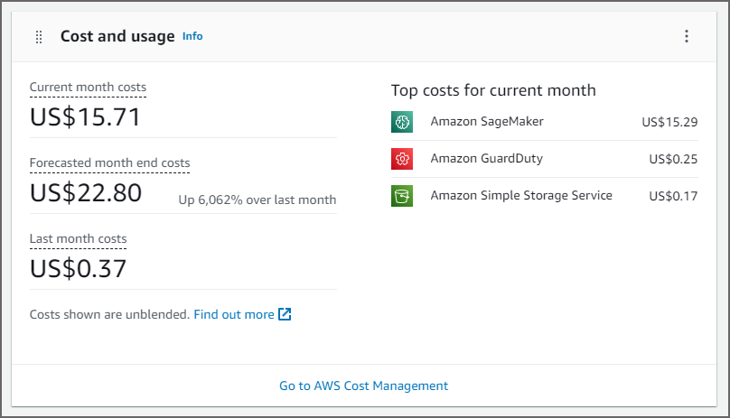
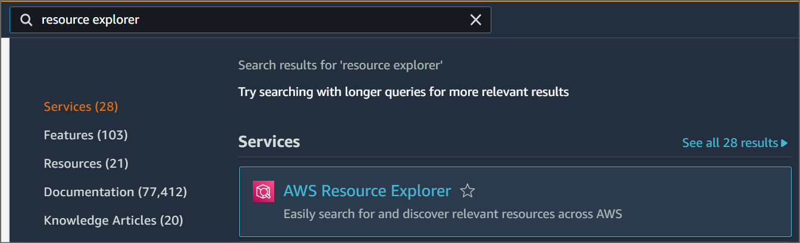
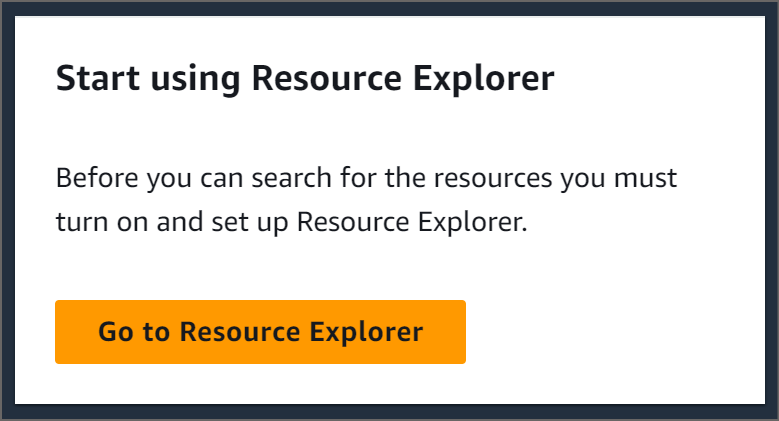
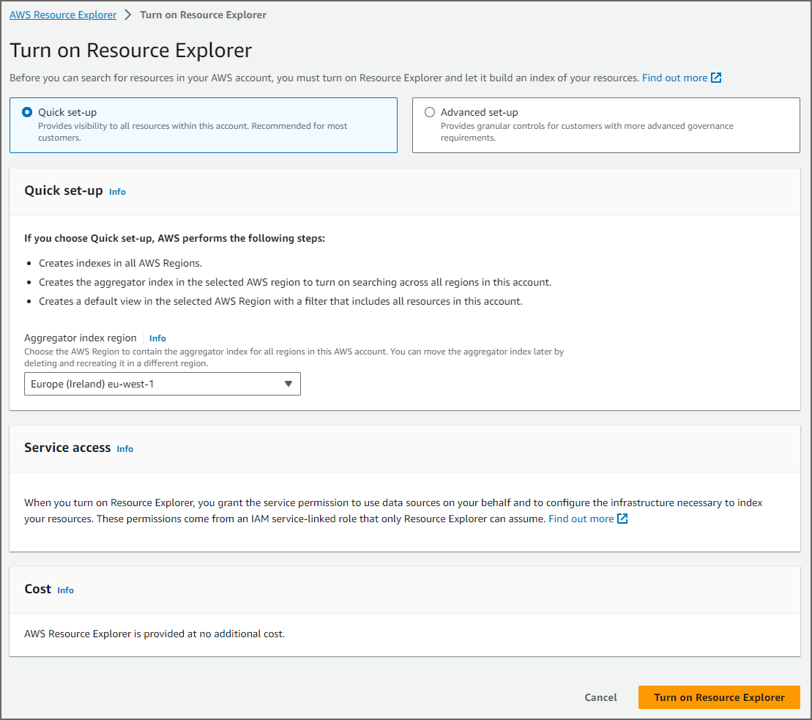
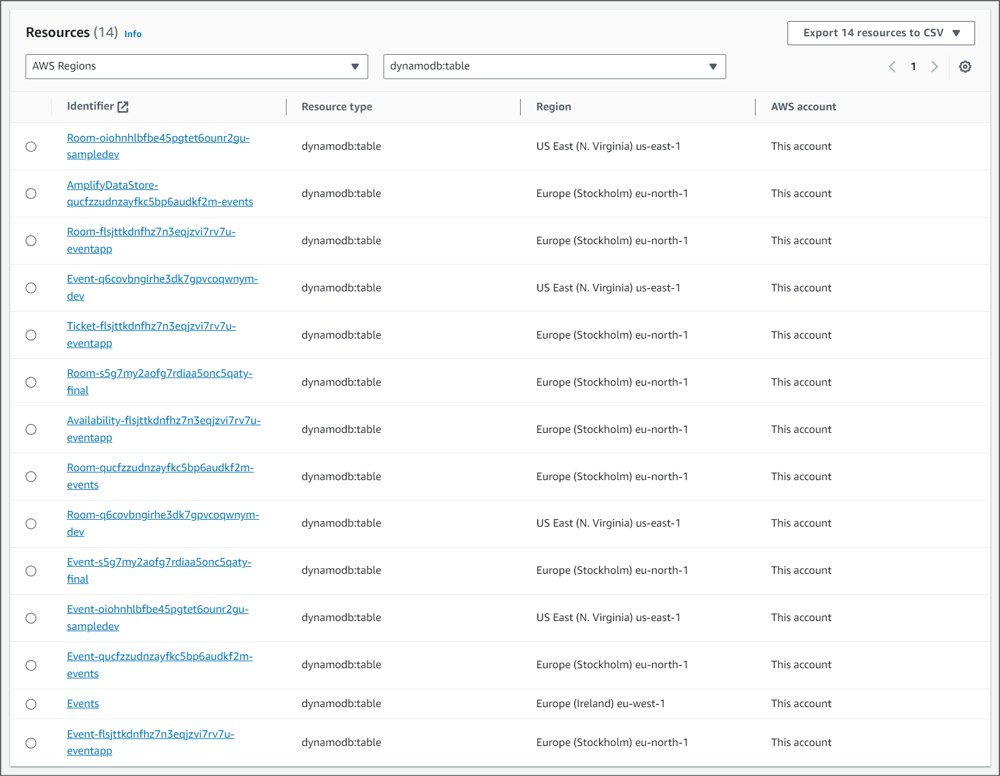
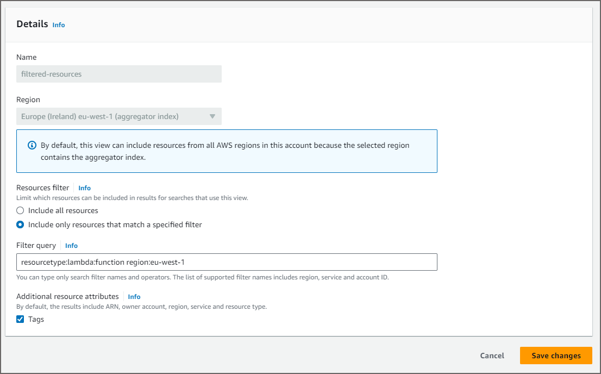

| ToC |
|-----|

Have you ever created AWS resources for a quick project and then forgotten about them? I definitely have! When I'm learning a new service or building a quick prototype, it's easy to spin up resources to try them out. However, when it comes to paying the bill, I only want to pay for what I need and use. This tutorial will show you how to identify unneeded resources with AWS Resource Explorer.

## Modern Cloud Development

I usually work with students and academics, but this topic applies to experienced developers too. When I was learning to code, long, long ago, the cloud didn't exist, so every resource I needed was created on my local device. This was limiting in some ways as my personal desktop might not be as powerful as the server that my code would eventually run on. This meant my local database server might have a slower disk, and I might only have a quarter of the RAM of the server. However, I could quickly stop locally running services and delete them from my limited hard disk space. If I forgot to do that, I'd quickly remember that I had a local server running when I tried to use my computer for anything else!

Nowadays, I develop on the cloud, which gives me access to far greater computing power than I could ever have on my local device. But with great power comes great responsibility, because I might forget to delete the resources I'm creating as:  

1. they are quick and easy to provision, use, and forget about, or  
2. they are supplementary resources that AWS automatically creates for me, such as an Amazon Simple Storage Service (S3) bucket for Amazon SageMaker Studio.

## Clean as You Go

Sometimes I describe a messy cloud account to students using a messy bedroom metaphor. Perhaps you are trying on different outfits before going out to a party. You might not be sure if you should dress up or down, or whether all the parts of your outfit match just right. If you end up trying everything in your wardrobe and 'forget' to put each item back after you try it on, you'll come home to find a messy bedroom full of clothes you've 'forgotten' to tidy away.  

No one likes having to tidy their bedroom when they're tired and just want to sleep, and AWS resources are similar. If you don't tidy them up as soon as you are finished with them, two things can happen:

* your account will end up like a messy bedroom with stuff lying about everywhere (or in lots of different AWS regions),
* some of these resources will cost you money every month, even if you are not actively using them. You created them, but didn't remove them, and now you will have to cover the cost. It may not be very much, but it adds up, and wouldn't you rather spend money on things you actually need, than no longer needed resources?  

Following a 'Clean as You Go' approach is better, and avoids a messy bedroom and AWS account. In case you didn't do that, I'm going to explain how unneeded resources can quickly add up, and how to identify them in this tutorial.

## How to Identify Unused Resources

Recently I was using [**AWS Amplify**](https://docs.aws.amazon.com/amplify/latest/userguide/welcome.html?sc_channel=el&sc_campaign=costwave&sc_content=tidy-your-bedroom&sc_geo=mult&sc_country=mult&sc_outcome=acq) to make a workshop for students learning serverless app development. Every time I tested an iteration of the workshop, I created an IAM user with only the minimum permissions needed to use Amplify. Amplify makes it easy to provision resources like storage, functions, NoSQL database tables and authentication. I diligently deleted the IAM user when each time I was finished, but that only removes the user, not the resources Amplify created.

Soon after this, I created an [Amazon SageMaker Studio](https://docs.aws.amazon.com/sagemaker/latest/dg/sm-domain.html?sc_channel=el&sc_campaign=costwave&sc_content=tidy-your-bedroom&sc_geo=mult&sc_country=mult&sc_outcome=acq) domain for a student demo. I had finished the demo, and no longer needed the Amazon SageMaker Studio domain. I thought I had switched off the service, but I hadn't deleted it yet.

Then I logged into my **AWS Management Console** to be greeted with an unexpected estimated cost:

I didn't think I had anything running in my account. But I soon discovered that the resources Amplify had provisioned for me were still active, waiting to be used, and costing me money each month. SageMaker Studio was patiently waiting for me to come back and do some more data science, and the cost was adding up. I no longer needed any of these resources, but I was presented with a challenge: how do I find **all** the S3 buckets, DynamoDB tables etc. that Amplify and SageMaker had created? 

To make it more complicated, I had written the Amplify workshop in the **eu-west-1** region, and tested it in different regions including **us-east-1** and **us-east-2** regions. How would I find *all* my resources in *all* my regions without an extensive hunt?  

The easiest way I have found is to use **[AWS Resource Explorer](https://docs.aws.amazon.com/resource-explorer/latest/userguide/welcome.html?sc_channel=el&sc_campaign=costwave&sc_content=tidy-your-bedroom&sc_geo=mult&sc_country=mult&sc_outcome=acq)**.  

## AWS Resource Explorer

AWS Resource Explorer makes it easy to search for resources in your AWS account. It supports a range of resource types such as Amazon S3 buckets or Amazon DynamoDB tables. Most conveniently, Resource Explorer works across multiple AWS Regions available to your account, making it easy to see an overview of what exists and where it is located.

AWS Resource Explorer does not charge for usage, but you do have to set it up and let it index all the resources before you can use it.  

The following tutorial steps will show you how to:

1. Set up AWS Resource Explorer
2. Find all resources in your account
3. Find specific resource types in your account
4. Create a custom view

*Note: AWS Resource Explorer does not support every single type of resource that exists. Some may not be supported yet or may be added in the future. It does support many of the common resource types, and you can check the whole list of [supported types](https://docs.aws.amazon.com/resource-explorer/latest/userguide/supported-resource-types.html?sc_channel=el&sc_campaign=costwave&sc_content=tidy-your-bedroom&sc_geo=mult&sc_country=mult&sc_outcome=acq).*  

### Step 1: Set Up AWS Resource Explorer

This is a one time step that only needs to be completed the first time you want to use AWS Resource Explorer.  

*Note:  This step can take some time to complete, especially if your account has lots of resources in many different regions. You should wait until this step is complete before proceeding to step 2.*

1. From AWS Console, search for `AWS Resource Explorer` using the search bar or the shortcut *Alt + S*.
2. Select AWS Resource Explorer:

3. On the Resource Explorer dashboard, select `Go to Resource Explorer` button:

4. Select **Quick set-up** which indexes all the regions available to the account. This is ideal for most users, especially students and new users who may not realize exactly what regions their resources are located in.  

5. Select **Aggregator index region**, I chose the closest region to me, *Europe (Ireland) eu-west-1*, but you can choose any region that your account has access to. Resource Explorer indexes every region and stores the aggregate (combined) results in this region.

6. Select **Turn on Resource Explorer** and prepare to wait a while as the indexes are set up and all the resources in each region are identified.

Remember, this step takes a while to run. The [docs](https://docs.aws.amazon.com/resource-explorer/latest/userguide/getting-started-setting-up.html?icmpid=docs_re_console_getting-started-setting-up&sc_channel=el&sc_campaign=costwave&sc_content=tidy-your-bedroom&sc_geo=mult&sc_country=mult&sc_outcome=acq) state:  

> "Tagged resources local to the index appear in search results within a few minutes. Untagged resources typically take less than two hours to appear, but can take longer when there is heavy demand. It can also can take up to an hour to complete the initial replication to a new aggregator index from all of the existing local indexes.".  

With that in mind, plan to set up AWS Resource Explorer at least a few hours before using it.  

### Step 2: Find All Resources in Your Account

Once AWS Resource Explorer has finished creating *indexes* for each region and creating a *view*, you open the view to find your existing resources.  

1. From AWS Console for AWS Resource Explorer, use the left navigation pane to go to `Resource search`.
2. The default view will open, and this may show a banner at the top stating `You can start searching immediately while we begin indexing the resources in your account. You might see incomplete results until indexing is complete, especially for cross-Region searches.`
   * I recommend waiting for this indexing to be complete, because otherwise you may miss resources that have not been indexed yet.

In my case, I had **724** resources!

Now, some of these are perfectly fine and should not be interfered with or deleted, as they are a normal part of my account and my day to day use of AWS.  

I want to narrow down the scope to resource types I *know* should be removed. To do this, I need to have some understanding of the different resource types that exist in AWS.  

**Note:** I can't just delete **everything**, as that would be reckless; some of the resources are important and should not be touched!  

### Step 3: Find Specific Resource Types in Your Account

However, I know that I should have no **DynamoDB tables**, **S3 buckets**, or **Lambda functions** right now. These were all created by Amplify and SageMaker (on my behalf).  

With that understanding, I decide to start with DynamoDB resources. You may not be able to follow these steps exactly if you do not have any DynamoDB tables in your account, but you can use any other resource type *that you are sure is unneeded* and follow the same steps.  

1. Open the list `All types` and select `DynamoDB:table`.
2. A filtered view will show only DynamoDB tables in all regions.
3. If you have too many to manage in different regions, you can filter by region too.

  

4. Now select each resource, and decide if it is needed. If it's no longer needed, click on the Identifier link or View in dynamodb console link and it will take you to that resource's AWS console page. You can then delete the resource. Ensure that only resources that are **not** needed are deleted. Backup the resource first, if unsure.

5. Once completed for DynamoDB tables, repeat the steps for `S3:buckets` and `lambda:functions`.  

*Note: If you have a great number of resources to be deleted, manually deleting them this way might take a **long** time, as each deletion will be challenged to ensure you are certain. If you are an advanced user, an AWS CLI query will list all the resources of a certain type in a certain region and you can pipe that output to a CLI delete function. This is beyond the scope of this post, but an option if you are comfortable with the CLI. If you are a student, I recommend understanding the AWS Console first, and then learning how to use the AWS CLI.*

### Step 4: Create a Custom View

It's possible that you will need an additional view for certain resource types. For instance, a lecturer who provisioned a separate Lambda function in a single region for each of their students might want a view showing only these resources.

1. From AWS Console for AWS Resource Explorer, use the left navigation pane to go to `View`.
2. Select `Create View`
3. Add any name (e.g., `filtered-resources`)
4. Select the region. In my case, it is **Europe (Ireland) eu-west-1**.
5. Select `Include only resources that match a specified filter`

6. Add the filter query, in this example, `resourcetype:lambda:function region:eu-west-1` will return only **Lambda functions** in the region **Europe (Ireland) eu-west-1**. You can check all the [query syntax](https://docs.aws.amazon.com/resource-explorer/latest/userguide/using-search-query-syntax.html?icmpid=docs_arex_hp_ss_create_resourcetype_wizard&sc_channel=el&sc_campaign=costwave&sc_content=tidy-your-bedroom&sc_geo=mult&sc_country=mult&sc_outcome=acq) for more complex queries.
7. Select `Create View`.

8. It will take some time to create each view, but once it is ready, you can see the results of the view and query by:

  * selecting `Resource search` from the left navigation pane and changing the `View` dropdown to your view's name or
  * selecting `Views`  from the left navigation pane, select the view of choice and then select `Explore resources`.

*Note: just like the default view, it can take several minutes to a few hours create the view, depending on the number of regions and number of resources you have. Expect it to take some time even on relatively small accounts.*

## Conclusion

It's easy for AWS resources to proliferate as we prototype, experiment, and learn new services. Like tidying a messy bedroom, identifying and removing unused resources takes some time and effort upfront but pays off in the long run with a clean account and reduced costs.  

AWS Resource Explorer is a valuable service to help understand what resources you have and where they are. This will help drill down to orphaned and unused resources, and let you identify what needs to be cleaned up.

Keeping your AWS resources in order is an important part of cloud cost optimization and fiscal responsibility. Regularly scan for resources you no longer need, delete what you won't use again, and make resource hygiene part of your workflow. Small efforts compound over time into significant savings and prevent billing surprises. Keep your cloud nice and tidy!  

*If you are a student interested in learning more about the AWS Community, please check out our [Student Hub](https://s12d.com/students).*

## About the Author

Stephen is an Academic Developer Advocate at AWS, supporting students and faculty on their cloud skills journey. When not teaching, learning, or tidying his bedroom, Stephen likes to [read | write | play] science fiction [books | stories | games] with his family.  
