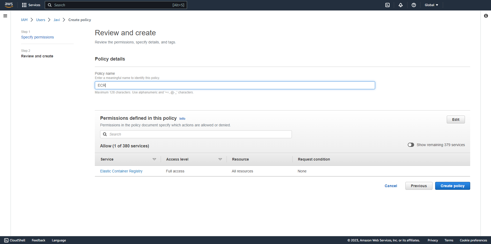

AWS Deep Learning Containers (DL Containers) are Docker images pre-installed with deep learning frameworks. DL Containers make it easy to deploy custom machine learning environments by skipping the complicated building process so you can optimize your environments from scratch.

Using AWS DL Containers, developers and data scientists can quickly add machine learning to their containerized applications. This can be deployed on the following:

- Amazon Elastic Container Service for Kubernetes (Amazon EKS)
- Self-managed Kubernetes
- Amazon Elastic Container Service (Amazon ECS)
- Amazon EC2

In this tutorial, you will train an MNIST CNN model with TensorFlow on an Amazon EC2 instance using AWS Deep Learning Containers.

## Table of Contents

| Attributes                |                                   |
| ------------------- | -------------------------------------- |
| ✅ AWS Level        | 100 - Beginner                          |
| ⏱ Time to complete  | 10 minutes                             |
| 💰 Cost to complete | Free when using the AWS Free Tier or less than $1 USD       |
| 🧩 Prerequisites    | [AWS Account](https://aws.amazon.com/resources/create-account/?sc_channel=el&sc_campaign=devopswave&sc_content=cicdcdkpthnec2aws&sc_geo=mult&sc_country=mult&sc_outcome=acq)                         |
| 📢 Feedback            | <a href="https://pulse.buildon.aws/survey/DEM0H5VW" target="_blank">Any feedback, issues, or just a</a> 👍 / 👎 ?    |
| ⏰ Last Updated     | 2023-07-07                             |

| ToC |
|-----|

## Adding permissions to access Amazon ECR

To get started, you need to add permissions to access the Amazon Elastic Container Registry (ECR). Amazon ECR is a fully-managed Docker container registry where developers can store, manage, and deploy Docker container images. AWS Deep Learning Container images are also hosted on Amazon ECR.

You will grant an existing IAM (Identity and access management) user with permissions to access Amazon ECR using [AmazonECS_FullAccess Policy](https://console.aws.amazon.com/iam/home?region=us-east-1#/policies/arn%3Aaws%3Aiam%3A%3Aaws%3Apolicy%2FAmazonECS_FullAccess). If you do not have an existing IAM user, refer to the [IAM Documentation](https://docs.aws.amazon.com/IAM/latest/UserGuide/access_policies_manage-attach-detach.html) for more information.

### Selecting users and adding permissions to the IAM console

First, open the [AWS Management Console](https://console.aws.amazon.com/console/home) and refer to this tutorial for step-by-step instruction. When the screen loads, enter your user name and password to get started. Type *IAM* into the search bar and select `IAM` to open the service console:

|||
|-|-|
| Next,  select `Users` from the navigation pane on the left: |  |
| Now you can add permissions to a newly created IAM user, or to an existing IAM user. Select `Add permissions` on the `Permissions` tab as in the following: |  |
| After selecting users and adding permissions, you can insert a couple of policies in the next step. |  |

### Adding the ECS Full Access and inline Policy

To add the ECS Full Access policy, select `Attach policies directly` and search for *ECS_FullAccess*. Then select the `AmazonECS_FullAccess` policy and press `Next`:


On the IAM user page, go to the `Permissions` tab and select `Add permissions`, then from the drop-down list, select `Create inline policy`: 


Now you can select the `JSON` tab and paste in the following policy:

```json
{ 
       "Version": "2012-10-17", 
       "Statement": [ 
              { 
                     "Action": "ecr:*", 
                     "Effect": "Allow", 
                     "Resource": "*" 
              } 
       ] 
} 
```


Enter the policy name as *ECR* and select `Create policy`:



With your policies added, you have finished adding permissions to access Amazon ECR. Next you’ll start up your AWS deep learning image.

## Launching an AWS Deep Learning Base AMI instance

You’ll use AWS Deep Learning Containers on an AWS Deep Learning [Base Amazon Machine Images (AMIs)](https://docs.aws.amazon.com/AWSEC2/latest/UserGuide/AMIs.html), which are pre-configured with essential dependencies. You can run Deep Learning Containers on any AMI with these packages.

First, return to the AWS Management Console home screen and type *EC2* in the search bar and select `EC2` to open the service console:


Go back to the Amazon EC2 console and press the `Launch Instance` button:


Next, you’ll have to select the name and tag for your EC2 instance. Provide a name for the instance and choose the `Browse more AMIs` option within the `Quick Start` section:


Choose the `AWS Marketplace AMIs` tab at the top, then search for *amazon linux 2023*.  Select `Amazon Linux 2023 AMI`:


Press `Continue`:


Now you can choose an Amazon EC2 instance type. Amazon Elastic Compute Cloud (EC2) is the Amazon Web Service you use to create and run virtual machines in the cloud. AWS calls these virtual machines 'instances'.

Here we use a `c5.large` instance, but you can choose additional instance types, including GPU-based instances such as G4, G5, P3, and P4.


Once you’ve launched your AWS Deep Learning Base AMI instance, next you will create a private key file to secure your instance with SSH.


### Creating a new private key file

On the `Key pair (login)` option, you will choose between using an existing key pair or creating a new key pair. A key pair is used to securely access your instance using SSH. AWS stores the public part of the key pair, and you can download the private part of the key pair. You use this private key to gain access.

If you have previously created a private key file that you can access, use your existing private key by selecting the name of your key pair under the `Select` option:


If you don’t have a key file already, select `Create new key pair` and provide a name. When your key is created and downloaded, you should store it in a secure location. If you lose your key, you won't be able to access your instance. Similarly, if someone else gains access to your key, they can access your instance. Therefore, placing your key in a secure location is highly recommended to protect your instance:


Now that you’ve created your private key file, you can proceed to launching your instance. You can leave the values for `Network Settings,` `Configure Storage,` and `Advanced Details` at their default settings.

Next, review the details of your instance and select `Launch instance`:


To view details about your instance, select the instance ID of your newly created Amazon EC2 on the console:


Next is connecting to your newly launched instance using SSH. The following instructions use a Mac/Linux environment. If you are using Windows, [follow step 4 in our tutorial on launching a virtual machine](https://aws.amazon.com/getting-started/tutorials/launch-a-virtual-machine/).

If you want to find and copy your instance’s public DNS, you can locate it by toggling to the `Details` tab and copy your Amazon EC2 instance’s `Public IPV4 DNS`:


### Installing Docker

Before installing Docker, you need to run a few commands in your terminal. Open your terminal prompt and navigate to the directory where your security key is located: 

```bash
cd /Users/<your_username>/Downloads/
```

Update your permissions using the `chmod` command: 

```bash
chmod 0400 <your .pem filename>
```

This lets you connect to your instance by running `SSH`: 

```bash
ssh -L localhost:8888:localhost:8888 -i <your .pem filename> ec2-user@<your instance DNS> 
```

The SSH connection is successful if you receive the following output: 


Now you’re ready to install Docker. Here we’re using a Red Hat/Fedora distribution Linux image, so run your installation command using `yum`: 

```bash
sudo yum install docker
```

After Docker is installed you can start the service with the following command:

```bash
sudo service docker start
```

With Docker installed and started, you can set up your Amazon Elastic Container Registry (ECR). 


### Logging into Amazon Elastic Container Registry (ECR)

In order to access images, you will login and verify access to Amazon ECR. To configure your EC2 instance, you need to provide your `AWS Access Key ID` and `Secret Access Key.` If you don’t already have this information, you can create an `Access Key ID` and `Secret Access Key` [by following these instructions](https://docs.aws.amazon.com/IAM/latest/UserGuide/id_credentials_access-keys.html#Using_CreateAccessKey).


Use the following command to log into Amazon ECR:

```bash
sudo su 
aws ecr get-login-password --region us-east-1 | docker login --username AWS --password-stdin 763104351884.dkr.ecr.us-east-1.amazonaws.com 
```


Now that your ECR is ready, you can set up your AWS Deep Learning Container in the next step. 


## Running TensorFlow training with AWS Deep Learning Containers

You are ready to use an AWS Deep Learning Container image on your EC2 instance. Here you’ll be doing TensorFlow training on CPU instances. You can use a command that automatically pulls the Deep Learning Container image if it doesn’t exist locally.

If you’re using a CPU instance, run:

```bash
docker run -it 763104351884.dkr.ecr.us-east-1.amazonaws.com/tensorflow-training:2.8.0-cpu-py39-ubuntu20.04-e3
```

*`Note:` This step may take a few minutes depending on the size of the image. If you are using a GPU instance, use ‘nvidia-docker’ instead of ‘docker.’ Once this step completes successfully, you enter a bash prompt for your container.*


Next, pull an example model to train by cloning the Keras repository. This includes example Python scripts to train models:

```bash
git clone https://github.com/gilinachum/keras
```


Start training the canonical MNIST CNN model with the following command:

```bash
python keras/mnist.py 
```

You have just successfully commenced training with your AWS Deep Learning Container:


After training the model with your AWS Deep Learning Container, next is learning how to clean up your resources. 


## Terminating Your Resources

Knowing how to terminate instances to reclaim your resources is just as important as knowing how to spin them up. Terminating resources that are not actively being used reduces costs and is a best practice. Not terminating your resources can result in charges to your account.

On the Amazon EC2 Console, select `Instances (running)`:


Select the EC2 instance you created and choose `Instance state` and then `Terminate instance` from the drop-down menu:


You will be asked to confirm your termination. Select `Terminate`:


*`Note:` This process can take several seconds to complete. Once your instance has been terminated, the `Instance state` will change to terminated on your EC2 Console.*


Your resources have now been successfully terminated. 


## Conclusion

You have successfully trained an MNIST CNN model with TensorFlow using AWS Deep Learning Containers.

You can use AWS DL Containers for training and inference on CPU and GPU resources on Amazon EC2, Amazon ECS, Amazon EKS, and Kubernetes.

Use these stable deep learning images, which have been optimized for performance and scale on AWS, to build your own custom deep learning environments.
