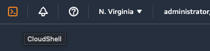
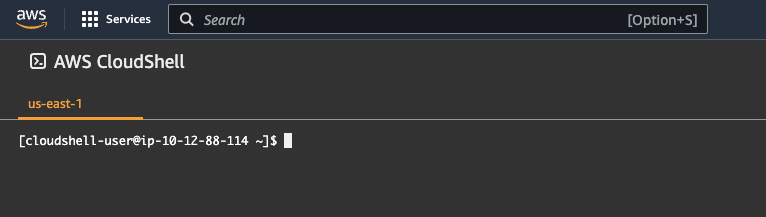
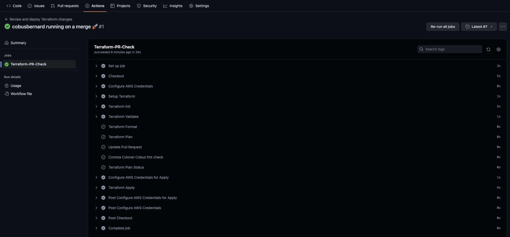

If you've ever had to manually manage infrastructure for multiple AWS accounts, you know how much work this can be if done by hand. Never mind all the documentation, onboarding of new team members, mistakes made along the way, and that Friday evening spent manually fixing production after one step in the deployment document had a missing step.

This guide will focus on showing you a way to manage multiple AWS accounts with [Terraform](https://www.terraform.io/) and [GitHub Actions](https://github.com/features/actions), and keep the 3 environments (dev, test, and prod) infrastructure in sync. If you want to take a look at all the code, or clone it to play locally, you can do so via the [main repo](https://github.com/build-on-aws/multiple-accounts-with-terraform-github-actions-main) (`git clone https://github.com/build-on-aws/multiple-accounts-with-terraform-github-actions-main.git`) and [base-environments repo](https://github.com/build-on-aws/multiple-accounts-with-terraform-github-actions-base-environments) (`git clone https://github.com/build-on-aws/multiple-accounts-with-terraform-github-actions-base-environments.git`). It is based on the [BOA328 re:Invent talk](https://www.youtube.com/watch?v=P6Ngme9KBqs) by [Emily Freeman](https://twitter.com/editingemily), [Julie Gunderson](https://twitter.com/Julie_Gund), and [Cobus Bernard](https://twitter.com/cobusbernard) - apologies for the audio, there were issues on the day. We will cover the following topics in this guide:

- Use [Amazon OpenID Connect](https://docs.aws.amazon.com/IAM/latest/UserGuide/id_roles_providers_create_oidc.html) to allow access from GitHub Actions to our AWS account without creating / managing long-lived credentials
- Using S3 as a backend for Terraform [state files](https://developer.hashicorp.com/terraform/language/state)
- GitHub Actions to run our CI/CD pipelines to deploy all infrastructure and services
- Use a [Makefile](https://opensource.com/article/18/8/what-how-makefile) to simplify CI/CD commands
- Manage all user access via Terraform
- Create an ECS cluster and deploy a demo service

| Attributes             |                                                                 |
|------------------------|-----------------------------------------------------------------|
| ✅ AWS experience      | 200 - Intermediate                                              |
| ⏱ Time to complete     | 60 minutes                                                      |
| 💰 Cost to complete    | Fee tier eligible                                               |
| 🧩 Prerequisites       | - [Docker](https://www.docker.com/get-started) 4.11+ (Required)<br>- [AWS Account](https://portal.aws.amazon.com/billing/signup#/start/email)<br>- [GitHub](https://github.com) account |

## Table of Contents

| ToC |
|-----|

## Overview

Let's take a look at a simplified multi-account layout of infrastructure:


In the diagram, there are four AWS accounts, one each for dev, test, and prod accounts, and one main account. The main account is where the [AWS IAM users](https://docs.aws.amazon.com/IAM/latest/UserGuide/introduction_identity-management.html) are created, with access to the 3 environments via [cross-account access](https://docs.aws.amazon.com/IAM/latest/UserGuide/tutorial_cross-account-with-roles.html), and the various ECR container image repositories for services. The environment accounts each have a load balancer, ECS cluster with a demo service and database running. The prod account has two copies of the demo service, with dev and test only having one. We will broadly group infrastructure into 3 buckets:

1. **Globally common infrastructure:** anything that is common regardless of the number of environments in use. These include users, container images, central services, etc.
2. **Environment common infrastructure:** anything that is the same in each environment, e.g. load-balancers, DNS, container clusters, etc, for environments like dev, test, and prod.
3. **Service specific infrastructure:** any infrastructure / config that is required by a service or system deployed to the environment accounts. There will be a repo per service that includes the source code as well as the infrastructure, and the CI/CD pipeline will ensure both are deployed together for each service.

### Security

Throughout this guide, we will ensure that we use a secure approach to the infrastructure we set up. We will set up access between our AWS accounts and GitHub to allow Terraform to create and manage infrastructure in the accounts, and deploy the demo service we will build. This will be done by [configuring GitHub Actions](https://docs.github.com/en/actions/deployment/security-hardening-your-deployments/configuring-openid-connect-in-amazon-web-services) to use Amazon OpenID Connect as an IdP. We will also set up very specific IAM permissions for the development and platform / DevOps teams - developers will have full access to dev and test accounts, but read-only to production, platform team members will have full access to all environments. Access to the AWS accounts will be managed via [AWS Organizations](https://docs.aws.amazon.com/organizations/index.html), [AWS SSO](https://docs.aws.amazon.com/singlesignon/) (with 2fa enforced) for both console and API access.

## Setting up the main account

Let's get started setting this up! The first step is to create a GitHub repo for our main infrastructure environment, for all the commands and instructions below, we will use `build-on-aws` as the GitHub org, `multiple-accounts-with-terraform-github-actions-main` as the repo name, and `123456789012` as the AWS Account ID. Go ahead and create a new repo now, using Terraform for the `.gitignore` template. Next, we need to add the required infrastructure to our AWS account - we will start with a single one, and create the environment accounts using Terraform from it. We need to create the following pieces of infrastructure:

1. **OpenID Connect provider for GitHub Actions**: The allows GitHub to authenticate to our AWS account.
2. **IAM roles**: Provides the role for GitHub Actions to assume in the account - one for the `main` branch, one for any pull requests (PRs).
3. **IAM policies**: Set the boundaries of what the GitHub Actions IAM role may do in our account - full admin access for `main` branch, `ReadOnly` for the PR branches.
4. **S3 bucket**: An S3 bucket to store our Terraform state files in.
5. **S3 bucket versioning**: Allows keeping backup copies of the Terraform state file each time it changes.
6. **DynamoDB Table**: Used by Terraform to create a lock - this prevents multiple CI jobs making changes when run in parallel.
7. **KMS Encryption Key**: (Optional) While the state file is stored in S3, we want to encrypt it while at rest using a KMS key. For this tutorial, we will use the pre-existing `aws/s3` key, please uncomment the last API call below to create a custom one ($1/month) if you require one.

The easiest way to create these resources are via AWS CLI commands using CloudShell in your account. You can start a session by clicking the CloudShell icon at the top right of the console as shown below in orange on the left:



This will open up a CloudShell session:



Change the values environment variables in the commands below for your setup, then paste it into the CloudShell window - make sure to press `enter` after pasting to ensure the last command also executes.

```bash
BUCKET_NAME="tf-gh-multi-account-buildon"
IAM_ROLE_NAME="GitHub-Actions-Main"
GH_ORG="build-on-aws"
GH_TF_MAIN_REPO="multiple-accounts-with-terraform-github-actions-main"
AWS_ACCOUNT_ID="123456789012"
AWS_REGION="us-east-1"
DYNAMODB_LOCK_TABLE="Terraform-Main-State-Lock"
KMS_KEY_ALIAS="Terraform-Main"

# Create local file with the IAM trust policy to allow our GitHub repo access to the IAM role for Terraform
# This is for the main branch, and will have full admin access.
#
# NB: The `ref:refs/heads/main` is *not* a typo, this is how GH Actions assumes the IAM role.
cat <<EOF > gh-iam-trust-policy.json
{
  "Version": "2012-10-17",
  "Statement": [{
    "Sid": "Statement1",
    "Effect": "Allow",
    "Principal": {
      "Federated": "arn:aws:iam::$AWS_ACCOUNT_ID:oidc-provider/token.actions.githubusercontent.com"

    },
    "Action": "sts:AssumeRoleWithWebIdentity",
    "Condition": {
      "StringLike": {
        "token.actions.githubusercontent.com:aud": "sts.amazonaws.com",
        "token.actions.githubusercontent.com:sub": "repo:$GH_ORG/$GH_TF_MAIN_REPO:ref:refs/heads/main"
      }
    }
  }]
}
EOF

# Create local file with the IAM trust policy to allow our GitHub repo access to the IAM role for Terraform
# This is for any PR branches, and will have read-only access.
#
# NB: The `ref:refs/heads/main` is *not* a typo, this is how GH Actions assumes the IAM role.
cat <<EOF > gh-pr-iam-trust-policy.json
{
  "Version": "2012-10-17",
  "Statement": [{
    "Sid": "Statement1",
    "Effect": "Allow",
    "Principal": {
      "Federated": "arn:aws:iam::$AWS_ACCOUNT_ID:oidc-provider/token.actions.githubusercontent.com"

    },
    "Action": "sts:AssumeRoleWithWebIdentity",
    "Condition": {
      "StringLike": {
        "token.actions.githubusercontent.com:aud": "sts.amazonaws.com",
        "token.actions.githubusercontent.com:sub": ["repo:$GH_ORG/$GH_TF_MAIN_REPO:ref:refs/heads/main", "repo:$GH_ORG/$GH_TF_MAIN_REPO:pull_request"]
      }
    }
  }]
}
EOF

# OpenID provider to allow GitHub Actions access to our AWS account. Thumbprint from:
# https://github.blog/changelog/2022-01-13-github-actions-update-on-oidc-based-deployments-to-aws/
aws iam create-open-id-connect-provider \
  --region $AWS_REGION \
  --url "https://token.actions.githubusercontent.com" \
  --client-id-list "sts.amazonaws.com" \
  --thumbprint-list "6938fd4d98bab03faadb97b34396831e3780aea1"

# IAM role that will be assumed from GitHub Actions using the trust policy for the main branch
aws iam create-role \
  --region $AWS_REGION \
  --role-name $IAM_ROLE_NAME \
  --assume-role-policy-document file://gh-iam-trust-policy.json
  
# IAM policy giving admin access to create all our infrastructure for the main branch
aws iam attach-role-policy \
  --region $AWS_REGION \
  --role-name $IAM_ROLE_NAME \
  --policy-arn arn:aws:iam::aws:policy/AdministratorAccess

# IAM role that will be assumed from GitHub Actions using the trust policy for any pull requests
aws iam create-role \
  --region $AWS_REGION \
  --role-name "$IAM_ROLE_NAME-PR" \
  --assume-role-policy-document file://gh-pr-iam-trust-policy.json
  
# IAM policy giving read-only access to run terraform plan on pull requests
aws iam attach-role-policy \
  --region $AWS_REGION \
  --role-name "$IAM_ROLE_NAME-PR" \
  --policy-arn arn:aws:iam::aws:policy/ReadOnlyAccess

# Creates the state file bucket for Terraform
aws s3api create-bucket \
  --region $AWS_REGION \
  --bucket $BUCKET_NAME \
  --acl private
  
# Add versioning to the bucket to keep copies in case something goes wrong
aws s3api put-bucket-versioning \
  --region $AWS_REGION \
  --versioning-configuration Status=Enabled \
  --bucket $BUCKET_NAME

# Create the DynamoDB Terraform lock table
aws dynamodb create-table \
  --region $AWS_REGION \
  --table-name $DYNAMODB_LOCK_TABLE \
  --attribute-definitions AttributeName=LockID,AttributeType=S \
  --key-schema AttributeName=LockID,KeyType=HASH \
  --provisioned-throughput ReadCapacityUnits=5,WriteCapacityUnits=5

# (Optional - uncomment if needed) Create a KMS encryption key and an alias for it
# TF_KMS_KEY_ID=$(aws kms create-key \
#   --region $AWS_REGION \
#   --query 'KeyMetadata.KeyId' \
#   --output text)

# aws kms create-alias \
#   --region $AWS_REGION \
#   --alias-name "alias/$KMS_KEY_ALIAS" \
#   --target-key-id "$TF_KMS_KEY_ID"


```

🚨🚨🚨 **SECURITY ALERT** 🚨🚨🚨

>In the IAM trust policies above, it is very important to take care with the GitHub repo org and repo name, while you can add wildcards to simplify access from multiple GitHub repos in your org, it is a security concern as this will provide full, admin level access to your AWS accounts. Access to the `main` repo should be restricted to as small a group as is possible, access is only needed when onboarding new team members, or doing some maintenance on the permissions of the `base-environment` accounts. We address this by creating two different IAM roles (with corresponding trust policies): the first one has admin access (needed to create infrastructure), and is restricted to changes made to the `main` branch via `ref:refs/heads/main`. The second is limited to read-only access for all pull requests (via `ref:refs/pull/*`) - this will allow Terraform to perform the `plan` step to show what infrastructure changes will be made in the PR, but deny any changes to the infrastructure. Please note that the `git` reference is subtly different to what you usually see: `ref:refs/heads/main` instead of `refs/heads/main` - this is a property of how GitHub Actions invokes the job. You should also enable [branch protection](https://docs.github.com/en/repositories/configuring-branches-and-merges-in-your-repository/defining-the-mergeability-of-pull-requests/about-protected-branches) on your GitHub repo, and [require 1+ reviewer approvals](https://docs.github.com/en/pull-requests/collaborating-with-pull-requests/reviewing-changes-in-pull-requests/about-pull-request-reviews) before merging any PR to your `main` branch.

## Setting up Terraform

We are now ready to start configuring Terraform to create the rest of the infrastructure in our main account. First, we create a directory inside our git repo for the main account, then a few empty files via:

```bash
mkdir infra
cd infra
touch providers.tf variables.tf outputs.tf main-account.tf environment-accounts.tf
```

When terraform is executed in a directory, it will concatenate all the `.tf` files, and determine the dependency graph for you. Each of the files we just created has a specific purpose - while you could put everything in a single file, it is easier to find specific parts of the infrastructure if it is grouped in a file specific for what it is for. The files are:

- **providers.tf:** Where we configure Terraform, and all the providers we are going to use for infrastructure (AWS, GitHub).
- **variables.tf:** Any variables that we want to use in our infra - grouping them in a file makes it easier to manage them.
- **outputs.tf:** Some values from our infrastructure are useful in other places, e.g. when we get to DNS, we will construct an output for the command to update the NS servers for our custom domain that you can copy & paste into CloudShell.
- **main-account.tf:** All the infrastructure inside our main account.
- **environment-accounts.tf:** Creates the base environment accounts, and any infrastructure we want to control from the main account, e.g. IAM roles to allow users to switch to the accounts.

Add the following to the `providers.tf` file, changing the S3 bucket name to the one you used earlier for the state files:

```bash
# State file setup
# State file setup
terraform {
  backend "s3" {
    bucket         = "tf-gh-multi-account-buildon"
    key            = "terraform/main"
    region         = "us-east-1"
    encrypt        = true
    kms_key_id     = "alias/aws/s3"
    dynamodb_table = "Terraform-Main-State-Lock"
  }

  required_providers {
    aws = {
      source  = "hashicorp/aws"
      version = "~> 4.0"
    }
  }
}

# Configure the AWS Provider
provider "aws" {
  region = "us-east-1"
}
```

Let's take a look at each section to understand what it does. First, the `terraform` configuration block:

```bash
  backend "s3" {
    bucket         = "tf-gh-multi-account-buildon"
    key            = "terraform/main"
    region         = "us-east-1"
    encrypt        = true
    kms_key_id     = "alias/aws/s3"
    dynamodb_table = "Terraform-Main-State-Lock"
  }
```

The values inside the `backend` block defines which [backend](https://developer.hashicorp.com/terraform/language/settings/backends/configuration) Terraform should use to store state, in this case the `"s3"` specifies the [S3 backend](https://developer.hashicorp.com/terraform/language/settings/backends/s3). If you do not specify a backend, it will save the state file locally in the `.terraform` directory, and it is up to you to figure out how to keep it safe and distribute it to the rest of the team. This is definitely not ideal. The fields inside are for the following:

- `bucket`: which s3 bucket to use
- `key`: which key (if any) to use inside the bucket for the state file
- `region`: which region the bucket is in - note that this can be different from the region that the AWS provider uses, which is why we specify it there as well
- `encrypt`: indicates we want to encrypt the state file while at rest in S3
- `kms_key_id`: which KMS key to use (replace this with the alias or ARN if you created a key earlier)
- `dynamodb_table`: the DynamoDB table to use for locking to ensure that only one instance of Terraform can apply changes at a time

Next, we specify the `required_providers` that Terraform should use to allow us to be specific about which version.

```bash
  required_providers {
    aws = {
      source  = "hashicorp/aws"
      version = "~> 4.0"
    }
```

The `source` indicates which provider to use from the [Terraform Registry](https://registry.terraform.io/), and the `hashicorp` part indicates the one published by Hashicorp. The `~> 4.0` uses [semantic versioning](https://semver.org/) (semver for short) to specify we need version 4 of the [AWS provider](https://registry.terraform.io/providers/hashicorp/aws/latest/docs), and the `~` ("tilde") specifies to use any version from `4.0` and update to any future `4.x` versions.

Lastly, we configure the AWS provider via:

```bash
provider "aws" {
  region = "us-east-1"
}
```

The `region` field indicates which region to use by default, but can be overridden in resources later by specifying `region = "some-other-region"` if you need to create a resource in a different region.

This is all we need to start building the CI/CD pipeline in GitHub Actions to use Terraform, we will continue further down by adding infrastructure to our `main` account.

## Setting up GitHub Actions workflow

We are now ready to set up our CI/CD pipeline to use Terraform. GitHub Actions uses [Yaml workflow](https://docs.github.com/en/actions/using-workflows/workflow-syntax-for-github-actions) files to define each pipeline. We will be using conditional logic in the workflow to determine if it is run on a PR, or on the `main` branch. All changes should be done via a PR, reviewed, tested, and only merged after these steps. When first setting up a GitHub Actions workflow, it needs to be created on the `main` branch before any PR can have a workflow. We will be committing the Terraform code we've written so far that only initializes the backend to do this. Now, create a new file in `.github/workflows/terraform.yaml`, and add the following to it (we will cover each step further down).

> **Please ensure you update the placeholder AWS Account ID of `123456789012` with your one - there are two instances that need to be replaced:**

```yaml
name: Review and deploy Terraform changes
run-name: ${{ github.actor }} running on a merge 🚀
on:
    push:
        branches:
          - main
        pull_request:
          branches:
             - main
        
permissions:
  id-token: write   # This is required for requesting the JWT
  contents: read    # This is required for actions/checkout
        
jobs:
  Terraform-PR-Check:
    runs-on: ubuntu-latest
    steps:
        # Checkout the repository to the GitHub Actions runner
        - name: Checkout
          uses: actions/checkout@v3

        # Configure AWS credentials to use to connect to account use limited PR IAM role
        - name: Configure AWS Credentials
          uses: aws-actions/configure-aws-credentials@v1
          with:
            role-to-assume: arn:aws:iam::123456789012:role/GitHub-Actions-Main-PR
            role-session-name: gh-actions-main
            aws-region: us-east-1
          
        # Install the preferred version of Terraform CLI 
        - name: Setup Terraform
          uses: hashicorp/setup-terraform@v1
          with:
            terraform_version: 1.3.1

        # Run terraform init to enable running on a clean worker node
        - name: Terraform Init
          id: init
          run: terraform init -no-color
          
        # Make sure the terraform submitted is valid
        - name: Terraform Validate
          id: validate
          run: terraform validate -no-color
        
        # Ensure the terraform code is properly formatted
        - name: Terraform Format
          id: fmt
          run: terraform fmt -check -no-color
          continue-on-error: true
                      
        # Generate the plan
        - name: Terraform Plan
          id: plan
          if: github.event_name == 'pull_request'
          run: terraform plan -no-color -input=false
          continue-on-error: true
          
        # Add a comment to the PR with output details
        - name: Update Pull Request
          id: update-pr
          uses: actions/github-script@v6
          if: github.event_name == 'pull_request'
          env:
            PLAN: "terraform\n${{ steps.plan.outputs.stdout }}"
          with:
            github-token: ${{ secrets.GITHUB_TOKEN }}
            script: |
              const output = `#### Terraform Format and Style 🖌\`${{ steps.fmt.outcome }}\`
              #### Terraform Initialization ⚙️\`${{ steps.init.outcome }}\`
              #### Terraform Plan 📖\`${{ steps.plan.outcome }}\`
              #### Terraform Validation 🤖\`${{ steps.validate.outcome }}\`
        
              <details><summary>Show Plan</summary>
        
              \`\`\`\n
              ${process.env.PLAN}
              \`\`\`
        
              </details>
        
              *Pushed by: @${{ github.actor }}, Action: \`${{ github.event_name }}\`*`;
        
              github.rest.issues.createComment({
                issue_number: context.issue.number,
                owner: context.repo.owner,
                repo: context.repo.repo,
                body: output
              })
              
        # Comma Colonel Cobus checking in, fail if you didn't format correctly
        - name: Comma Colonel Cobus fmt check
          if: steps.fmt.outcome == 'failure'
          run: exit 1
              
        # Make sure to fail the job if planning failed
        - name: Terraform Plan Status
          if: steps.plan.outcome == 'failure'
          run: exit 1
        
        # Switch to different credentials when ready to apply changes
        # Configure AWS credentials to use to connect to account use full access main branch IAM role
        - name: Configure AWS Credentials
          uses: aws-actions/configure-aws-credentials@v1
          with:
            role-to-assume: arn:aws:iam::123456789012:role/GitHub-Actions-Main
            role-session-name: gh-actions-main
            aws-region: us-east-1


          if: github.ref == 'refs/heads/main' && github.event_name == 'push'

        # Only apply if this is on the main branch (after merging)
        - name: Terraform Apply
          if: github.ref == 'refs/heads/main' && github.event_name == 'push'
          run: terraform apply -auto-approve -input=false

```

The workflow is based on the [Terraform GitHub Actions](https://developer.hashicorp.com/terraform/tutorials/automation/github-actions) tutorial, and we will only cover a subset of details here, or where we deviate from it. The workflow is broken into sections, let's take a look at each. First up is the following section:

```yaml
name: Review or deploy Terraform changes
run-name: ${{ github.actor }} running on a merge 🚀
on:
    push:
        branches:
          - main
        pull_request:
          branches:
             - main
```

This sets the `name` for the workflow to display on GitHub, along with a descriptive `run-name`. The `on` block defines when the job should run, in our case, on any push to the `main` branch, and also when a pull requests is opened / updated to merge to `main`.

The `permissions` section defines what the job runner is allowed to access:

```yaml
permissions:
  id-token: write   # This is required for requesting the JWT
  contents: read    # This is required for actions/checkout
```

We are allowing it `write` permission to the JWT token to allow the job runner to request a JWT token from GitHub's OIDC provider - for more details, have a look at the [GitHub Actions Security](https://docs.github.com/en/actions/deployment/security-hardening-your-deployments/about-security-hardening-with-openid-connect#adding-permissions-settings) page. We also allow it access to read the content of the repo, but not make any changes via `contents: read`. In some scenarios you may want to allow changes, e.g. if you wanted to enforce the `terraform fmt` command's formatting by fixing any files, and committing them when the job runs.

The steps in our pipeline are defined in the next section for `jobs`. All the jobs use the `ubuntu-latest` [GitHub runner](https://docs.github.com/en/actions/using-github-hosted-runners/about-github-hosted-runners) - you can look at the [full list](https://docs.github.com/en/actions/using-workflows/workflow-syntax-for-github-actions#jobsjob_idruns-on) if you need to use a different runner, e.g. if you are building an application that requires MacOS or Windows Server. We only set up a single job, and differentiate between PRs and `main` branch pushes using `if: github.event_name == 'pull_request'` and `github.ref == 'refs/heads/main' && github.event_name == 'push'`. The reasoning is that a number of steps would be duplicated (code checkout, installing / initializing Terraform) if we use multiple jobs. We also set a default `working-directory` value for `./infra` as we keep our infrastructure code in a sub-directory relative to the application code - while the first two repos in this tutorial don't have any application code, it is less confusing / error-prone to follow the same pattern across all repo's.

Please pay close attention to the two `Configure AWS Credentials` steps - for all the steps, except the last, we limit the permissions to not allow any changes via the PR IAM role, and then switch to the role that can make changes before the last `Terraform apply` step - we limit this to only allow changes on the `main` branch using `if: github.ref == 'refs/heads/main' && github.event_name == 'push'` in the step definition.

Lastly, we use the following to output the various results of the steps in our build job - the reason we allow continuing after some steps fail is to show where and what failed. This will allow the person to address as many issues in one go as possible, instead of fixing the formatting, updating the PR, then seeing there were syntax issues, fixing that, then having the `plan` step fail, etc.

```yaml
  `#### Terraform Format and Style 🖌\`${{ steps.fmt.outcome }}\`
  #### Terraform Initialization ⚙️\`${{ steps.init.outcome }}\`
  #### Terraform Plan 📖\`${{ steps.plan.outcome }}\`
  #### Terraform Validation 🤖\`${{ steps.validate.outcome }}\`
```

To print the `plan` output, we store the output as an environment variable via:

```yaml
  env:
    PLAN: "terraform\n${{ steps.plan.outputs.stdout }}"
```

And then output the text between the `<details> </details>` html tags using `${process.env.PLAN}`. Lastly, we use the GitHub CLI to write this as a comment to the PR:

```yaml
github.rest.issues.createComment({
                issue_number: context.issue.number,
                owner: context.repo.owner,
                repo: context.repo.repo,
                body: output
              })
```

We are now ready for the first run of our pipeline on `main`. Commit the files, and push the changes to GitHub. Head over to `https://github.com/<name>/<repo-name>/actions`, and confirm the job was successful - output should be similar to the image below:



We are now ready to create our environment accounts, set them up to use GitHub Actions, and create our users along with IAM policies defining their access to the `dev`, `test`, and `prod` accounts.

### Creating environment accounts

Now that the base pipeline is in place, it is time to start using it. Create a new local branch using `git checkout -b add-environment-accounts`. We will be setting up three additional AWS accounts for `dev`, `test`, and `prod` using Terraform, and AWS Organizations. We will create a number of different files:

`variables.tf` - used to define variables used for the infrastructure we are creating - we group them into a single file to make it easier to manage. Using the `+` in an email address allows you to create a unique value to register an AWS account without needing to set up multiple email accounts / mailing lists. This a requirement as the email you register an account with needs to be unique. The mails for the below will be sent to `my-email@example.com`, with the `+dev|test|prod` parts appended and viewable in the `TO` field. We also specify the IAM role name that will be used when creating the environment accounts to allow assuming roles inside them as users in the main account.

```bash
variable "iam_account_role_name" {
  type    = string
  default = "admin"
}

variable "account_emails" {
  type = map(any)
  default = {
    dev : "my-email+dev@example.com",
    test : "my-email+test@example.com",
    prod : "my-email+prod@example.com",
  }
}
```

`aws-accounts.tf` - creates our environment accounts using the values we set in the `variables.tf` file. It uses AWS Organizations, sets up organizational units, and links the AWS accounts to the appropriate units.

```bash
# Set up the organization
resource "aws_organizations_organization" "org" {
  aws_service_access_principals = [
    "cloudtrail.amazonaws.com",
    "config.amazonaws.com",
    "sso.amazonaws.com",
  ]

  feature_set = "ALL"
}

# Create a new OU for environment accounts
resource "aws_organizations_organizational_unit" "environments" {
  name      = "environments"
  parent_id = aws_organizations_organization.org.roots[0].id
}

# Create a new AWS account called "dev"
resource "aws_organizations_account" "dev" {
  name      = "dev"
  email     = lookup(var.account_emails, "dev")
  role_name = var.iam_account_role_name
  parent_id = aws_organizations_organizational_unit.environments.id

  depends_on = [aws_organizations_organization.org]
}

# Create a new AWS account called "test"
resource "aws_organizations_account" "test" {
  name      = "test"
  email     = lookup(var.account_emails, "test")
  role_name = var.iam_account_role_name
  parent_id = aws_organizations_organizational_unit.environments.id

  depends_on = [aws_organizations_organization.org]
}

# Create a new AWS account called "prod"
resource "aws_organizations_account" "prod" {
  name      = "prod"
  email     = lookup(var.account_emails, "prod")
  role_name = var.iam_account_role_name
  parent_id = aws_organizations_organizational_unit.environments.id

  depends_on = [aws_organizations_organization.org]
}
```

### Using a Makefile for environment accounts

#### Set up GitHub Actions CI/CD pipeline

#### Adding the base infrastructure

LB
DNS
ECS cluster

### Creating a module for services

### Deploying our service

### Cleanup

### Conclusion
