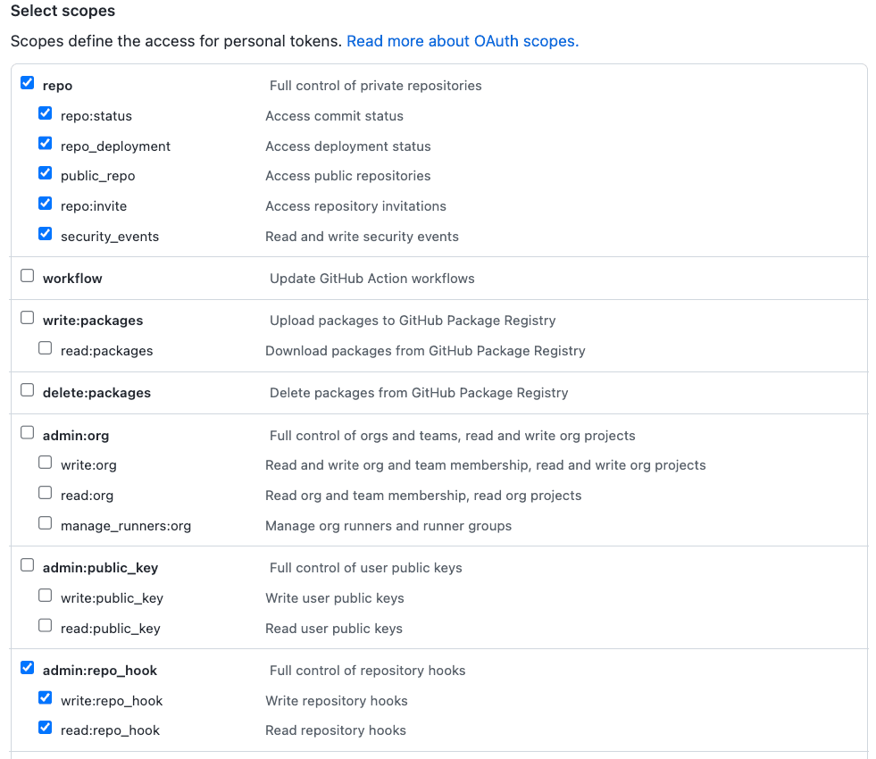
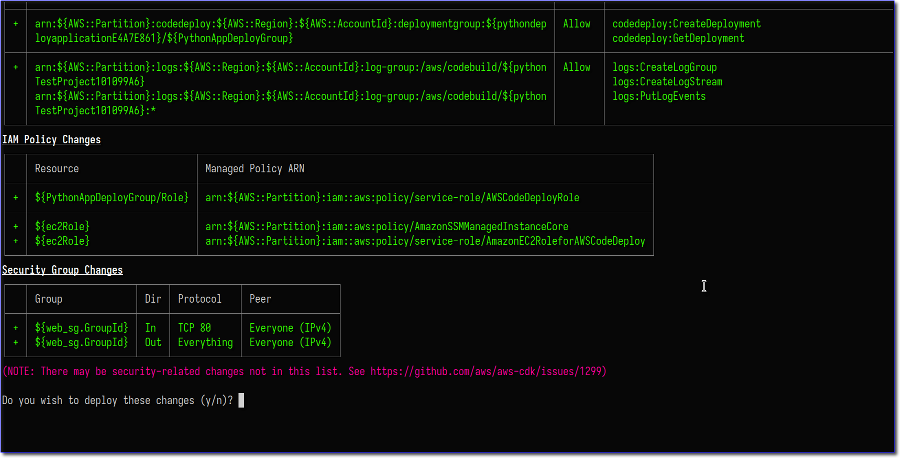

Manually setting up and configuring the packages required to run a Python web app using [Nginx](https://www.nginx.com/) and [uWSGI](https://uwsgi-docs.readthedocs.io/en/latest/) on a server can be time consuming — and it's tough to accomplish without any errors. But why do that hard work when you can automate it? Using [AWS CDK](https://docs.aws.amazon.com/cdk/api/v2/?sc_channel=el&sc_campaign=devopswave&sc_content=cicdcdkebaws&sc_geo=mult&sc_country=mult&sc_outcome=acq), we can set up [user data](https://docs.aws.amazon.com/AWSEC2/latest/UserGuide/user-data.html?sc_channel=el&sc_campaign=devopswave&sc_content=cicdcdkebaws&sc_geo=mult&sc_country=mult&sc_outcome=acq) scripts and an infrastructure to preconfigure an EC2 instance - which in turn will turn a manual, time-intensive process into a snap. In this tutorial, we will be using a combination of bash scripts and [AWS CodeDeploy](https://docs.aws.amazon.com/codedeploy/latest/userguide/welcome.html?sc_channel=el&sc_campaign=devopswave&sc_content=cicdcdkebaws&sc_geo=mult&sc_country=mult&sc_outcome=acq) to install and configure Nginx and uWSGI, set up a `systemd` service for uWSGI, and copy our application using CDK. Then, we are going to deploy our Python-based web application from a GitHub repository. We will cover how to:

- Create an AWS CDK stack with an Amazon EC2 instance, a CI/CD Pipeline, and the required resources for it to operate.
- Install software packages on the EC2 instance's first launch by creating a user data asset.
- Test, Deploy and Configure the web application using the CI/CD pipeline.

## Table of Contents

| Attributes             |                                                                 |
|------------------------|-----------------------------------------------------------------|
| ✅ AWS experience      | Beginner                                                        |
| ⏱ Time to complete    | 60 minutes                                                      |
| 💰 Cost to complete    | [Free tier](https://aws.amazon.com/free/) eligible                                               |
| 🧩 Prerequisites       | - [AWS account](https://aws.amazon.com/resources/create-account/)<br>-CDK installed: Visit [Get Started with AWS CDK](https://aws.amazon.com/getting-started/guides/setup-cdk/) to learn more.  |
| 💻 Code Sample         | Code sample used in tutorial on [GitHub](https://github.com/build-on-aws/sample-python-web-app)                             |
| 📢 Feedback            | <a href="https://pulse.buildon.aws/survey/DEM0H5VW" target="_blank">Any feedback, issues, or just a</a> 👍 / 👎 ?    |
| ⏰ Last Updated        | 2023-04-11                                                      |

| ToC |
|-----|

## Introduction

To deploy this web application we will be using AWS CDK to create and deploy the underlying infrastructure. This infrastructure will consist of an EC2 instance, a VPC, CI/CD pipeline, and accompanying resources required for it to operate (Security Groups and IAM permissions).

### Setting up the CDK project
First, let's check if our CDK version is up to date — this guide is based on v2 of the CDK. If you are still using v1, please read through the [migration docs](https://docs.aws.amazon.com/cdk/v2/guide/migrating-v2.html?sc_channel=el&sc_campaign=devopswave&sc_content=cicdcdkebaws&sc_geo=mult&sc_country=mult&sc_outcome=acq). To check the version, run the following:

```bash
cdk --version

# 2.35.0 (build 85e2735)
```

If you see output showing `1.x.x`, or you just want to ensure you are on the latest version, run the following:

```bash
npm install -g aws-cdk
```

We will now create the skeleton CDK application using TypeScript as our language of choice:

```bash
mkdir ec2-cdk
cd ec2-cdk
cdk init app --language typescript

# Output:

Applying project template app for typescript
# Welcome to your CDK TypeScript project

This is a blank project for CDK development with TypeScript.

The `cdk.json` file tells the CDK Toolkit how to execute your app.

## Useful commands

* `npm run build`  compile typescript to js
* `npm run watch`  watch for changes and compile
* `npm run test` perform the jest unit tests
* `cdk deploy` deploy this stack to your default AWS account/region
* `cdk diff` compare deployed stack with current state
* `cdk synth`  emits the synthesized CloudFormation template

Initializing a new git repository...
Executing npm install...
npm WARN deprecated w3c-hr-time@1.0.2: Use your platform's native performance.now() and performance.timeOrigin.
npm notice 
npm notice New patch version of npm available! 8.19.2 → 8.19.3
npm notice Changelog: https://github.com/npm/cli/releases/tag/v8.19.3
npm notice Run npm install -g npm@8.19.3 to update!
npm notice 
✅ All done!
```

### Create the Code for the Resource Stack

CDK uses the folder name for the files it generates. For this tutorial, we will be using `ec2-cdk`. If you named your directory differently, please replace this with the folder name you used. To start adding infrastructure, go to the file `lib/ec2-cdk-stack.ts`. This is where we will write the code for the resource stack you are going to create.

A resource stack is a set of cloud infrastructure resources (in your particular case, they will be all AWS resources) that will be provisioned into a specific account. The account and Region where these resources are provisioned can be configured in the stack — which we will cover later on.

In this resource stack, you are going to create the following resources:

- IAM roles: This role will be assigned to the EC2 instance to allow it to call other AWS services.
- EC2 instance: The virtual machine you will use to host your web application.
- Security group: The virtual firewall to allow inbound requests to your web application.
- Secrets manager secret: This is a place where you will store your Github Token that we will use to authenticate the pipeline to it.
- CI/CD Pipeline: This pipeline will consist of [AWS CodePipeline](https://docs.aws.amazon.com/codepipeline/latest/userguide/welcome.html?sc_channel=el&sc_campaign=devopswave&sc_content=cicdcdkebaws&sc_geo=mult&sc_country=mult&sc_outcome=acq), [AWS CodeBuild](https://docs.aws.amazon.com/codebuild/latest/userguide/welcome.html?sc_channel=el&sc_campaign=devopswave&sc_content=cicdcdkebaws&sc_geo=mult&sc_country=mult&sc_outcome=acq), and [AWS CodeDeploy](https://docs.aws.amazon.com/codedeploy/latest/userguide/welcome.html?sc_channel=el&sc_campaign=devopswave&sc_content=cicdcdkebaws&sc_geo=mult&sc_country=mult&sc_outcome=acq).

### Create the EC2 Instance

In this segment we will create the EC2 instance and its required resources. During the course of this tutorial, there will be code checkpoints where we show what the full file should look like at that point. We do recommend following step-by-step by typing out or copying and pasting the sample code blocks to ensure you understand what each code block does.

To start off, we will create the needed IAM role for your EC2 instance. This role will be used to give your instance permission to interact with [AWS Systems Manager](https://docs.aws.amazon.com/systems-manager/latest/userguide/what-is-systems-manager.html?sc_channel=el&sc_campaign=devopswave&sc_content=cicdcdkebaws&sc_geo=mult&sc_country=mult&sc_outcome=acq) and AWS CodeDeploy. This will be important later in the tutorial. To get started, make sure you import the following modules into your main stack. (`lib/ec2-cdk-stack.ts`):

```typescript
import { readFileSync } from 'fs';
import { Vpc, SubnetType, Peer, Port, AmazonLinuxGeneration, 
  AmazonLinuxCpuType, Instance, SecurityGroup, AmazonLinuxImage,
  InstanceClass, InstanceSize, InstanceType
} from 'aws-cdk-lib/aws-ec2';
import { Role, ServicePrincipal, ManagedPolicy } from 'aws-cdk-lib/aws-iam';
```

Then add the following lines to create a role and attach the needed managed IAM Policies:

```typescript
    const webServerRole = new Role(this, "ec2Role", {
      assumedBy: new ServicePrincipal("ec2.amazonaws.com"),
    });

    // IAM policy attachment to allow access to
    webServerRole.addManagedPolicy(
      ManagedPolicy.fromAwsManagedPolicyName("AmazonSSMManagedInstanceCore")
    );

    webServerRole.addManagedPolicy(
      ManagedPolicy.fromAwsManagedPolicyName("service-role/AmazonEC2RoleforAWSCodeDeploy")
    );
```

Next step is to create a VPC where our EC2 instance will be residing. We are creating a VPC with three Public subnets only, so there will be no NAT Gateways, or private subnets.

```typescript
    // This VPC has 3 public subnets, and that's it
    const vpc = new Vpc(this, 'main_vpc',{
      subnetConfiguration: [
        {
          cidrMask: 24,
          name: 'pub01',
          subnetType: SubnetType.PUBLIC,
        },
        {
          cidrMask: 24,
          name: 'pub02',
          subnetType: SubnetType.PUBLIC,
        },
        {
          cidrMask: 24,
          name: 'pub03',
          subnetType: SubnetType.PUBLIC,
        }
      ]
    });
```

We also need to be able to access our instance via `http` (port 80). To allow traffic to this port, we need to set up firewall rules by creating a [security group](https://docs.aws.amazon.com/vpc/latest/userguide/VPC_SecurityGroups.html?sc_channel=el&sc_campaign=devopswave&sc_content=cicdcdkebaws&sc_geo=mult&sc_country=mult&sc_outcome=acq). We will set up port 80 to allow HTTP traffic to come to the instance from any location on the internet.

```typescript
    // Security Groups
    // This SG will only allow HTTP traffic to the Web server
    const webSg = new SecurityGroup(this, 'web_sg',{
      vpc,
      description: "Allows Inbound HTTP traffic to the web server.",
      allowAllOutbound: true,
    });

    webSg.addIngressRule(
      Peer.anyIpv4(),
      Port.tcp(80)
    );
```

We're now ready to create the EC2 instance using a pre-built [Amazon Machine Image](https://docs.aws.amazon.com/AWSEC2/latest/UserGuide/AMIs.html?sc_channel=el&sc_campaign=devopswave&sc_content=cicdcdkebaws&sc_geo=mult&sc_country=mult&sc_outcome=acq) (AMI - pronounced "Ay-Em-Eye") — for this tutorial, we will be using the [Amazon Linux 2](https://aws.amazon.com/amazon-linux-2/?sc_channel=el&sc_campaign=devopswave&sc_content=cicdcdkebaws&sc_geo=mult&sc_country=mult&sc_outcome=acq) AMI for X86_64 CPU architecture. We will also pass the IAM role and VPC created earlier, and the instance type to run on, in your case, a `t2.micro` that has 1 vCPU and 1GB of memory. If you are running this tutorial in one of the newer AWS Regions, the `t2.micro` type may not be available. Just use the `t3.micro` one instead. To view all the different instance types, see the [EC2 instance types page](https://aws.amazon.com/ec2/instance-types/?sc_channel=el&sc_campaign=devopswave&sc_content=cicdcdkebaws&sc_geo=mult&sc_country=mult&sc_outcome=acq).

```typescript
    // the AMI to be used for the EC2 Instance
    const ami = new AmazonLinuxImage({
      generation: AmazonLinuxGeneration.AMAZON_LINUX_2,
      cpuType: AmazonLinuxCpuType.X86_64,
    });

    // The actual Web EC2 Instance for the web server
    const webServer = new Instance(this, 'web_server',{
      vpc,
      instanceType: InstanceType.of(
        InstanceClass.T2,
        InstanceSize.MICRO,
      ),
      machineImage: ami,
      securityGroup: webSg,
      role: webServerRole,
    });
```

Finally we are attaching User Data and tagging the instance with specific tags. The user data is used to bootstrap the EC2 instance and install specific application packages on the instance's first boot. The tags are used by Systems Manager to identify the instance later on for deployments.

Here is the user data bash script we will be attaching to the EC2 Instance. Make sure this code sits in a file named `configure_amz_linux_sample_app.sh` in the `assets` directory in the root of your CDK Application.

```bash
#!/bin/bash -xe
# Install OS packages
yum update -y
yum groupinstall -y "Development Tools"
amazon-linux-extras install -y nginx1
yum install -y nginx python3 python3-pip python3-devel ruby wget
pip3 install pipenv wheel
pip3 install uwsgi

# Code Deploy Agent
cd /home/ec2-user
wget https://aws-codedeploy-us-west-2.s3.us-west-2.amazonaws.com/latest/install
chmod +x ./install
./install auto
```

Now, use CDK to attach the user data script and add tag the instance:

```typescript
    // User data - used for bootstrapping
    const webSGUserData = readFileSync('./assets/configure_amz_linux_sample_app.sh','utf-8');
    webServer.addUserData(webSGUserData);
    // Tag the instance
    cdk.Tags.of(webServer).add('application-name','python-web')
    cdk.Tags.of(webServer).add('stage','prod')
```

Additionally, we will configure outputs to easily track down the EC2 instance's IP address:

```typescript
    // Output the public IP address of the EC2 instance
    new cdk.CfnOutput(this, "IP Address", {
      value: webServer.instancePublicIp,
    });
```

We have now defined our AWS CDK stack to create an EC2 instance, a VPC, a security group with inbound access rules, and an IAM role, attached to the EC2 instance as an IAM instance profile. On top of that, we have tagged the EC2 instance and attached a user data script to it.

> #### ✅ ✅ ✅  **Checkpoint 1**  ✅ ✅ ✅

Your `lib/ec2-cdk-stack.ts` file should now look like this:

```typescript
import * as cdk from 'aws-cdk-lib';
import { readFileSync } from 'fs';
import { Construct } from 'constructs';

import { Vpc, SubnetType, Peer, Port, AmazonLinuxGeneration, 
  AmazonLinuxCpuType, Instance, SecurityGroup, AmazonLinuxImage,
  InstanceClass, InstanceSize, InstanceType
} from 'aws-cdk-lib/aws-ec2';

import { Role, ServicePrincipal, ManagedPolicy } from 'aws-cdk-lib/aws-iam';

export class PythonEc2BlogpostStack extends cdk.Stack {
  constructor(scope: Construct, id: string, props?: cdk.StackProps) {
    super(scope, id, props);
    // IAM
    // Policy for CodeDeploy bucket access
    // Role that will be attached to the EC2 instance so it can be 
    // managed by AWS SSM
    const webServerRole = new Role(this, "ec2Role", {
      assumedBy: new ServicePrincipal("ec2.amazonaws.com"),
    });

    // IAM policy attachment to allow access to
    webServerRole.addManagedPolicy(
      ManagedPolicy.fromAwsManagedPolicyName("AmazonSSMManagedInstanceCore")
    );
    
    webServerRole.addManagedPolicy(
      ManagedPolicy.fromAwsManagedPolicyName("service-role/AmazonEC2RoleforAWSCodeDeploy")
    );

    // VPC
    // This VPC has 3 public subnets, and that's it
    const vpc = new Vpc(this, 'main_vpc',{
      subnetConfiguration: [
        {
          cidrMask: 24,
          name: 'pub01',
          subnetType: SubnetType.PUBLIC,
        },
        {
          cidrMask: 24,
          name: 'pub02',
          subnetType: SubnetType.PUBLIC,
        },
        {
          cidrMask: 24,
          name: 'pub03',
          subnetType: SubnetType.PUBLIC,
        }
      ]
    });

    // Security Groups
    // This SG will only allow HTTP traffic to the Web server
    const webSg = new SecurityGroup(this, 'web_sg',{
      vpc,
      description: "Allows Inbound HTTP traffic to the web server.",
      allowAllOutbound: true,
    });

    webSg.addIngressRule(
      Peer.anyIpv4(),
      Port.tcp(80)
    );
    
    // EC2 Instance
    // This is the Python Web server that we will be using
    // Get the latest AmazonLinux 2 AMI for the given region
    const ami = new AmazonLinuxImage({
      generation: AmazonLinuxGeneration.AMAZON_LINUX_2,
      cpuType: AmazonLinuxCpuType.X86_64,
    });

    // The actual Web EC2 Instance for the web server
    const webServer = new Instance(this, 'web_server',{
      vpc,
      instanceType: InstanceType.of(
        InstanceClass.T2,
        InstanceSize.MICRO,
      ),
      machineImage: ami,
      securityGroup: webSg,
      role: webServerRole,
    });

    // User data - used for bootstrapping
    const webSGUserData = readFileSync('./assets/configure_amz_linux_sample_app.sh','utf-8');
    webServer.addUserData(webSGUserData);
    // Tag the instance
    cdk.Tags.of(webServer).add('application-name','python-web')
    cdk.Tags.of(webServer).add('stage','prod')

    // Output the public IP address of the EC2 instance
    new cdk.CfnOutput(this, "IP Address", {
      value: webServer.instancePublicIp,
    });
  }
}
```

### Setting up GitHub

Now we are going to fork the sample application to your own GitHub account and configure a Github Token to be used by the CI/CD pipeline.

It is best practice to use tokens instead of passwords to access your GitHub account via GitHub API or command line. Read more about [creating a personal access token](https://docs.github.com/en/authentication/keeping-your-account-and-data-secure/creating-a-personal-access-token#creating-a-personal-access-token-classic).

Save the token in a safe place for later use. We will be using this token for two purposes:

1. To provide authentication to stage, commit, and push code from local repo to the GitHub repo. You may also use SSH keys for this.
2. To connect GitHub to CodePipeline, so whenever new code is committed to GitHub repo it automatically triggers pipeline execution.

The token should have the scopes **repo** (to read the repository) and **admin:repo_hook** (if you plan to use webhooks, true by default) as shown in the image below.



Now, for AWS CodePipeline to read from this GitHub repo, we need to configure the GitHub personal access token we just created. This token should be stored as a plaintext secret (not a JSON secret) in [AWS Secrets Manager](https://aws.amazon.com/secrets-manager/?sc_channel=el&sc_campaign=devopswave&sc_content=cicdcdkebaws&sc_geo=mult&sc_country=mult&sc_outcome=acq) under the exact name `github-token`.

Replace `GITHUB_ACCESS_TOKEN` with your plaintext secret and `REGION` in following command and run it:

```bash
aws secretsmanager create-secret \ 
  --name github-token \ 
  --description "Github access token for cdk" \ 
  --secret-string GITHUB_ACCESS_TOKEN \ 
  --region REGION
```

For more help, see [Creating and Retrieving a Secret](https://docs.aws.amazon.com/secretsmanager/latest/userguide/create_secret.html?sc_channel=el&sc_campaign=devopswave&sc_content=cicdcdkebaws&sc_geo=mult&sc_country=mult&sc_outcome=acq).

Finally, let's now go ahead and fork the [Sample Application](https://github.com/build-on-aws/sample-python-web-app) repo into our own GitHub Account. This is how we will be interacting with this application from now on. More information on forking repositories can be found [here](https://docs.github.com/en/get-started/quickstart/fork-a-repo).

### Creating the CI/CD Pipeline

It's time to create a CI/CD Pipeline. This CI/CD pipeline will be responsible for testing, deploying, and configuring our Web app on our EC2 Instance. The pipeline itself will consist of three phases: **1/ Source** - This is where the pipeline extracts the commit from your GitHub repository we forked earlier; **2/ Build** - A stage where we test the Application code using the `unittest` Python [Unit Testing Framework](https://docs.python.org/3/library/unittest.html); and **3/ Deploy** - Deploying and configuring the web application on the EC2 instance using AWS CodeDeploy. Let's get back to CDK.

To start off, let's import additional modules into our main CDK stack file `lib/ec2-cdk-stack.ts`:

```typescript
import { Pipeline, Artifact } from 'aws-cdk-lib/aws-codepipeline';
import { GitHubSourceAction, CodeBuildAction, CodeDeployServerDeployAction } from 'aws-cdk-lib/aws-codepipeline-actions';
import { PipelineProject, LinuxBuildImage } from 'aws-cdk-lib/aws-codebuild';
import { ServerDeploymentGroup, ServerApplication, InstanceTagSet } from 'aws-cdk-lib/aws-codedeploy';
import { SecretValue } from 'aws-cdk-lib';
```

Let's now create the pipeline and its stages, this is just us defining the pipeline and the skeleton of different stages/phases:

```typescript
    // CodePipeline
    const pipeline = new Pipeline(this, 'python_web_pipeline',{
      pipelineName: 'python-webApp',
      crossAccountKeys: false, // solves the encrypted bucket issue
    });

    // STAGES
    // Source Stage
    const sourceStage = pipeline.addStage({
      stageName: 'Source',
    })
    
    // Build Stage
    const buildStage = pipeline.addStage({
      stageName: 'Build',
    })
    
    // Deploy Stage
    const deployStage = pipeline.addStage({
      stageName: 'Deploy',
    })
```

We will start with the `Source` stage, as here is where we connect the pipeline to Github, so it can retrieve our code commits to be passed down the pipeline. Some important parts to take note of here: make sure to set up the **github token** as a **secret** in AWS Secrets Manager (check the steps above), and ensure to change the `owner` parameter to match that of your GitHub username:

```typescript
    // Source action
    const sourceOutput = new Artifact();
    const githubSourceAction = new GitHubSourceAction({
      actionName: 'GithubSource',
      oauthToken: SecretValue.secretsManager('github-oauth-token'), // MAKE SURE TO SET UP BEFORE
      owner: 'darko-mesaros', // THIS NEEDS TO BE CHANGED TO YOUR OWN USER ID
      repo: 'sample-python-web-app',
      branch: 'main',
      output: sourceOutput,
    });

    sourceStage.addAction(githubSourceAction);
```

On to the `Build` stage: we are not actually building anything, but rather testing the code. In this stage, we are running unit tests against our code (which we will set up later), and if successful, it continues along to the next next stage.

```typescript
    // Build Action
    const pythonTestProject = new PipelineProject(this, 'pythonTestProject',{
      environment: {
        buildImage: LinuxBuildImage.AMAZON_LINUX_2_3
      }
    });

    const pythonTestOutput = new Artifact();

    const pythonTestAction = new CodeBuildAction({
      actionName: 'TestPython',
      project: pythonTestProject,
      input: sourceOutput,
      outputs: [pythonTestOutput]
    });

    buildStage.addAction(pythonTestAction);
```

And finally the `Deploy` stage: this stage uses CodeDeploy to deploy and configure the web application on the EC2 instance. For this to work, we need to have the CodeDeploy agent installed and running on the instance (which we did before with the user data), and also we need to tell CodeDeploy which instances to target for deployment. We will be using tags for this. If you recall, earlier in this tutorial we tagged the EC2 instance with specific tags. Now we are using those tags to target the instances with CodeDeploy, and deploy the code.

```typescript
    // Deploy Actions
    const pythonDeployApplication = new ServerApplication(this,"python_deploy_application",{
      applicationName: 'python-webApp'
    });

    // Deployment group
    const pythonServerDeploymentGroup = new ServerDeploymentGroup(this,'PythonAppDeployGroup',{
      application: pythonDeployApplication,
      deploymentGroupName: 'PythonAppDeploymentGroup',
      installAgent: true,
      ec2InstanceTags: new InstanceTagSet(
      {
        'application-name': ['python-web'],
        'stage':['prod', 'stage']
      })
    });

    // Deployment action
    const pythonDeployAction = new CodeDeployServerDeployAction({
      actionName: 'PythonAppDeployment',
      input: sourceOutput,
      deploymentGroup: pythonServerDeploymentGroup,
    });

    deployStage.addAction(pythonDeployAction);
```

> #### ✅ ✅ ✅  **Checkpoint 2**  ✅ ✅ ✅

We have now completed all code changes to our CDK app, and the `lib/ec2-cdk-stack.ts` file should look like this:

```typescript
import * as cdk from 'aws-cdk-lib';
import { readFileSync } from 'fs';
import { Construct } from 'constructs';

import { Vpc, SubnetType, Peer, Port, AmazonLinuxGeneration, 
  AmazonLinuxCpuType, Instance, SecurityGroup, AmazonLinuxImage,
  InstanceClass, InstanceSize, InstanceType
} from 'aws-cdk-lib/aws-ec2';

import { Role, ServicePrincipal, ManagedPolicy } from 'aws-cdk-lib/aws-iam';
import { Pipeline, Artifact } from 'aws-cdk-lib/aws-codepipeline';
import { GitHubSourceAction, CodeBuildAction, CodeDeployServerDeployAction } from 'aws-cdk-lib/aws-codepipeline-actions';
import { PipelineProject, LinuxBuildImage } from 'aws-cdk-lib/aws-codebuild';
import { ServerDeploymentGroup, ServerApplication, InstanceTagSet } from 'aws-cdk-lib/aws-codedeploy';
import { SecretValue } from 'aws-cdk-lib';

export class PythonEc2BlogpostStack extends cdk.Stack {
  constructor(scope: Construct, id: string, props?: cdk.StackProps) {
    super(scope, id, props);
    // IAM
    // Policy for CodeDeploy bucket access
    // Role that will be attached to the EC2 instance so it can be 
    // managed by AWS SSM
    const webServerRole = new Role(this, "ec2Role", {
      assumedBy: new ServicePrincipal("ec2.amazonaws.com"),
    });

    // IAM policy attachment to allow access to
    webServerRole.addManagedPolicy(
      ManagedPolicy.fromAwsManagedPolicyName("AmazonSSMManagedInstanceCore")
    );
    
    webServerRole.addManagedPolicy(
      ManagedPolicy.fromAwsManagedPolicyName("service-role/AmazonEC2RoleforAWSCodeDeploy")
    );

    // VPC
    // This VPC has 3 public subnets, and that's it
    const vpc = new Vpc(this, 'main_vpc',{
      subnetConfiguration: [
        {
          cidrMask: 24,
          name: 'pub01',
          subnetType: SubnetType.PUBLIC,
        },
        {
          cidrMask: 24,
          name: 'pub02',
          subnetType: SubnetType.PUBLIC,
        },
        {
          cidrMask: 24,
          name: 'pub03',
          subnetType: SubnetType.PUBLIC,
        }
      ]
    });

    // Security Groups
    // This SG will only allow HTTP traffic to the Web server
    const webSg = new SecurityGroup(this, 'web_sg',{
      vpc,
      description: "Allows Inbound HTTP traffic to the web server.",
      allowAllOutbound: true,
    });
    
    webSg.addIngressRule(
      Peer.anyIpv4(),
      Port.tcp(80)
    );
    
    // EC2 Instance
    // This is the Python Web server that we will be using
    // Get the latest AmazonLinux 2 AMI for the given region
    const ami = new AmazonLinuxImage({
      generation: AmazonLinuxGeneration.AMAZON_LINUX_2,
      cpuType: AmazonLinuxCpuType.X86_64,
    });

    // The actual Web EC2 Instance for the web server
    const webServer = new Instance(this, 'web_server',{
      vpc,
      instanceType: InstanceType.of(
        InstanceClass.T3,
        InstanceSize.MICRO,
      ),
      machineImage: ami,
      securityGroup: webSg,
      role: webServerRole,
    });

    // User data - used for bootstrapping
    const webSGUserData = readFileSync('./assets/configure_amz_linux_sample_app.sh','utf-8');
    webServer.addUserData(webSGUserData);
    // Tag the instance
    cdk.Tags.of(webServer).add('application-name','python-web')
    cdk.Tags.of(webServer).add('stage','prod')
    
    // Pipeline stuff
    // CodePipeline
    const pipeline = new Pipeline(this, 'python_web_pipeline', {
      pipelineName: 'python-webApp',
      crossAccountKeys: false, // solves the encrypted bucket issue
    });

    // STAGES
    // Source Stage
    const sourceStage = pipeline.addStage({
      stageName: 'Source',
    });
    
    // Build Stage
    const buildStage = pipeline.addStage({
      stageName: 'Build',
    });
    
    // Deploy Stage
    const deployStage = pipeline.addStage({
      stageName: 'Deploy',
    });

    // Add some action
    // Source action
    const sourceOutput = new Artifact();
    const githubSourceAction = new GitHubSourceAction({
      actionName: 'GithubSource',
      oauthToken: SecretValue.secretsManager('github-oauth-token'), // SET UP BEFORE
      owner: 'darko-mesaros', // THIS NEEDS TO BE CHANGED TO THE READER
      repo: 'sample-python-web-app',
      branch: 'main',
      output: sourceOutput,
    });

    sourceStage.addAction(githubSourceAction);

    // Build Action
    const pythonTestProject = new PipelineProject(this, 'pythonTestProject', {
      environment: {
        buildImage: LinuxBuildImage.AMAZON_LINUX_2_3
      }
    });
    
    const pythonTestOutput = new Artifact();
    const pythonTestAction = new CodeBuildAction({
      actionName: 'TestPython',
      project: pythonTestProject,
      input: sourceOutput,
      outputs: [pythonTestOutput]
    });

    buildStage.addAction(pythonTestAction);

    // Deploy Actions
    const pythonDeployApplication = new ServerApplication(this,"python_deploy_application", {
      applicationName: 'python-webApp'
    });

    // Deployment group
    const pythonServerDeploymentGroup = new ServerDeploymentGroup(this,'PythonAppDeployGroup', {
      application: pythonDeployApplication,
      deploymentGroupName: 'PythonAppDeploymentGroup',
      installAgent: true,
      ec2InstanceTags: new InstanceTagSet(
      {
        'application-name': ['python-web'],
        'stage':['prod', 'stage']
      })
    });

    // Deployment action
    const pythonDeployAction = new CodeDeployServerDeployAction({
      actionName: 'PythonAppDeployment',
      input: sourceOutput,
      deploymentGroup: pythonServerDeploymentGroup,
    });

    deployStage.addAction(pythonDeployAction);

    // Output the public IP address of the EC2 instance
    new cdk.CfnOutput(this, "IP Address", {
      value: webServer.instancePublicIp,
    });
  }
}
```

### Additional Files for Testing and Deploying

To properly test and deploy our application, we will need to add some additional content to the sample repository we forked earlier. These files are used by the CodeBuild and CodeDeploy services. On top of that, we will write a simple Python unit test. Let's start with that.

To create our tests, in the root directory of the sample application create a `tests` directory, and add the following `test_sample.py` file to it:

```python
import unittest
from application import application

class TestHello(unittest.TestCase):

    def setUp(self):
        application.testing = True
        self.application = application.test_client()

    def test_hello(self):
        rv = self.application.get('/')
        self.assertEqual(rv.status, '200 OK')

if __name__ == '__main__':
    import xmlrunner
    unittest.main(testRunner=xmlrunner.XMLTestRunner(output='test-reports'))
    unittest.main()
```

This test will run the Flask application and see if it returns a `200` HTTP status code. Simple as that. On top of this file, just for posterity, let's create a `__init__.py` file in the same directory. This file can be empty so you can just create it with the following command:

```bash
touch tests/__init__.py
```

We are now ready to create the `buildspec.yml` file. This file is used by CodeDeploy as an instruction set of what it needs to do to build your code. In our case, we are instructing it on how to run the tests. In the root directory of the sample application, add the `buildspec.yml` file with the following contents:

```yaml
version: 0.2

phases:
  install:
    runtime-versions:
      python: 3.7
    commands:
      - echo Entered the install phase...
      - pip install pipenv
      - pipenv install
    finally:
      - echo This always runs even if the update or install command fails 
  build:
    commands:
      - echo Entered the build phase...
      - echo Build started on `date`
      - pipenv run python -m unittest # not an interactive session so we need to run
    finally:
      - echo This always runs even if the install command fails
  post_build:
    commands:
      - echo Entered the post_build phase...
      - echo Build completed on `date`
```

Finally, let's add some much needed files for CodeDeploy. Similarly to CodeBuild, CodeDeploy takes a file called `appspec.yml` as an instruction set on how to deploy your application to its final destination. On top of that file, we will be adding a few shell scripts to configure and launch the application on the server. This is needed as we need to create a specific `nginx` website, and do some service restarts. But let's first create the `appspec.yml` file in the root of the sample application directory, with the following contents:

```yaml
version: 0.0
os: linux
files:
  - source: /
    destination: /var/www/SampleApp
hooks:
  BeforeInstall:
    - location: scripts/setup_dirs.sh
      timeout: 300
      runas: root
  AfterInstall:
    - location: scripts/setup_services.sh
    - location: scripts/pipenv.sh
      timeout: 300
      runas: root
  ApplicationStart:
    - location: scripts/start_server.sh
      timeout: 300
      runas: root
```

As you can see, here we are involving 4 different scripts in different phases of the deployment. This is required to properly set up the EC2 instance before and after code deployment. These scripts should sit in a directory called `scripts` in the root of the sample application. These scripts should be named as follows, and should contain the following contents:

`setup_dirs.sh`

```bash
#!/bin/bash -xe
mkdir -p /var/www/SampleApp
chown nginx:nginx /var/www
chown nginx:nginx /var/www/SampleApp
```

`setup_services.sh`

```bash
#!/bin/bash -xe
## Install uWSGI as a systemd service, enable it to run at boot, then start it
cp /var/www/SampleApp/sample-app.uwsgi.service /etc/systemd/system/mywebapp.uwsgi.service
mkdir -p /var/log/uwsgi
chown nginx:nginx /var/log/uwsgi
systemctl enable mywebapp.uwsgi.service

## Copy the nginx config file, then ensure nginx starts at boot, and restart it to load the config
cp /var/www/SampleApp/nginx-app.conf /etc/nginx/conf.d/nginx-app.conf
mkdir -p /var/log/nginx
chown nginx:nginx /var/log/nginx
systemctl enable nginx.service
```

`pipenv.sh`

```bash
#!/bin/bash -xe

chown nginx:nginx -R /var/www/SampleApp/
cd /var/www/SampleApp
/usr/local/bin/pipenv install
```

`start_server.sh`

```bash
#!/bin/bash -xe
systemctl restart mywebapp.uwsgi.service
systemctl restart nginx.service
```

Once all these files are created, the sample application directory should look like this:

```bash
├── application.config
├── application.py
├── appspec.yml
├── buildspec.yml
├── CODE_OF_CONDUCT.md
├── configure_amz_linux_sample_app.sh
├── CONTRIBUTING.md
├── Dockerfile
├── LICENSE
├── nginx-app.conf
├── Pipfile
├── README.md
├── sample-app.uwsgi.service
├── scripts
│   ├── pipenv.sh
│   ├── setup_dirs.sh
│   ├── setup_services.sh
│   └── start_server.sh
├── start.sh
├── static
│   ├── bootstrap
│   └── jquery
├── templates
│   └── index.html
└── tests
    ├── __init__.py
    ├── __pycache__
    └── test_sample.py
```

Now make sure to add, commit, and push your changes to the sample code to your GitHub Repository before we continue to the next step and deploy the infrastructure.

## Bootstrap CDK

Before we can deploy our CDK app, we need to configure CDK on the account you are deploying to. Edit the `bin/ec2-cdk.ts` and uncomment line 14:

```typescript
env: { account: process.env.CDK_DEFAULT_ACCOUNT, region: process.env.CDK_DEFAULT_REGION },
```

This will use the account ID and Region configured in the AWS CLI—if you have not yet set this up, please follow [this tutorial section](https://aws.amazon.com/getting-started/guides/setup-environment/module-three/). We also need to bootstrap CDK in our account. This will create the required infrastructure for CDK to manage infrastructure in your account, and it only needs to be done once per account. If you have already done the bootstrapping, or aren't sure, you can just run the command again. It will only bootstrap if needed. To bootstrap CDK, run `cdk bootstrap` (your account ID will be different from the placeholder ones below):

```bash
cdk bootstrap

#output
⏳  Bootstrapping environment aws://0123456789012/<region>...
✅  Environment aws://0123456789012/<region> bootstrapped
Deploying the stack
```

Once the bootstrapping has completed, we're ready to deploy all the infrastructure. Run the following:

```bash
cdk deploy
```

You will be presented with the following output and confirmation screen. Because there are security implications for our stack, you will see a summary of these and need to confirm them before deployment proceeds. This will always be shown if you are creating, modifying, or deleting any IAM policy, role, group, or user, and when you change any firewall rules.



Enter `y` to continue with the deployment and create the resources. The CLI will show the deployment progress, and in the end, the output we defined in our CDK app.

```bash
Do you wish to deploy these changes (y/n)? y
PythonEc2BlogpostStack: deploying...
[0%] start: Publishing afe67465ec62603d27d77795221a45e68423c87495467b0265ecdadad80bb5e2:current
[33%] success: Published afe67465ec62603d27d77795221a45e68423c87495467b0265ecdadad80bb5e2:current
[33%] start: Publishing 73887b77b71ab7247eaf6dc4647f03f9f1cf8f0da685460f489ec8f2106d480d:current
[66%] success: Published 73887b77b71ab7247eaf6dc4647f03f9f1cf8f0da685460f489ec8f2106d480d:current
[66%] start: Publishing 13138ebf2da51426144f6f5f4f0ad197787f52aad8b6ceb26ecff68d33cd2b78:current
[100%] success: Published 13138ebf2da51426144f6f5f4f0ad197787f52aad8b6ceb26ecff68d33cd2b78:current
Ec2CdkStack: creating CloudFormation changeset...

✅  PythonEc2BlogpostStack

✨  Deployment time: 27.74s

Outputs:
PythonEc2BlogpostStack.IPAddress = 18.236.81.182
Stack ARN:
arn:aws:cloudformation:us-west-2:123456789000:stack/PythonEc2BlogpostStack/59f1e560-grunf-11ed-afno1-06f3bbc9cf63

✨  Total time: 29.11s
```

Your infrastructure is now deployed, the instance is spinning up, and you can use the outputs at the bottom that indicate the IP address of your web server. The application will not be immediately available, as it needs to be deployed. To check the status of the deployment, head over to the AWS CodePipeline console and find the `python-webApp` pipeline. There you should see something similar to this:


After the deployment is successful (the `Deploy` stage should be green), copy and then paste the IP address of your EC2 instance in your browser, and your sample application should be up and running. Congratulations! You have set up a Python web application running on an EC2 instance, with a CI/CD pipeline to test and deploy and changes!

## Cleaning Up Your AWS Environment

You have now completed this tutorial, but we still need to clean up the resources created during this tutorial. If your account is still in the Free Tier, there will not be any monthly charges. Once out of the Free Tier, it will cost ~$9.45 per month, or $0.0126 per hour.

To remove all the infrastructure we created, use the `cdk destroy` command. This will only remove infrastructure created during this tutorial in our CDK application. You will see a confirmation:

```bash
cdk destroy

# Enter y to approve the changes and delete any stack resources.
PythonEc2BlogpostStack: destroying ...

✅ PythonEc2BlogpostStack: destroyed
```

When the output shows `PythonEc2BlogpostStack: destroyed`, your resources have been removed. There is one more step for the cleanup: removing the S3 bucket used by CDK to upload the scripts and sample application. These resources aren't deleted by CDK as a safety precaution. Open the [S3 console](https://s3.console.aws.amazon.com/s3/buckets) in your browser, and look for a bucket with a name like `pythonec2blockpoststack-<randonmunbers>-us-east-1` (yours will have a different random number and your account number instead of `123456789012`). If you see more than one (usually if you have used the CDK asset feature before), you can sort by `Creation Date` to see the latest created one. Open the bucket to confirm that you see a directory called `python-webApp`. Select all the directory, then choose `actions` -> `delete`, and follow the prompts to delete the objects. Lastly, go back to the S3 console, and delete the bucket.

## Conclusion

Congratulations! You have finished the Build a Web Application on Amazon EC2 tutorial using CDK to provision all infrastructure, and configured your EC2 instance to install and configure OS packages to run the sample Python web app. If you enjoyed this tutorial, found any issues, or have feedback for us, <a href="https://pulse.buildon.aws/survey/DEM0H5VW" target="_blank">please send it our way!</a>
