| Attributes             |                                                                 |
|------------------------|-----------------------------------------------------------------|
| ✅ AWS experience      | 200 - Intermediate                                             |
| ⏱ Time to complete     | 60 minutes                                                      |
| 💰 Cost to complete    | < $2.00 USD                                              |
| 🧩 Prerequisites       | - [AWS Account](https://portal.aws.amazon.com/billing/signup#/start/email)|
| ⏰ Last Updated        | 2023-04-20                                                     |
| 💾 Code         | [Download the code](https://github.com/build-on-aws/automating-amazon-guardduty-with-iac) |


## Table of Content
| ToC |
|-----|
 
Threat detection and incident response (TDIR) can be a time-consuming and manual process for many organizations. This leads to inconsistent response processes, inconsistent security outcomes, and increased risk. In this tutorial, you will learn how to automate threat detection findings and automate your incident response process, reducing the time to respond to threats. As many organizations prefer to use a standard Infrastructure-as-Code (IaC) tool for consistent configurations among vendors, this tutorial will show how to configure this solution using Terraform.

### About Amazon GuardDuty

Before we dive into the tutorial, it's helpful to understand the basic function of some of the tools we'll be using. Amazon GuardDuty offers threat detection enabling you to continuously monitor and protect your AWS accounts, workloads, and data stored in Amazon Simple Storage Service (S3). GuardDuty analyzes continuous metadata streams generated from your account and network activity found in AWS CloudTrail Events, Amazon Virtual Private Cloud (VPC) Flow Logs, and domain name system (DNS) Logs. GuardDuty also uses integrated threat intelligence such as known malicious IP addresses, anomaly detection, and machine learning (ML) to more accurately identify threats.

GuardDuty operates completely independently from your resources, so there is no risk of performance or availability impacts to your workloads. The service is fully managed with integrated threat intelligence, anomaly detection, and ML. Amazon GuardDuty delivers detailed and actionable alerts that are easy to integrate with existing event management and workflow systems. There are no upfront costs and you pay only for the events analyzed, with no additional software to deploy or threat intelligence feed subscriptions required.

### About Terraform and Cloud9

[Terraform](https://www.terraform.io/) is an Infrastructure-as-Code (IaC) tool created by Hashicorp that allows you to manage infrastructure with configuration files rather than a user interface. With Terraform you can build, change, and destroy your infrastructure using human readable, declarative configuration files. Yes, you can also build, change, and destroy AWS infrastructure using Terraform - by using a Terraform plugin called a [Provider](https://registry.terraform.io/). The AWS Provider allows Terraform to interact with the AWS application programming interface (API).

This tutorial will use AWS Cloud9 to perform the Terraform configuration. AWS Cloud9 is a cloud-based integrated development environment (IDE) that lets you write, run, and debug your code with just a browser. It includes a code editor, debugger, and terminal. Cloud9 comes pre-packaged with essential tools for popular programming languages including JavaScript, Python, PHP, and Terraform, so you don’t need to install files or configure your development machine to start this workshop. Cloud9 runs on an EC2 instance that was created for you when this workshop was started. 

## What You Will Accomplish

Here is what happens in this scenario:

1. A "malicious" host interacts with a "compromised" host causing GuardDuty to report a finding.
2. The finding will be matched in an EventBridge rule that you will create using Terraform.  The EventBridge rule does the following two things:
   1. It triggers an SNS rule that you will create using Terraform.  This SNS rule will send an email to a defined admin with easy to read text explaining the finding.
   2. It triggers a Lambda function that you will create using Terraform. The Lambda function moves the compromised host to a forensic security group where it is isolated for further investigation.


### Prerequisites

You will need an AWS account to complete this tutorial. If you do not have an AWS account, create a new AWS account to get started.  You will also need to download the sample code provided above.

## Step 1. Load the Initial Configuration

This tutorial makes use of an AWS CloudFormation template to provision initial resources. This is done so that you can focus only on the terraform configuration of your security solution. The CloudFormation template creates a stack. The stack consists of an AWS Cloud9 IDE instance. We use this Cloud9 instance so that everyone performing this tutorial will have the same editing and implementation experience. Additionally, when you implement the stack in US-WEST-2, you ensure that there is a t3.small instance. If the template is deployed in other regions, you may need to modify the template to use another instance type if t3.small is not available.

1.1. Navigate to [AWS CloudFormation in the AWS Management Console](https://us-west-2.console.aws.amazon.com/cloudformation/home?region=us-west-2#/) and create a stack by clicking the `create stack` button.  

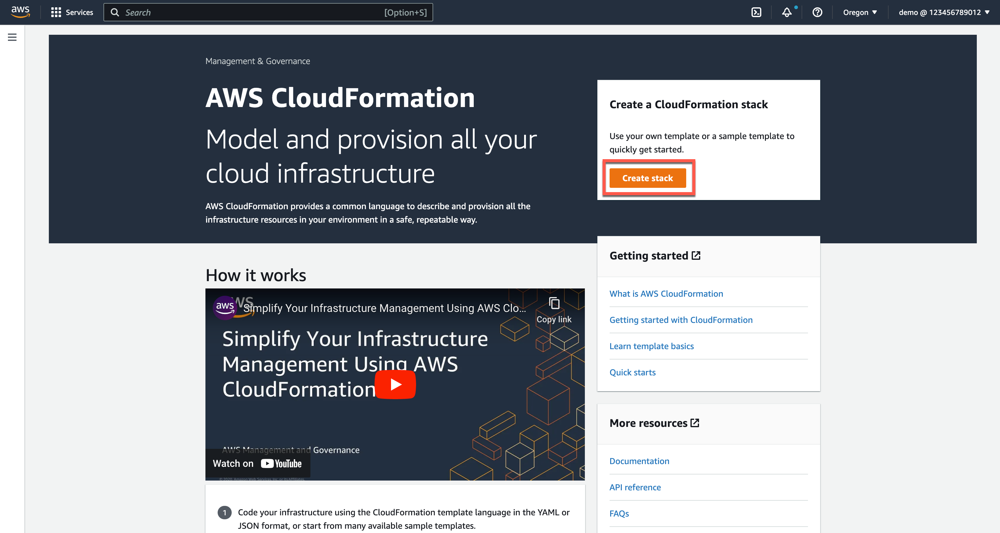

1.2. Select **Upload Template File** and upload the `gd-iac-initial.yml` file from the sample code repo provided above. Then click **Next**.  

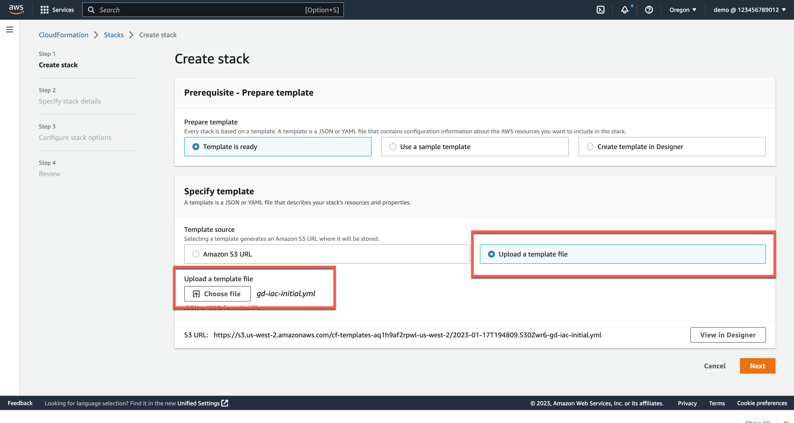

1.3. Enter a stack name and click **Next**.

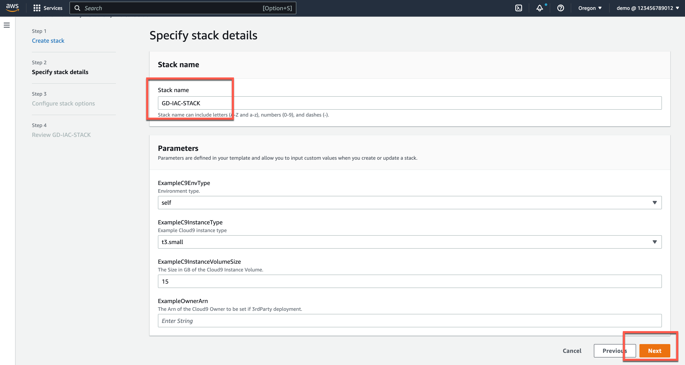

1.4. Click **Next** on the **Configure stack options** page.

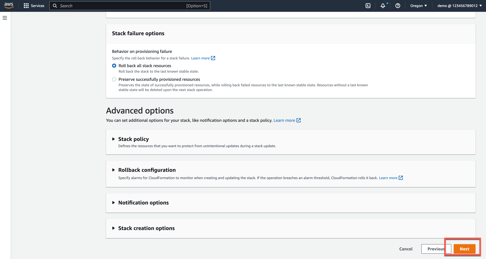

1.5. On the **Review** page, scroll to the bottom and click the checkbox to **acknowledge that AWS CloudFormation might create IAM resources**, then click **Next**. 

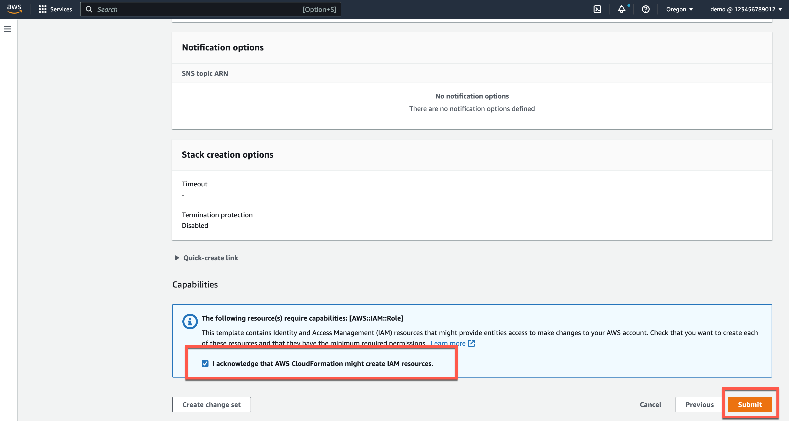

1.6. Watch for the stack to be in a **Create Complete** state.

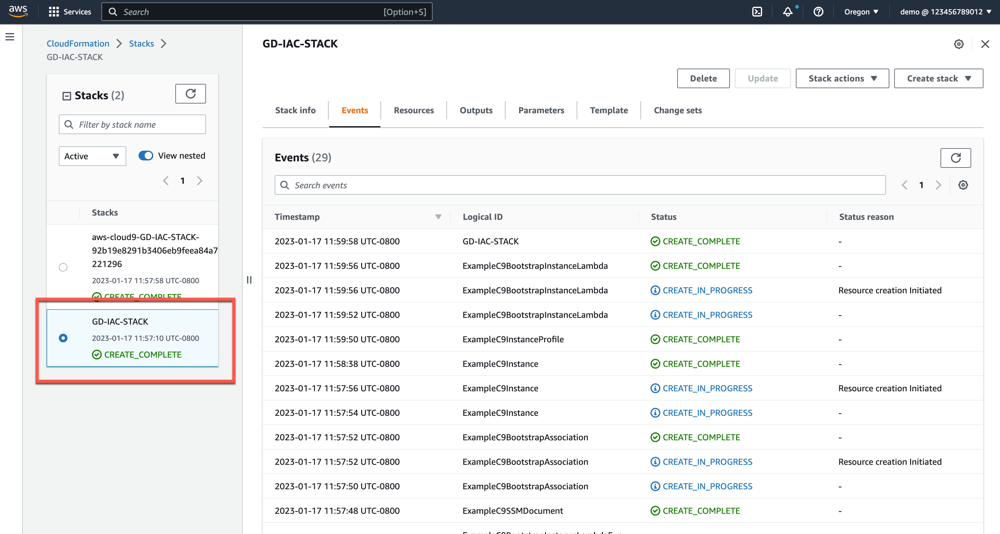

At this point you have deployed the initial resources you will use to follow along with this tutorial on your own. In the next step you will access the Cloud9 instance that the stack created and initialize Terraform.

## Step 2. Access Cloud9 and Initialize Terraform

2.1. Open [AWS Cloud9 in the AWS Management Console](https://us-west-2.console.aws.amazon.com/cloud9control/home?region=us-west-2#/) and open the environment in the Cloud9 IDE.

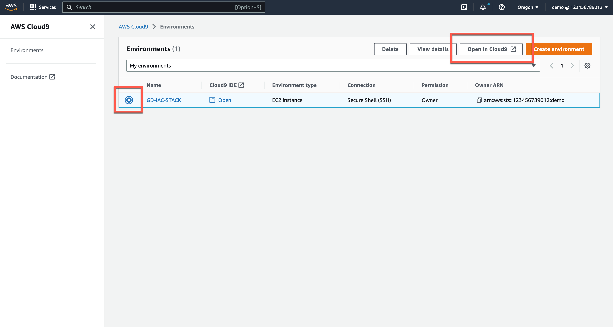

2.2. In the Cloud9 preferences, disable the use of **AWS managed temporary credentials**.

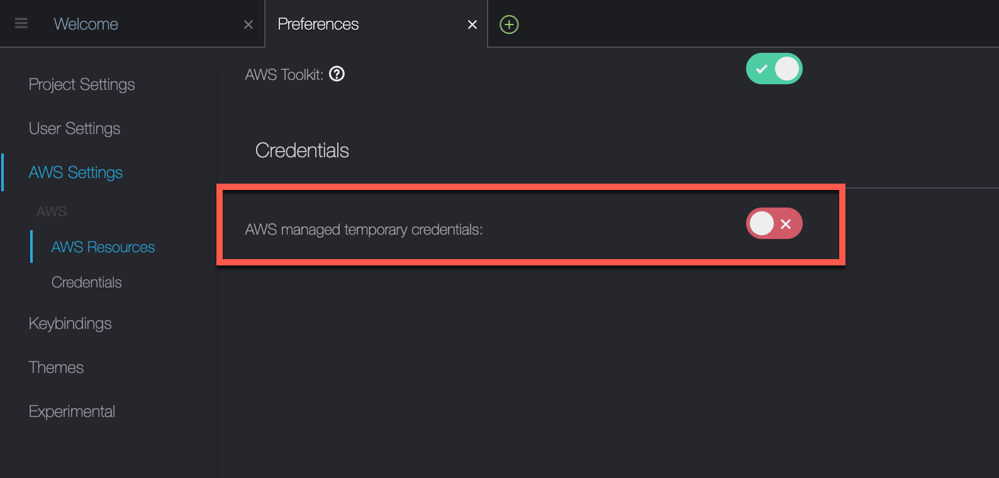

2.3.  From the terminal in your Cloud9 instance, clone the initial code repo. 

```
git clone https://github.com/build-on-aws/automating-amazon-guardduty-with-iac.git
```

2.4. Change into the **automating-amazon-guardduty-with-iac** directory and perform a **terraform init**, **terraform plan**, and **terraform apply**.  

> Terraform will apply configuration in US-WEST-2. The Cloudformation template created the Cloud9 instance in US-WEST-1. This is intentional. The idea is that you can do your verifications seeing only what you create with Terraform. 

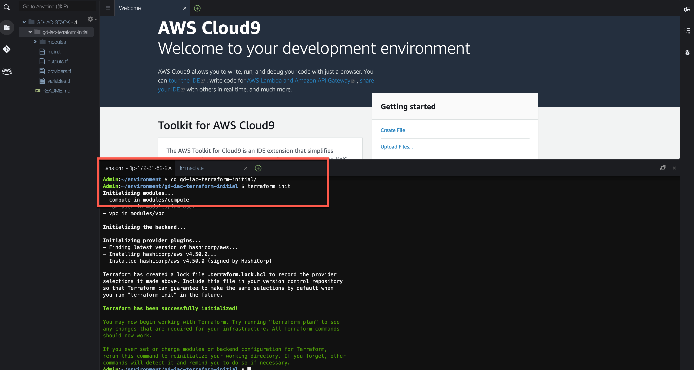

A successful apply will resemble the following:

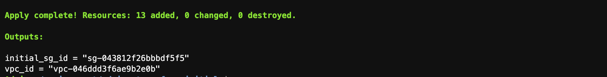

2.5. Verify that there are two new EC2 instances, one named **IAC Tutorial: Compromised Instance** and the other named **IAC Tutorial: Malicious Instance**.

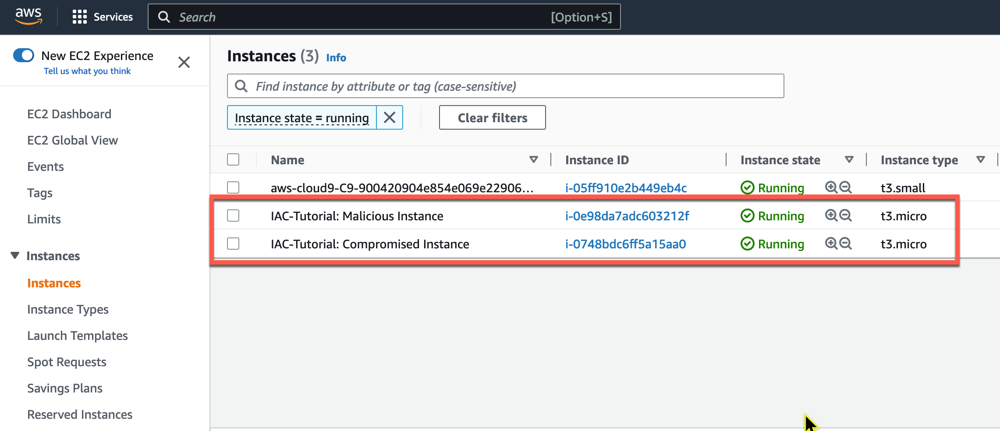

At this point, you have deployed a VPC and two EC2 instances. The two EC2 instances will talk to one another, and later when you add one of the EC2 instances Elastic IP address to a threat list it will cause GuardDuty to produce a finding. From this point on, you will create each of the resources that are part of the actual security solution.

## Step 3: Create an S3 Bucket to Store a Threat List

GuardDuty can reference two types of lists: a **Trusted IP list** and a **Threat IP list**. GuardDuty does not generate findings for IP addresses that are included in trusted IP lists, but it does generate findings for IP addresses that are included in threat IP lists. Since we want to force a finding in this tutorial, we are using a threat IP list.  

3.1. Begin by creating a variable in the `modules/s3/variables.tf` for the `vpc_id`.

```
variable "vpc_id" {}

```

3.2. Next, in the `modules/s3/main.tf` file, get the current AWS user account number and create an S3 bucket resource.

> The following code will create two S3 buckets. One bucket will store flow logs. We won't use them in this tutorial, but they will be generated, and you can explore them if you wish. Flow log data is what GuardDuty uses, but you don't have to enable them for GuardDuty to use the data. We only enable them here so you can see them. The other bucket we create will be used to store our Threat List.

```
 # GET CURRENT AWS ACCOUNT NUMBER
 
 data "aws_caller_identity" "current" {}

  # CREATE TWO S3 BUCKETS
 
 resource "aws_s3_bucket" "bucket" {
   bucket = "guardduty-example-${data.aws_caller_identity.current.account_id}-us-east-1"
   force_destroy = true
 }

  resource "aws_s3_bucket" "flow-log-bucket" {
   bucket = "vpc-flow-logs-${data.aws_caller_identity.current.account_id}-us-east-1"
   force_destroy = true
 }

```

3.3. Next enable VPC Flow logs to the S3 bucket. This is not required, but it will allow us to view the logs that GuardDuty sees.

```
# VPC FLOW LOGS
 resource "aws_flow_log" "flow_log_example" {
   log_destination      = aws_s3_bucket.flow-log-bucket.arn
   log_destination_type = "s3"
   traffic_type         = "ALL"
   vpc_id               = var.vpc_id
 }
```

3.4. Lastly, output the `bucket_id` and `bucket_arn` values in the `modules/s3/outputs.tf` file.

```
# S3 Bucket id
 output "bucket_id" {
   value       = aws_s3_bucket.bucket.id
   description = "Output of s3 bucket id."
 }
 # S3 Bucket arn
 output "bucket_arn" {
   value       = aws_s3_bucket.bucket.arn
   description = "Output of s3 bucket arn."
 }
```

3.5. Now return to the `root/main.tf` file and add the S3 bucket. 

```
# CREATES S3 BUCKET
module "s3_bucket" {
  source = "./modules/s3"
  vpc_id = module.iac_vpc.vpc_attributes.id
}
```

> **Why are you creating an S3 bucket?** You are primarily creating an S3 bucket to hold a text file that will be referred to by GuardDuty. As mentioned before, GuardDuty uses two types of lists: a Trusted IP list and a Threat IP list. Our S3 bucket will host the Threat IP List. The secondary reason is to store VPC flow logs. GuardDuty uses VPC flow logs, but you do not need to enable them for GuardDuty to use them. Here, we enable VPC FLow Logs so that we can use the data in other tools if we want to later on.

At this point you have created two S3 buckets. One bucket is for the VPC flow logs if you wish to explore them on your own. The other bucket will contain the threat list that you will create in a later step.

## Step 4: Create the GuardDuty Terraform Modules

4.1. The GuardDuty Module files have been created for you, but like the S3 files, they are empty. Start with the `modules/guardduty/variables.tf` file. Here you will need to create two variables. The first is a variable called `bucket` which we will use to define the S3 bucket threat list details. The second will be for the malicious IP that we will have added to the bucket.

```
variable "bucket" {

}

variable "malicious_ip" {

}
```

4.2. Next, move to the `modules/guardduty/main.tf` file.

In this file you will add three resources. The first resource is the [GuardDuty detector](https://registry.terraform.io/providers/hashicorp/aws/latest/docs/resources/guardduty_detector). You'll note in the provider documentation that the options are all optional - nothing is required other than declaring the resource. However, we will set the `enabled` value to `true` in our example and also change the `finding_publishing_frequency` to 15 minutes. The default is one hour.

```

# ENABLE THE DETECTOR
resource "aws_guardduty_detector" "gd-tutorial" {
  enable = true
  finding_publishing_frequency = "FIFTEEN_MINUTES"

}

```

4.3. Next we will [upload a file to the S3 bucket](https://registry.terraform.io/providers/hashicorp/aws/latest/docs/resources/s3_object) that we created in a previous step. This is not required, but for demonstration purposes we want to use the IP address of one of the EC2 instances to ensure that findings are generated in this tutorial. In the code below we are uploading a text file to our S3 bucket, calling it MyThreatIntelSet, and the content of the file will be the IP address found in the variable `var.malicious_ip`. 

```

# ADD THE EIP/MALICIOUS IP TO THE BUCKET AS A TEXT FILE.
resource "aws_s3_object" "MyThreatIntelSet" {
  content = var.malicious_ip
  bucket  = var.bucket
  key     = "MyThreatIntelSet"
}

```

4.4. Finally we will create a resource, `aws_guardduty_threatintelset`, that tells GuardDuty that it should use (this is what `activate = true` does) the file located at the `location` defined.

```

# HAVE GUARDDUTY LOOK AT THE TEXT FILE IN S3
resource "aws_guardduty_threatintelset" "Example-Threat-List" {
  activate    = true
  detector_id = aws_guardduty_detector.gd-tutorial.id
  format      = "TXT"
  location    = "https://s3.amazonaws.com/${aws_s3_object.MyThreatIntelSet.bucket}/${aws_s3_object.MyThreatIntelSet.key}"
  name        = "MyThreatIntelSet"
}

```

> For GuardDuty, we don't need to output anything at this time.

4.5. Next, move to the `root/main.tf` file and call the GuardDuty module. We need to provide the bucket ID and the malicious IP. You can see that these are coming from the S3 module and the compute module.

```
# Enable GuardDuty
module "guardduty" {
  source       = "./modules/guardduty"
  bucket       = module.s3_bucket.bucket_id
  malicious_ip = module.compute.malicious_ip
}

```
In this section, you enabled GuardDuty, created the threat list, and added the Elastic IP address of the Malicious EC2 instance to that list. Next, we're going to create an SNS Rule.

## Step 5: Create the SNS Terraform Module

In this section we will use [Terraform](https://www.terraform.io/) to create an SNS Rule. SNS is the Simple Notification Service and it enables you to send a notification when certain criteria are met. SNS itself doesn't match an action to send a message; we will use EventBridge for that. However, since EventBridge will need a rule to send notifications, we must create the SNS rule first. 

5.1. Beginning in the `modules/sns/variables.tf` file, you will need to create two variables:

1. `sns_name` to name the SNS topic that we will create.
2. `email` to hold the email address we will use to subscribe to our notifications.

Below is an example of our variables for SNS.

```

variable "sns_name" {
  description = "Name of the SNS Topic to be created"
  default     = "GuardDuty-Example"
}

variable "email" {
 description = "Email address for SNS"
}

```

5.2. Next we will create the SNS topic and subscription in the `modules/sns/main.tf` file.

Start by creating a topic resource.

```

# Create the SNS topic
 
 resource "aws_sns_topic" "gd_sns_topic" {
   name = var.sns_name
 }

```

In the above code you are creating a resource that is called `gd_sns_topic` by Terraform. In the AWS console, this will be called "GuardDuty-Example." This is because we are calling the variable `var.sns_name`, and it has a default set to "GuardDuty-Example."

5.3. Next create an SNS Policy Resource. The `arn` and `policy` are required values. The policy being created here is an [AWS IAM Policy Document](https://developer.hashicorp.com/terraform/tutorials/aws/aws-iam-policy?_ga=2.3643440.1670455977.1666808943-645029333.1658185431). This policy document is allowing the service principal `events.amazonaws.com` to publish to the topic.


```

resource "aws_sns_topic_policy" "gd_sns_topic_policy" {
   arn = aws_sns_topic.gd_sns_topic.arn
   policy                                   = jsonencode(
         {
             Id        = "ID-GD-Topic-Policy"
             Statement = [
                 {
                     Action    = "sns:Publish"
                     Effect    = "Allow"
                     Principal = {
                         Service = "events.amazonaws.com"
                     }
                     Resource  = aws_sns_topic.gd_sns_topic.arn
                     Sid       = "SID-GD-Example"
                 },
             ]
             Version   = "2012-10-17"
         }
     )
 }
 

```

5.5. Next you will create the topic subscription. The topic subscription calls the ARN, sets the protocol to be used - in this case email - and the email address to which the notification will be sent. The email address in this case will be hard-coded, but you can configure it to prompt for the email address when you apply the Terraform. Also, the `endpoint_auto_confirm` being set to `false` means that the owner of the email will get an email with a link that they must click to subscribe to the notifications.

```

# Create the topic subscription 
 
 resource "aws_sns_topic_subscription" "user_updates_sqs_target" {
   topic_arn              = aws_sns_topic.gd_sns_topic.arn
   protocol               = "email"
   endpoint               = var.email
   endpoint_auto_confirms = false
 }

```


5.6. Next, in the `modules/sns/outputs.tf` file, we want to output the ARN of the topic so we can reference that in the EventBridge configuration we will perform later.

```

output "sns_topic_arn" {
  value       = aws_sns_topic.gd_sns_topic.arn
  description = "Output of ARN to call in the eventbridge rule."
}

```

5.7. Finally, return to the `root/main.tf` file and add the SNS topic. This is where you will set the email address to be subscribed.

> Note that you will need to enter your email address in the code below.

```

# Creates an SNS Topic

 module "guardduty_sns_topic" {
   source = "./modules/sns"
   email  = "youremailaddress@domain.com"
 }


```
In this section you created the SNS topics to send you an email when a specific finding is produced.

## Step 6: Create the EventBridge Terraform Module

In this section you will use [Terraform](https://www.terraform.io/) to create an EventBridge Rule. The EventBridge Rule will tie two elements of this solution together.  

How does EventBridge work? Essentially, EventBridge receives an event - an indicator of a change in environment - and applies a rule to route the event to a target. Rules match events to targets based on either the structure of the event, called an event pattern, or on a schedule. In this case, GuardDuty creates an event for Amazon EventBridge when any change in findings takes place. The event matches and Amazon EventBridge rule to a target. In this case, the target is anSNS rule. The SNS rule takes the finding data and generates an email notification to the subscribed user. This can be seen in the image below. 


6.1. The EventBridge rule will need information about GuardDuty and SNS. Begin by creating a variable that can be used for the SNS topic ARN. Do this in the `modules/eventbridge/variables.tf` file.

```
 variable "sns_topic_arn" {
 }

```

6.2. Next, create an Event Rule Resource in the `modules/eventbridge/main.tf` file. You will need to define the source and the type of event we are looking for.

```

 # EVENT RULE RESOURCE
 resource "aws_cloudwatch_event_rule" "GuardDuty-Event-EC2-MaliciousIPCaller" {
   name        = "GuardDuty-Event-EC2-MaliciousIPCaller"
   description = "GuardDuty Event: UnauthorizedAccess:EC2/MaliciousIPCaller.Custom"

   event_pattern = <<EOF
 {
   "source": ["aws.guardduty"],
   "detail": {
     "type": ["UnauthorizedAccess:EC2/MaliciousIPCaller.Custom"]
   }
 }
 EOF
 }

```

> The event pattern defined above looks at events from the source service, in this case GuardDuty, and looks for a finding with the detail type of "UnauthorizedAccess:EC2/MaliciousIPCaller.Custom."

6.3. Next define the Event Target Resource. When creating this resource, you can add an extra bit of readability into the email notification by defining an [Input Transformer](https://docs.aws.amazon.com/eventbridge/latest/userguide/eb-input-transformer-tutorial.html). This customizes what EventBridge passes to the event target. Below we are getting the GuardDuty ID, the Region, and the EC2 Instance ID - and we are creating an input template that elaborates a bit on the message. You can see below that we have created an input template that makes use of the detail information in the GuardDuty finding in the email message that is sent.

```

# EVENT TARGET RESOURCE FOR SNS NOTIFICATIONS
 resource "aws_cloudwatch_event_target" "sns" {

   rule      = aws_cloudwatch_event_rule.GuardDuty-Event-EC2-MaliciousIPCaller.name
   target_id = "GuardDuty-Example"
   arn       = var.sns_topic_arn

   input_transformer {
     input_paths = {
       gdid     = "$.detail.id",
       region   = "$.detail.region",
       instanceid = "$.detail.resource.instanceDetails.instanceId"
     }
     input_template = "\"First GuardDuty Finding for the GuardDuty-IAC tutorial. | ID:<gdid> | The EC2 instance: <instanceid>, may be compromised and should be investigated. Go to https://console.aws.amazon.com/guardduty/home?region=<region>#/findings?macros=current&fId=<gdid>\""
   }
 }

```

6.4. In the first Event rule that we created, we are looking for the **GuardDuty-Event-EC2-MaliciousIPCaller** event. Create a second event rule to look for the **GuardDuty-Event-IAMUser-MaliciousIPCaller** finding and send an email notification for that as well. 

> This finding will not show up; it's primarily there for you to practice creating the resources.

```

# EVENT RULE RESOURCE
 resource "aws_cloudwatch_event_rule" "GuardDuty-Event-IAMUser-MaliciousIPCaller" {
   name        = "GuardDuty-Event-IAMUser-MaliciousIPCaller"
   description = "GuardDuty Event: UnauthorizedAccess:IAMUser/MaliciousIPCaller.Custom"
   event_pattern = <<EOF
 {
   "source": ["aws.guardduty"],
   "detail": {
     "type": ["UnauthorizedAccess:IAMUser/MaliciousIPCaller.Custom", "Discovery:S3/MaliciousIPCaller.Custom"]
   }
 }
 EOF
 }

 #EVENT TARGET RESOURCE FOR SNS NOTIFICATIONS
 resource "aws_cloudwatch_event_target" "iam-sns" {

   rule      = aws_cloudwatch_event_rule.GuardDuty-Event-IAMUser-MaliciousIPCaller.name
   target_id = "GuardDuty-Example"
   arn       = var.sns_topic_arn

   input_transformer {
     input_paths = {
       gdid     = "$.detail.id",
       region   = "$.detail.region",
       userName = "$.detail.resource.accessKeyDetails.userName"
     } 
     input_template = "\"Second GuardDuty Finding for the GuardDuty-IAC tutorial. | ID:<gdid> | AWS Region:<region>. An AWS API operation was invoked (userName: <userName>) from an IP address that is included on your threat list and should be investigated.Go to https://console.aws.amazon.com/guardduty/home?region=<region>#/findings?macros=current&fId=<gdid>\""
   }
 }

```

6.5. Once you have the resources created in the module, go back to the `root/main.tf` file and add the EventBridge rule.

```

# Create the EventBridge rule

module "guardduty_eventbridge_rule" {
  source                          = "./modules/eventbridge"
  sns_topic_arn                   = module.guardduty_sns_topic.sns_topic_arn
}

```

In this section you created an EventBridge rule that uses the SNS topic you created to send an email when a GuardDuty finding is matched. In the next section you will enhance that functionality using Lambda.

## Step 7: Create the Lambda Terraform Module

In this section we will use [Terraform](https://www.terraform.io/) to create a Lambda function that performs a remediation function for our environment. What we want to do with this tutorial is have our compromised host get moved to a new security group. Similar to the way that EventBridge used SNS to generate an email, EventBridge will involve a Lambda function as shown below.


One thing to keep in mind is that there are many possible approaches here. For more information, please see the documentation on [creating custom responses to GuardDuty findings with Amazon CloudWatch Events](https://docs.aws.amazon.com/guardduty/latest/ug/guardduty_findings_cloudwatch.html) and [automatically blocking suspicious traffic with AWS Network Firewall and Amazon GuardDuty](https://aws.amazon.com/blogs/security/automatically-block-suspicious-traffic-with-aws-network-firewall-and-amazon-guardduty/).

Before we get started, let's see what needs to happen for this to work.

Currently, our GuardDuty Findings are matched in an EventBridge rule to a target - currently an SNS rule that sends an email. To enhance this functionality, we will have EventBridge use AWS Lambda as a target.

Because we are going to have AWS Lambda access other resources on our behalf, we need to [create an IAM role to delegate permissions to the service](https://docs.aws.amazon.com/IAM/latest/UserGuide/id_roles_create_for-service.html). This is called a **service role**, and AWS Lambda will *assume* this role when it changes the security group of our EC2 instance.

The following image shows how the first three code blocks fit together to allow the AWS Lambda service to assume a role that can make changes to the security groups assigned to the EC2 instances.


7.1. Start in the `modules/lambda/main.tf` by creating the IAM policy document. This is the trust relationship for the policy.

```

data "aws_iam_policy_document" "GD-EC2MaliciousIPCaller-policy-document" {
  statement {
    effect  = "Allow"
    actions = ["sts:AssumeRole"]
    principals {
      type        = "Service"
      identifiers = ["lambda.amazonaws.com"]
    }
  }
}

```

7.2. Next, create the inline policy that will be applied to the role AWS Lambda will assume.

```

resource "aws_iam_role_policy" "GD-EC2MaliciousIPCaller-inline-role-policy" {
  name = "GD-EC2MaliciousIPCaller-inline-role-policy"
  role = aws_iam_role.GD-Lambda-EC2MaliciousIPCaller-role.id

  policy = jsonencode({
    "Version" : "2012-10-17",
    "Statement" : [
      {
        "Action" : [
          "ssm:PutParameter",
          "ec2:AuthorizeSecurityGroupEgress",
          "ec2:AuthorizeSecurityGroupIngress",
          "ec2:CreateSecurityGroup",
          "ec2:DescribeSecurityGroups",
          "ec2:RevokeSecurityGroupEgress",
          "ec2:RevokeSecurityGroupIngress",
          "ec2:UpdateSecurityGroupRuleDescriptionsEgress",
          "ec2:UpdateSecurityGroupRuleDescriptionsIngress",
          "ec2:DescribeInstances",
          "ec2:UpdateSecurityGroupRuleDescriptionsIngress",
          "ec2:DescribeVpcs",
          "ec2:ModifyInstanceAttribute",
          "lambda:InvokeFunction",
          "cloudwatch:PutMetricData",
          "xray:PutTraceSegments",
          "xray:PutTelemetryRecords"
        ],
        "Resource" : "*",
        "Effect" : "Allow"
      },
      {
        "Action" : [
          "logs:*"
        ],
        "Resource" : "arn:aws:logs:*:*:*",
        "Effect" : "Allow"
      },
      {
        "Action" : [
          "sns:Publish"
        ],
        "Resource" : var.sns_topic_arn,
        "Effect" : "Allow"
      }      
    ]
  })
}


```

7.3. And now create the IAM role that AWS Lambda will assume.

```

resource "aws_iam_role" "GD-Lambda-EC2MaliciousIPCaller-role" {
  name               = "GD-Lambda-EC2MaliciousIPCaller-role1"
  assume_role_policy = data.aws_iam_policy_document.GD-EC2MaliciousIPCaller-policy-document.json
}

```

> The Python code we will use for the Lambda function has been created for you. The code can be found in the /modules/lambda/code folder, and it's called index.py.

7.4. Create a data resource pointing to the code.

```

data "archive_file" "python_lambda_package" {
  type        = "zip"
  source_file = "${path.module}/code/index.py"
  output_path = "index.zip"
}

```

7.5. Next we need to give EventBridge permission to access Lambda.

```

resource "aws_lambda_permission" "GuardDuty-Hands-On-RemediationLambda" {
  statement_id  = "GuardDutyTerraformRemediationLambdaEC2InvokePermissions"
  action        = "lambda:InvokeFunction"
  function_name = aws_lambda_function.GuardDuty-Example-Remediation-EC2MaliciousIPCaller.function_name
  principal     = "events.amazonaws.com"
}

```

The above block will give EventBridge permission to invoke the Lambda function.

7.6. Finally we create the Lambda function resource. To do this we will need to create a few variables that will let us pass some info. Edit the `modules/lambda/variables.tf` file with the following variables:

```

variable "sns_topic_arn" {}

variable "compromised_instance_id" {}

variable "forensic_sg_id" {}

```

7.7. Next, return to the `modules/lambda/main.tf` file and create the Lambda function resource. Note that in the code block below, we are using Python 3.9. Also, we are referencing the python code we zipped in index.zip. And lastly we are setting a few environment variables in the resource: `INSTANCE_ID`, `FORENSICS_SG`, and `TOPIC_ARN`. These will be passed into our Lambda function environment from the variables that we created.

```

# Create the Lambda function Resource

resource "aws_lambda_function" "GuardDuty-Example-Remediation-EC2MaliciousIPCaller" {
  function_name    = "GuardDuty-Example-Remediation-EC2MaliciousIPCaller"
  filename         = "index.zip"
  source_code_hash = data.archive_file.python_lambda_package.output_base64sha256
  role             = aws_iam_role.GD-Lambda-EC2MaliciousIPCaller-role.arn
  runtime          = "python3.9"
  handler          = "index.handler"
  timeout          = 10
  environment {
    variables = {
      INSTANCE_ID  = var.compromised_instance_id
      FORENSICS_SG = var.forensic_sg_id
      TOPIC_ARN    = var.sns_topic_arn
    }
  }
}

```

7.8. In the `root/main.tf` file call the Lambda module, set the SNS topic ARN, the Compromised Instance ID, and the Forensic Security group. Note that these values are coming from the GuardDuty Module, the Compute Module, and the VPC Module.

```
# CREATE THE LAMBDA FUNCTION
module "lambda" {
  source                  = "./modules/lambda"
  sns_topic_arn           = module.guardduty_sns_topic.sns_topic_arn
  compromised_instance_id = module.compute.compromised_instance_id
  forensic_sg_id          = module.forensic-security-group.security_group_id
}

```

7.9. The Forensic Security group has not been created yet. Add a security group to use for forensics.

```

# CREATES THE FORENSICS_SG SECUIRTY GROUP
module "forensic-security-group" {
  source  = "terraform-aws-modules/security-group/aws"
  version = "4.17.1"

  name        = "FORENSIC_SG"
  description = "Forensic Security group "
  vpc_id      = module.iac_vpc.vpc_attributes.id
}

```

7.10. To access the `forensic-security-group`, we need to output it. In the `root/outputs.tf` file and output the Security group ID.


```

output "forensic_sg_id" {
   value       = module.forensic-security-group.security_group_id
   description = "Output of forensic sg id created - to place the EC2 instance(s)."
 }

```


7.11. Now we need to adjust the EventBridge Rule to send the finding data to Lambda. We will do that in the next section. Return to the `modules/eventbridge/main.tf` file. Add an event target resource for the Lambda Function that looks at the `aws_cloudwatch_event_rule.GuardDuty-Event-EC2-MaliciousIPCaller.name` rule and sets the target ID to `GuardDuty-Example-Remediation`. You will need the ARN of the Lambda Function here. This can be output from the Lambda Module.

```

#EVENT TARGET RESOURCE FOR LAMBDA REMEDIATION FUCTION

resource "aws_cloudwatch_event_target" "lambda_function" {

  rule      = aws_cloudwatch_event_rule.GuardDuty-Event-EC2-MaliciousIPCaller.name
  target_id = "GuardDuty-Example-Remediation"
  arn       = var.lambda_remediation_function_arn
}


```

7.12. Add the output to the Lambda Module (`modules/lambda/outputs.tf`) if you haven't done so already.

```

output "lambda_remediation_function_arn" {
  value = aws_lambda_function.GuardDuty-Example-Remediation-EC2MaliciousIPCaller.arn
}

```

7.13. The variable also needs to be applied in the EventBridge module (`modules/eventbridge/variables.tf`).

```

variable "lambda_remediation_function_arn" {

}

```


7.14. And finally, add the ` lambda_remediation_function_arn` to the `root/main.tf` file. This goes in the EventBridge Rule which is already created. The output below is the entire code block, some of which already exists. Be sure to only add the `lambda_remediation_function_arn = module.lambda.lambda_remediation_function_arn` code to the existing block.

```

module "guardduty_eventbridge_rule" {
  source                          = "./modules/eventbridge"
  sns_topic_arn                   = module.guardduty_sns_topic.sns_topic_arn
  lambda_remediation_function_arn = module.lambda.lambda_remediation_function_arn
}

```

In this section you created a Lambda function that isolates a compromised host into a different security group.  This lambda function is called by EventBridge when a GuardDuty finding is matched by the EventBridge rule.  In the next section you will apply the entire configuration.

## Step 8: Apply The Configuration to your AWS Account

8.1. Perform a `terraform init`. This will initialize all of the modules that you have added code to in this tutorial. The output should resemble the following.


> Note that if you already have GuardDuty enabled in your account the apply will fail. If this happens, you can disable GuardDuty and run the terraform apply again. 

8.2. Do a `terraform plan`.

8.3. Do a `terraform apply` to push the changes to AWS. Once applied your should have an output that resembles the following:


In this section you applied the Terraform configuration to your AWS accoount. At this point you have two EC2 instances that are communicating with one another. One is malicious and its IP address has been added to our Threat IP List. When GuardDuty sees this IP talking to our compromised instance, it will produce a finding. We have an EventBridge rule that matches that finding and does two things: first, it sends us an email letting us know what happened, and second, it invokes the Lambda function to change the security group of the compromised host. In the next section, we will verify the configuration in our AWS console.

## Step 9: Verify The Solution in the AWS Management Console

In this section we will walk through the entire solution in the AWS console and verify that the security group has been moved once the finding shows up in GuardDuty and EventBridge triggers the Lambda Function.

You should also have received an email to confirm your subscription. Remember that you must subscribe to receive the notifications you have configured.

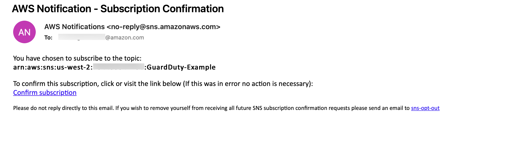

After subscribing, navigate to the AWS Management Console to verify that there are two EC2 instances and they are both in the Initial Security Group. 

> Depending on how long you have waited, if the remediation Lambda function is already applied you may not see them in the same group. 

First check the compromised host.

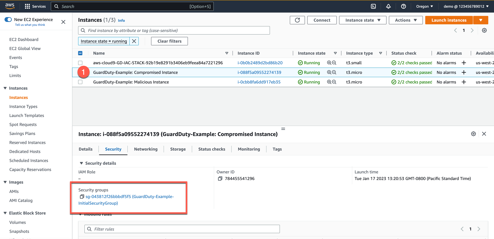

Next check the malicious host.

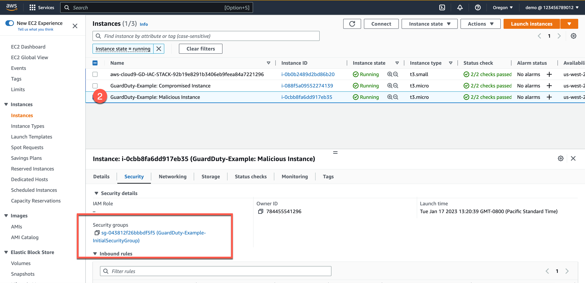

Next ensure that GuardDuty is reporting findings.

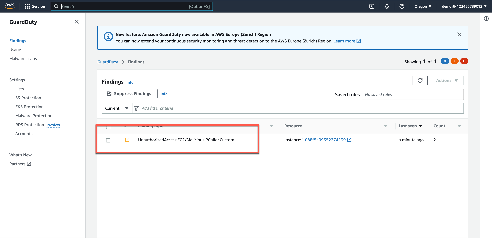

Now check that the EventBridge rule is looking for that finding.


Next check the target of the EventBridge rule. You should see one SNS target and one Lambda target.


Check the SNS rule to see what it does. It should be sending an email to the address you set.


Next check the Lambda function. You can get there from the EventBridge Rule or by navigating there directly. 


Finally check that the Lambda function has moved the compromised host to a new security group.


Depending on the time you have waited, if your configuration matches the screenshots above, you have successfully created an entire AWS Security solution using Terraform. Congratulations! 

In the next section we will clean up our environment and share additional resources.

## Conclusion

At this point in the tutorial you are likely getting emails every 15 minutes as GuardDuty reports its findings. If you prefer to keep the configurations to reference later but want to stop the emails, you can simply unsubscribe from the topic. See the example below on how to delete the subscription.


To remove the entire configuration, we will use the `terraform destroy` command from the CLI of our Cloud9 instance. 

When finished your output should resemble the following.


Next you will need to empty the S3 bucket that was created for the Cloud9 instance. 


Finally navigate to CloudFormation and delete the CloudFormation stack you created. Be sure to delete the one with the name you gave earlier in this workshop. Two stacks were created and both will be deleted when you delete the parent stack.


As you can see from this tutorial, much can be done to automate what happens when GuardDuty presents findings by using Amazon EventBridge and AWS Lambda. For more ideas on how to automate Incident Response, see the articles "[How to Use Amazon GuardDuty and AWS Web Application Firewall to Automatically Block Suspicious Hosts](https://aws.amazon.com/blogs/security/how-to-use-amazon-guardduty-and-aws-web-application-firewall-to-automatically-block-suspicious-hosts/)" and "[Automatically Block Suspicious Traffic with AWS Network Firewall and Amazon GuardDuty](https://aws.amazon.com/blogs/security/automatically-block-suspicious-traffic-with-aws-network-firewall-and-amazon-guardduty/)."
