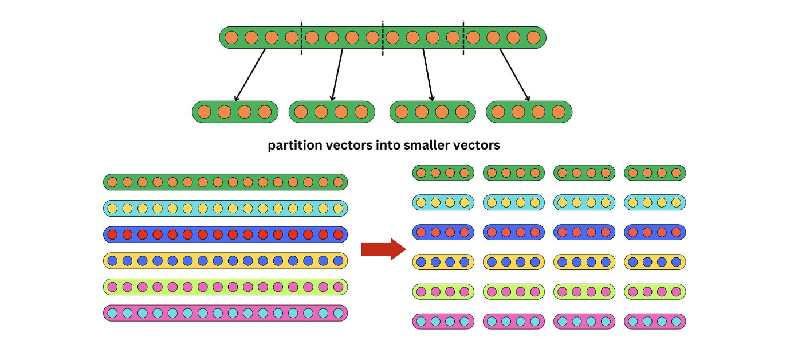
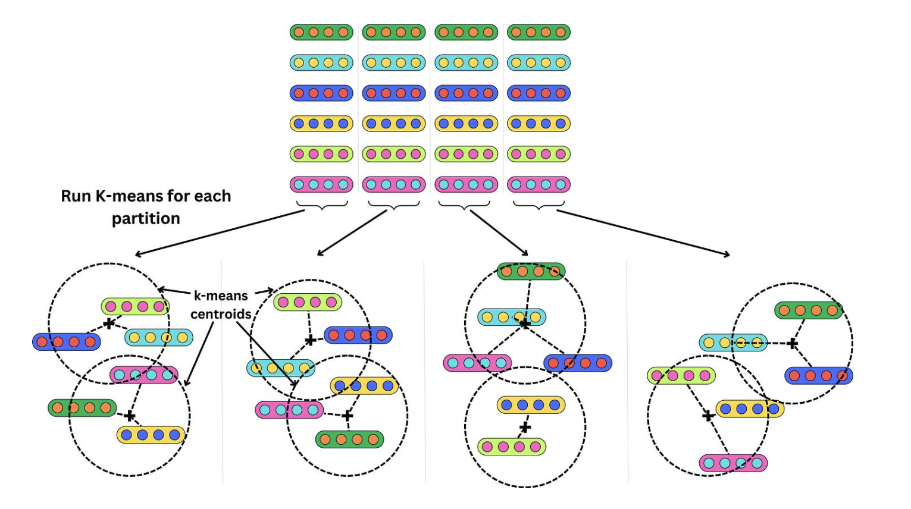
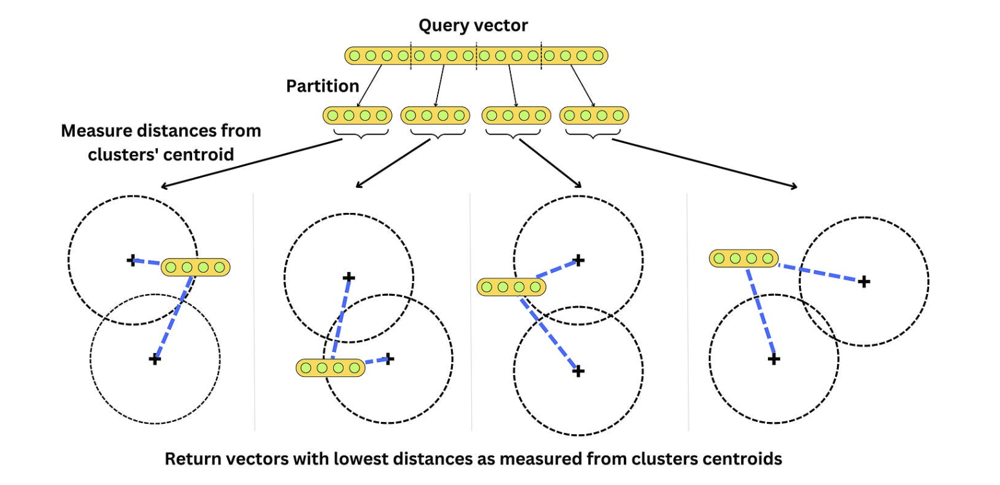
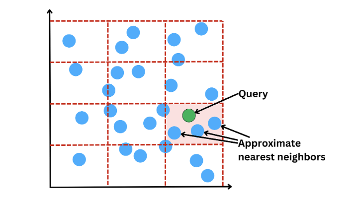
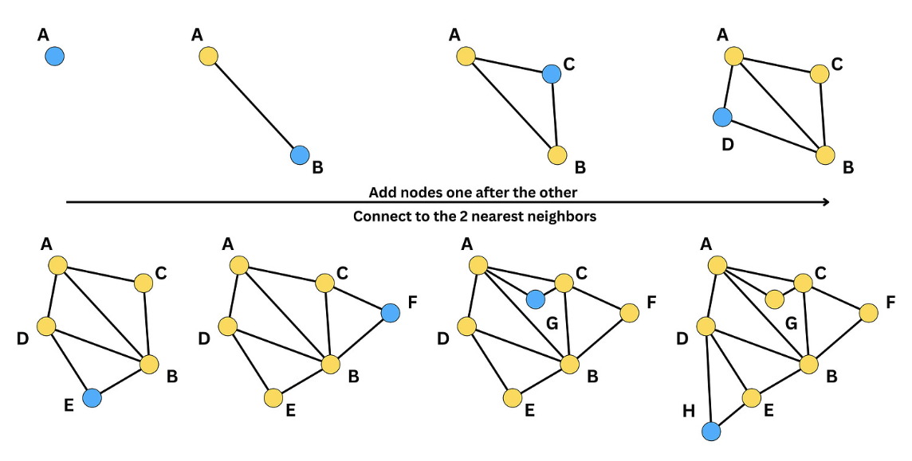
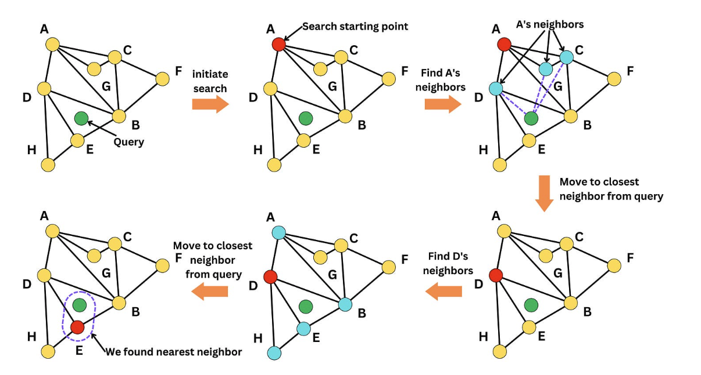
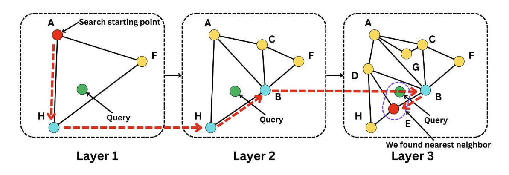
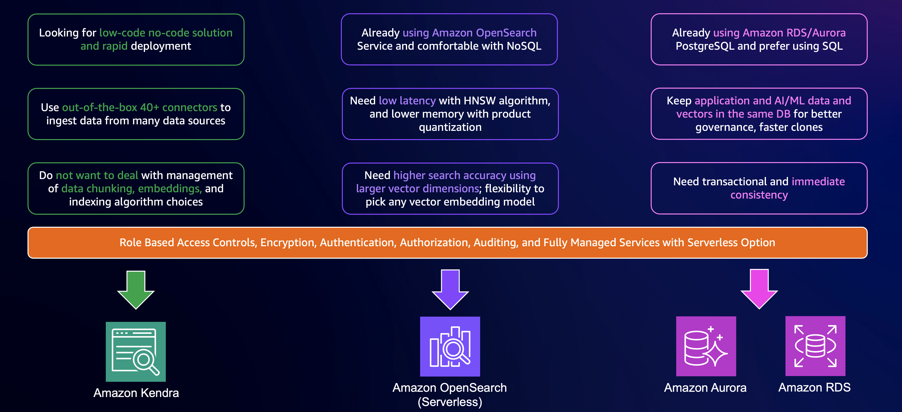
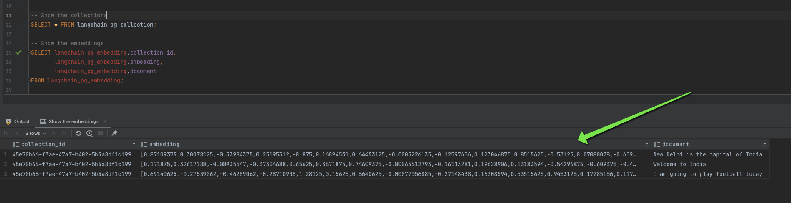

## What’s this Vector Buzz?

Ever wondered how apps suggest songs like those on Amazon Music, or products that perfectly match your taste on Amazon.com? Dive into the world of vector databases, where data isn't just stored in tables and rows but is mapped as geometric points in space.


In the rapidly evolving landscape of data engineering and machine learning, the concept of vector embeddings has emerged as a cornerstone for a myriad of innovative applications. As we navigate through the era of generative AI and large language models (LLMs), the need to understand and leverage these embeddings has become more crucial than ever. This blog post aims to demystify the world of vector embeddings and shed light on how they are transforming the way we handle and interpret vast amounts of data.

Through this post, we will embark on a journey to understand the nuts and bolts of vector embeddings and how we can store those embeddings in a vector store using Amazon Bedrock, Amazon Aurora and LangChain. From understanding the basic concept of an embedding to exploring advanced vector storage techniques and indexing methods, we will cover all the essential aspects that make vector embeddings an indispensable tool in modern data engineering and machine learning.

So, whether you are a seasoned data engineer, a machine learning enthusiast, or someone curious about the latest trends in AI, join us as we unravel the complexities of vector embeddings and discover how AWS's advanced capabilities can supercharge them.

## Embeddings

Let's start with the basics: what is an **embedding**? An embedding is a numerical representation of content in a form that machines can process and understand. The essence of the process is to convert an object, such as an image or text, into a vector that encapsulates its semantic content while discarding irrelevant details as much as possible. An embedding takes a piece of content, like a word, sentence, or image, and maps it into a multi-dimensional vector space. The distance between two embeddings indicates the semantic similarity between the corresponding concepts.

<div style="border: 2px solid #3498db; padding: 20px; margin-top: 20px; border-radius: 10px; background-color: #eaf2f8; font-family: 'Comic Sans MS', cursive, sans-serif; color: #2c3e50;">
    <p>
        Consider the terms <span style="font-weight:bold; color: #c0392b;">'coffee'</span> and <span style="font-weight:bold; color: #16a085;">'tea'</span>. In a hypothetical vocabulary space, these two could be transformed into numerical vectors. If we visualize this in a 3-dimensional vector space, <span style="color: #c0392b;">'coffee'</span> might be represented as <span style="background-color: #f1c40f; border-radius: 4px; padding: 2px;">[1.2, -0.9, 0.3]</span> and <span style="color: #16a085;">'tea'</span> as <span style="background-color: #f1c40f; border-radius: 4px; padding: 2px;">[1.0, -0.8, 0.5]</span>. Such numerical vectors carry semantic information, indicating that <span style="color: #c0392b;">'coffee'</span> and <span style="color: #16a085;">'tea'</span> are conceptually similar to each other due to their association with hot beverages and would likely be positioned closer together in the vector space than either would be to unrelated concepts like 'astronomy' or 'philosophy'.
    </p>
</div>

When it comes to text analysis, several strategies exist for converting words into vectors. Initially, one of the simpler techniques was the **bag-of-words model**. Here, words within a text are represented by their frequency of occurrence. [Scikit-learn](https://scikit-learn.org/stable/), a powerful Python library, encapsulates this method within its `CountVectorizer` tool. For a while, this was the standard—until the introduction of **word2vec**.

**Word2vec** represented a paradigm shift. It diverged from simply tallying words to understanding context by predicting a word's presence from its neighboring words while ignoring the sequence in which they appear. This method operates on a linear modeling approach.

In image processing, we create embeddings by pulling out specific features from images. This includes **identifying edges, analyzing textures**, and looking at **color patterns**. We do this over different sizes of image areas, making sure these embeddings understand changes in size and position.

The advent of **Convolutional Neural Networks (CNNs)**, especially those pre-trained on extensive datasets like [ImageNet](https://www.image-net.org/download.php), has revolutionized the way we understand images. CNNs employ **filters** or **kernels**, to generate feature maps from images, conceptually paralleling the principles of scale-space theory. When we use these CNNs on a new image, they are able to generate detailed and insightful vector representations of that image.

For both `textual` and `visual` data, the trend has shifted towards **transformer-based models**.

These transformer-based models consider the context and order of elements in the data, whether they are `words in text` or `pixels in images`. Equipped with a large number of parameters, these models excel in identifying complex patterns and relationships through training on comprehensive datasets.

### The versatility of embeddings in applications

Embeddings transform data into numerical vectors, making them highly adaptable tools. They enable us to apply mathematical operations to assess similarities or integrate them into various machine learning models. Their uses are diverse, ranging from search and similarity assessments to categorization and topic identification. A practical example is sentiment analysis, where embeddings of product reviews can be evaluated for their closeness to '`positive`' or '`negative`' sentiment indicators. This flexibility makes embeddings a fundamental component in many data-driven applications.

<div style="border: 2px solid #3498db; padding: 20px; margin-top: 20px; border-radius: 10px; background-color: #eaf2f8; font-family: 'Comic Sans MS', cursive, sans-serif; color: #2c3e50;">
    <h2 style="color: #2980b9;">Distance Metrics Between Embeddings</h2>
    <p>There are different distance metrics used in vector similarity calculations such as:</p>
    <ul>
        <li><strong>Cosine distance:</strong> This similarity measure calculates the cosine of the angle between two vectors in a vector space. It ranges from -1 to 1, where 1 represents identical vectors, 0 represents orthogonal vectors, and -1 represents vectors that are diametrically opposed.</li>
        <li><strong>Euclidean distance:</strong> It measures the straight-line distance between two vectors in a vector space. It ranges from 0 to infinity, where 0 represents identical vectors, and larger values represent increasingly dissimilar vectors.</li>
        <li><strong>Dot product:</strong> This measure reflects the product of the magnitudes of two vectors and the cosine of the angle between them. Its range extends from -∞ to ∞, with a positive value indicating vectors that point in the same direction, 0 indicating orthogonal vectors, and a negative value indicating vectors that point in opposite directions.</li>
    </ul>
</div>

Let's see how we can use [Amazon Titan Embeddings model](https://aws.amazon.com/bedrock/titan/) to create an embedding vector using [Amazon Bedrock](https://aws.amazon.com/bedrock/?refid=22360ac0-2986-47d9-bfa6-54c8f9bd7c50).

### Creating embeddings using Boto3 

First, let's try to create the embeddings using [boto3](https://boto3.amazonaws.com/v1/documentation/api/latest/reference/services/bedrock.html) with the `bedrock` client; later, we will see how we can do the same using `LangChain`.

```python
import boto3
import json

# Start a session with AWS using boto3
session = boto3.Session(profile_name='default')

# Initialize the bedrock-runtime client to interact with AWS AI services
bedrock = session.client(service_name='bedrock-runtime')

# Define a function to get the embedding for a given text
def get_embedding(text):
    # Convert the input text to a JSON-formatted string
    body = json.dumps({"inputText": text})
    
    # Define the model identifier for the embedding service
    model_id = 'amazon.titan-embed-text-v1'
    
    # Specify the type for the request and the expected response
    accept_type = 'application/json'
    
    # Call the embedding model service, passing the prepared request body and headers
    response = bedrock.invoke_model(body=body, 
                                    modelId=model_id, 
                                    accept=accept_type, 
                                    contentType=accept_type)
    
    # Read the response body, expected to be in JSON format
    response_body = json.loads(response['body'].read())
    
    # Extract the embedding from the response
    embedding = response_body['embedding']

    # Return the extracted embedding
    return embedding

# Build a list of embeddings to compare
embeddings_using_boto = []

# Append the embedding of sentences to the list
embeddings_using_boto.append(get_embedding("Sunny skies today."))
embeddings_using_boto.append(get_embedding("Language learning is fun."))
embeddings_using_boto.append(get_embedding("Cats are independent."))
embeddings_using_boto.append(get_embedding("Stocks go up and down."))
embeddings_using_boto.append(get_embedding("Home cooking is healthy."))

# Print the total number of embeddings in the list; expected output is 5
print("Total embeddings:", len(embeddings_using_boto))

# Print the length of each embedding vector in the list; each should print the same length, e.g., 1536
print("Embedding lengths:", [len(vec) for vec in embeddings_using_boto])
```

```
# Expected output
Total embeddings: 5
Embedding lengths: [1536, 1536, 1536, 1536, 1536]
```

This code performs the following actions:
- Initializes a session with AWS using `boto3` and creates a client for the `bedrock-runtime` service.
- Defines a function `get_embedding`, which accepts a text input, then utilizes the **Amazon Titan Embeddings** model to transform this text into an `embedding`. Once the embedding is generated, the function returns the embedding vector.

#### Creating embeddings using LangChain

In [LangChain](https://www.langchain.com/), you can obtain an embedding by using the `embed_query()` method from the `BedrockEmbeddings` class.

```python
from langchain.embeddings import BedrockEmbeddings

# Initialize an instance of BedrockEmbeddings
embeddings = BedrockEmbeddings()

# Initialize an empty list to store the embeddings
embeddings_using_lc = []

# Append the embedding of sentences to the list
embeddings_using_lc.append(embeddings.embed_query("Sunny skies today."))
embeddings_using_lc.append(embeddings.embed_query("Language learning is fun."))
embeddings_using_lc.append(embeddings.embed_query("Cats are independent."))
embeddings_using_lc.append(embeddings.embed_query("Stocks go up and down."))
embeddings_using_lc.append(embeddings.embed_query("Home cooking is healthy."))

# Print the total number of embeddings in the list; expected output is 5
print("Total embeddings:", len(embeddings_using_lc))

# Print the length of each embedding vector in the list; each should print the same length, e.g., 1536
print("Embedding lengths:", [len(vec) for vec in embeddings_using_lc])
```

```
# Expected output
Total embeddings: 5
Embedding lengths: [1536, 1536, 1536, 1536, 1536]
```

This code does the following:
- Imports the `BedrockEmbeddings` class from `langchain`.
- Creates an instance of `BedrockEmbeddings` to generate embeddings.
- Appends embeddings of several sentences to a `list`.

You can also obtain embeddings for multiple inputs using the `embed_documents()` method as well.

```python
from langchain.embeddings import BedrockEmbeddings

# Initialize an instance of BedrockEmbeddings
embeddings = BedrockEmbeddings()

# Obtain embeddings for a list of sentences
embeddings_using_lc_2 = embeddings.embed_documents([
    "Sunny skies today.",
    "Language learning is fun.",
    "Cats are independent.",
    "Stocks go up and down.",
    "Home cooking is healthy."
])
```
When examining the embeddings for a given text, the resulting vectors are consistent whether generated using `LangChain` or `boto3`. This uniformity is attributed to the underlying model in use, which is `Amazon Titan Embeddings G1 - Text`.

```python
# Compare the first embedding from each method to verify they are the same
are_embeddings_equal = (embeddings_using_boto[0] == embeddings_using_lc[0] == embeddings_using_lc_2[0])
print("Are the first embeddings from each method equal?", are_embeddings_equal)
```

```
# Expected output
Are the first embeddings from each method equal? True
```

We can also examine the specific vector generated for a text.

```python
# Print the text and its corresponding embedding
print("Text:", "Sunny skies today.")
print("Embedding:", embeddings_using_boto[0])
```

```
# Expected output
Text: Sunny skies today.
Embedding: [1.21875, 0.122558594, ..., -0.021362305]  # An array of length 1536 
```

## How can we store embeddings?

Now that we know how to represent any data point as a `vector`, let's explore how we can store it. But first, let's understand a bit about **Vector Search** to comprehend why we need to store the embeddings in the first place.

In **vector search**, each data point is represented as a `vector` in a high-dimensional space. The vectors capture the features or characteristics of the data points. The goal is to find the vectors that are most similar to a given query vector. In vector search, every data object in a dataset is assigned a vector embedding. These embeddings are arrays of numbers that can be used as coordinates in a high-dimensional space, as seen in the previous section. We have also observed how we can measure the distance between vectors using metrics like `cosine similarity`, `euclidean distance`, etc.

<div style="border: 2px solid #3498db; padding: 20px; border-radius: 10px; background-color: #eaf2f8; font-family: 'Comic Sans MS', cursive, sans-serif; color: #2c3e50;">
    <h3 style="color: #2980b9;">Vector Search</h3>
    <p>Vector search involves locating vectors within a database that closely align with a specific query vector. This technique is integral to applications like recommendation engines and search functionalities for images and text. The essence of vector search is in its ability to efficiently identify vectors in the database that closely resemble the query vector, using measures of similarity like the dot product or cosine similarity.</p>
</div>

To perform a vector search efficiently we need to store the vectors in some storage system, like some vector storage. A vector storage refers to a mechanism used to store vector embeddings, which is relevant to how they can be retrieved. Vector storage can be a standalone solution specifically designed for efficient storage and retrieval of vector embeddings. On the other hand, vector databases are purpose-built to manage vector embeddings and offer advantages over standalone vector indices like [FAISS](https://faiss.ai/). Let's explore a few of these concepts more deeply. There are three levels to this:

- **Indexing**: Organizes vectors to optimize retrieval, structuring them so that they can be quickly accessed. Different algorithms like k-d trees or Annoy are used for this purpose.
- **Vector libraries**: Provide functions for vector operations like dot product and vector indexing.
- **Vector databases**: Designed to store, manage, and retrieve large sets of vectors, such as Amazon Aurora (with `pgvector`), Amazon OpenSearch, and Amazon Kendra. These databases use indexing mechanisms to facilitate efficient similarity searches.

## Vector indexing

Indexing in the context of vector embeddings is a method of organizing data to optimize its retrieval. It’s akin to indexing in traditional database systems, where it allows quicker access to records. For vector embeddings, indexing aims to structure the vectors so that similar vectors are stored adjacently, enabling fast proximity or similarity searches. Algorithms like K-dimensional trees (k-d trees) are commonly applied, but many others like Ball Trees, Annoy, and FAISS are often implemented, especially for high-dimensional vectors.

<div style="border: 2px solid #3498db; padding: 20px; border-radius: 10px; background-color: #eaf2f8; font-family: 'Comic Sans MS', cursive, sans-serif; color: #2c3e50;">
    <h3 style="color: #2980b9;">K-Nearest Neighbor (KNN)</h3>
    <p>K-Nearest Neighbor (KNN) is a straightforward algorithm used for classification and regression tasks. In KNN, the class or value of a data point is determined by its k nearest neighbors in the training dataset.</p>
</div>

Here's how the K-NN algorithm works at a high level:

1. **Selecting k**: Decide the number of nearest neighbors (k) to influence the classification or regression.
   
2. **Distance Calculation**: Measure the distance between the point to classify and every point in the training dataset.
   
3. **Identifying Nearest Neighbors**: Choose the k closest data points.
   
4. **Classifying or Regressing**:
   - *For classification*: Assign the class based on the most frequent class within the k neighbors.
   - *For regression*: Use the average value from the k neighbors as the prediction.

5. **Making Predictions**: The algorithm assigns a predicted class or value to the new data point.

KNN is considered a lazy learning algorithm because it doesn't create a distinct model during training. Instead, it uses the entire dataset at the prediction stage. The time complexity for KNN is `O(nd)`, where `n` is the number of vectors and `d` is the vector dimension. This scalability issue is addressed with Approximate Nearest Neighbor algorithms (ANN) for faster search.

Alternative algorithms for vector search includes the following, these algorithms are used in combination for optimal retrieval speed.

- **Product Quantization**
- **Locality-sensitive hashing**
- **Hierarchical Navigable Small World (HNSW)**

Let's dive into this one by one, 

### Product Quantization (PO)
Its a technique that divides the vector space into smaller subspaces and quantizes each subspace separately. This reduces the dimensionality of the vectors and allows for efficient storage and search. 

1. **Vector Breakdown**: The first step in PQ involves breaking down each high-dimensional vector into smaller `sub-vectors`. By dividing the vector into segments, PQ can manage each piece individually, simplifying the subsequent clustering process.



2. **Cluster Formation via K-means**: Each sub-vector is then processed through a `k-means` clustering algorithm. This is like finding representative landmarks for different neighborhoods within a city, where each landmark stands for a group of nearby locations. We can see multiple clusters formed from the sub-vectors, each with its `centroid`. These `centroids` are the key players in PQ; instead of indexing every individual vector, PQ only stores the centroids, significantly reducing memory requirements.



3. **Centroid Indexing**: In PQ, we don't store the full detail of every vector; instead, we index the centroids of the clusters they belong to, as demonstrated in the first image. By doing this, we achieve data compression. For example, if we use two clusters per partition and have six vectors, we achieve a 3X compression rate. This compression becomes more significant with larger datasets.

4. **Nearest Neighbor Search**: When a query vector comes in, PQ doesn't compare it against all vectors in the database. Instead, it only needs to measure the squared euclidean distance from the centroids of each cluster. It's a quicker process because we're only comparing the query vector to a handful of centroids rather than the entire dataset.



5. **Balance Between Accuracy and Efficiency**: The trade-off here is between the granularity of the clustering (how many clusters are used) and the speed of retrieval. More clusters mean finer granularity and potentially more accurate results but require more time to search through.

In practical terms, PQ allows systems to quickly sift through vast datasets to find the most relevant items to a query. It's particularly beneficial in systems where speed is crucial, such as real-time recommendation engines or on-the-fly data retrieval systems. By using a combination of partitioning, clustering, and indexing centroids, PQ enables a more scalable and efficient approach to nearest neighbor search without the need for exhaustive comparisons.

---

### Enhanced Locality-Sensitive Hashing (LSH)

Locality-Sensitive Hashing (LSH) is a technique that clusters (or groups) vectors in a high-dimensional space based on their similarity. This method is advantageous for databases dealing with large, complex datasets, where it is impractical to compute exact nearest neighbors due to computational or time constraints. For example, we could partition the vector space into multiple buckets.


The LSH algorithm operates through several steps to efficiently group similar data points:

1. **Dimensionality Reduction**: Initially, vectors are projected onto a lower-dimensional space using a random matrix. This step simplifies the data, making it more manageable and reducing the computational load for subsequent operations.

2. **Binary Hashing**: After dimensionality reduction, each component of the projected vector is 'binarized', typically by assigning a `1` if the component is `positive` and a `0` if `negative`. This binary hash code represents the original vector in a much simpler form.

3. **Bucket Assignment**: Vectors that share the same binary hash code are assigned to the same bucket. By doing so, LSH groups vectors that are likely to be similar into the same '`bin`', allowing for quicker retrieval based on hash codes.



When searching for nearest neighbors, LSH allows us to consider vectors in the same bucket as the query vector as potential nearest neighbors. To compare how similar two hashed vectors are, the Hamming distance is used. It counts the number of bits that are different between two binary codes. This is analogous to comparing two strings of text to see how many letters are different. This method is faster than comparing the query to every vector in the dataset. 

### Hierarchical Navigable Small World (HNSW) 

Hierarchical Navigable Small World (HNSW) is a sophisticated method used to index and search through high-dimensional data like images or text vectors quickly. Think of it as a super-efficient librarian that can find the book you're looking for in a massive library by taking smart shortcuts.

#### Navigable Small World (NSW)

Imagine you're in a large room full of points, each representing different pieces of data. To create an NSW network, we start linking these points, or nodes, based on how similar they are to each other. If we have a new node, we'll connect it to its most similar buddies already in the network. These connections are like bridges between islands, creating a web of pathways.



In the above example, we connected each new node to the 2 most similar neighbors, but we could have chosen another number of similar neighbors. When building the graph, we need to decide on a metric for similarity such that the search is optimized for the specific metric used to query items. Initially, when adding nodes, the density is low and the edges will tend to capture nodes that are far apart in similarity. Little by little, the density increases, and the edges start to be shorter and shorter. As a consequence, the graph is composed of long edges that allow us to traverse long distances in the graph and short edges that capture closer neighbors. Because of it, we can quickly traverse the graph from one side to the other and look for nodes at a specific location in the vector space.

For example, let’s have a query vector. We want to find the nearest neighbor,



We initiate the search by starting at one node (i.e., node A in that case). Among its neighbors (D, G, C), we look for the closest node to the query (D). We iterate over that process until there are no closer neighbors to the query. Once we cannot move anymore, we found a close neighbor to the query. The search is approximate and the found node may not be the closest as the algorithm may be stuck in a local minima.

### Hierarchical Graph

The problem with just using NSW is like having only one type of bridge, regardless of the distance. Some bridges will be super long, and it might take ages to cross them. That's where the `hierarchical` part kicks in. We create multiple layers of graphs, each with different bridge lengths. The top layer has the longest bridges, while the bottom layer has the shortest.


Each layer is a bit less crowded than the one below it. It's like having express lanes on a highway. You start at the top layer to cover big distances quickly, then switch to lower layers for more precise, shorter searches.

When you search for a specific node, you begin at the top layer. If you find a close neighbor, you drop to the next layer to get even closer, and so on, until you're at the closest point possible. This way, you can find the nearest neighbors without having to check every single node.



<div style="border: 2px solid #3498db; padding: 20px; margin-top: 20px; border-radius: 10px; background-color: #eaf2f8; font-family: 'Comic Sans MS', cursive, sans-serif; color: #2c3e50;">
    <p>
In addition to HNSW and KNN, there are other ways to find similar items or patterns using graphs, such as with Graph Neural Networks (GNN) and Graph Convolutional Networks (GCN). These methods use the connections and relationships in graphs to search for similarities. There's also the Annoy (Approximate Nearest Neighbors Oh Yeah) algorithm, which sorts vectors using a tree structure made of random divisions, kind of like sorting books on shelves based on different categories. Annoy is user-friendly and good for quickly finding items that are almost, but not exactly, the same.

When choosing one of these methods, it's important to consider how fast you need the search to be, how precise the results should be, and how much computer memory you can use. The right choice depends on what the specific task needs and the type of data you're working with.
    </p>
</div>

## Vector libraries

Vector libraries are tools for managing and searching through large groups of vectors, which are like lists of numbers. Think of them as advanced systems for organizing and finding patterns in big data. Popular examples include Facebook's (now Meta) Faiss and Spotify's Annoy. These libraries are really good at finding vectors that are almost the same, using something called the Approximate Nearest Neighbor (ANN) algorithm. They can use different methods, like grouping or tree-like structures, to search through the vectors efficiently. Here's a simple look at some open-source libraries:

1. **FAISS (Facebook AI Similarity Search)**: Developed by Meta (formerly Facebook), this library helps find and group together similar dense vectors, which are just vectors with a lot of numbers. It's great for big search tasks and works well with both normal computers and those with powerful GPUs.

2. **Annoy**: This is a tool created by Spotify for searching near-identical vectors in high-dimensional spaces (which means lots of data points). It's built to handle big data and uses a bunch of random tree-like structures for searching.

3. **hnswlib**: This library uses the HNSW (Hierarchical Navigable Small World) algorithm. It's known for being fast and not needing too much memory, making it great for dealing with lots of high-dimensional vector data.

4. **nmslib (Non-Metric Space Library)**: It’s an open-source tool that's good at searching through non-metric spaces (spaces where distance isn't measured in the usual way). It uses different algorithms like HNSW and SW-graph for searching.

5. **SPTAG (Space Partition Tree And Graph) by Microsoft**: This library does something called distributed approximate nearest neighborhood search. It uses methods like kd-tree and balanced k-means tree for organizing and searching vectors.

## Vector databases 

A vector database is a type of database that is specifically designed to handle vector embeddings making it easier to search and query data objects. It offers additional features such as data management, metadata storage and filtering, and scalability. While a vector storage focuses solely on storing and retrieving vector embeddings, a vector database provides a more comprehensive solution for managing and querying vector data. Vector databases can be particularly useful for applications that involve large amounts of data and require flexible and efficient search capabilities across various types of vectorized data, such as text, images, audio, video, and more.

In essence, vector databases are like advanced tools for organizing and navigating vast and varied data collections. They are especially beneficial for scenarios where quick and efficient searching through different types of data, converted into vector fingerprints, is crucial. These databases are popular because they are optimized for scalability and representing and retrieving data in high-dimensional vector spaces. Traditional databases are not designed to efficiently handle large-dimensional vectors, such as those used to represent images or text embeddings.

<div style="border: 2px solid #3498db; padding: 20px; margin-top: 20px; border-radius: 10px; background-color: #eaf2f8; font-family: 'Comic Sans MS', cursive, sans-serif; color: #2c3e50;">
    <h2 style="color: #2980b9;">Applications of Vector Databases</h2>
    <p>Vector databases are key in managing and analyzing machine learning models and their embeddings. They shine in similarity or semantic search, enabling quick and efficient navigation through massive datasets of text, images, or videos to find items matching specific queries based on vector similarities. This technology finds diverse applications, including:</p>
    <p>For <strong>Anomaly Detection</strong>, vector databases compare embeddings to identify unusual patterns, crucial in areas like fraud detection and network security. In <strong>Personalization</strong>, they enhance recommendation systems by aligning similar vectors with user preferences. In the realm of <strong>Natural Language Processing (NLP)</strong>, these databases facilitate tasks like sentiment analysis and text classification by effectively comparing and analyzing text represented as vector embeddings.</p>
    <p>As the technology evolves, vector databases continue to find new and innovative applications, broadening the scope of how we handle and analyze large datasets in various fields.</p>
</div>

## Vector databases on AWS

AWS offers various services for selecting the right vector database, such as **Amazon Kendra** for low-code solutions, **Amazon OpenSearch** Service for NoSQL enthusiasts, and **Amazon RDS/Aurora** PostgreSQL for SQL users.



## Amazon RDS/Aurora with `pgvector` and `LangChain`

We will explore using Amazon Aurora or Amazon RDS with `pgvector` as a vector store, enhanced by `LangChain`.

<div style="border: 2px solid #3498db; padding: 20px; margin-top: 20px; border-radius: 10px; background-color: #eaf2f8; font-family: 'Comic Sans MS', cursive, sans-serif; color: #2c3e50;">
<p>
    Before running the code, ensure an 'Aurora instance' is configured and all details are added to the '.env file'. Create the 'pgvector extension' on your Aurora PostgreSQL database cluster:
    <code>CREATE EXTENSION vector;</code>
</p>
</div>

```python
# Import necessary classes from the langchain library
from langchain.embeddings import BedrockEmbeddings
from langchain.llms import Bedrock
from langchain.vectorstores.pgvector import PGVector, DistanceStrategy
from dotenv import load_dotenv
import os

# Load environment variables from a .env file
load_dotenv()

# Define the collection name for storing vectors
COLLECTION_NAME = "my_collection"

# Construct the connection string to the PostgreSQL database
CONNECTION_STRING = PGVector.connection_string_from_db_params(                                                  
    driver=os.getenv("PGVECTOR_DRIVER"),
    user=os.getenv("PGVECTOR_USER"),
    password=os.getenv("PGVECTOR_PASSWORD"),
    host=os.getenv("PGVECTOR_HOST"),
    port=os.getenv("PGVECTOR_PORT"),
    database=os.getenv("PGVECTOR_DATABASE"),
)

# Initialize the text embedding model
embeddings = BedrockEmbeddings()

# Create a PGVector instance for the vector database
store = PGVector(
    collection_name=COLLECTION_NAME,
    connection_string=CONNECTION_STRING,
    embedding_function=embeddings,
    distance_strategy=DistanceStrategy.EUCLIDEAN
)
```

Here we set up a vector store using `pgvector` for PostgreSQL on Amazon Aurora.

1. **Import Statements**: We import classes from `langchain` for handling embeddings, connecting to Bedrock LLM, and interfacing with a PostgreSQL database.
2. **Collection Name**: We define the table in the database where vector embeddings will be stored.
3. **Connection String**: We construct a connection string using environment variables.
4. **Text Embedding Model**: We initialize `BedrockEmbeddings`, likely a pre-trained model for generating vector embeddings from text.
5. **Vector Database Store Instance**: We create an instance of `PGVector`, configured with the collection name, connection string, embedding function, and distance strategy.

`LangChain` creates two tables in the Aurora database: `langchain_pg_collection` and `langchain_pg_embedding`.

We connect to the Aurora database using any SQL client/IDE.


We can see the collection we created, `my_collection`.


We expect the embeddings table to be empty since we haven't stored any embeddings yet.


Now, let's create some vectors and store their embeddings in the Aurora database.

```python
# List of textual data for vector embedding conversion
texts = ["New Delhi is the capital of India", "Welcome to India", "I am going to play football today"]

# Create a PGVector database instance and populate it with vector embeddings
db = PGVector.from_texts(
    texts=texts,
    collection_name=COL

LECTION_NAME,
    connection_string=CONNECTION_STRING,
    embedding=embeddings
)
```

We can verify these newly added vectors in our database.



## Document Loading using `LangChain`

Now that we know how to create embeddings and store them in a vector store, let's see how to load an entire document. In the real world, data often comes in document form, and we need to store it in a vector store before any downstream operations like similarity search.

LangChain provides document loaders for various data formats, such as PDFs, text files, HTML documents, and more.

We'll download the book "The Elements of Statistical Learning" by Trevor and Robert, embed it using `BedrockEmbeddings`, and store the entire book in the Aurora database using LangChain's `document_loaders` module.

```python
# Import necessary modules and classes for document loading, text splitting, embedding, and vector storage
from langchain.document_loaders import PyPDFLoader
from langchain.text_splitter import RecursiveCharacterTextSplitter
from langchain.embeddings import BedrockEmbeddings
from langchain.vectorstores.pgvector import PGVector
from dotenv import load_dotenv
import os

# Load environment variables from a .env file
load_dotenv()

# Define the file path for the PDF document
file_path = 'ESL.pdf'

# Initialize a loader for PDF documents
loader = PyPDFLoader(file_path=file_path)

# Initialize a text splitter for dividing text into chunks
text_splitter = RecursiveCharacterTextSplitter(chunk_size=2000, chunk_overlap=100)

# Load and split the document
data = loader.load_and_split(text_splitter=text_splitter)

# Define the collection name for storing embeddings
COLLECTION_NAME = "eslbook"

# Construct the connection string to the PostgreSQL database
CONNECTION_STRING = PGVector.connection_string_from_db_params(                                                  
    driver=os.getenv("PGVECTOR_DRIVER"),
    user=os.getenv("PGVECTOR_USER"),
    password=os.getenv("PGVECTOR_PASSWORD"),
    host=os.getenv("PGVECTOR_HOST"),
    port=os.getenv("PGVECTOR_PORT"),
    database=os.getenv("PGVECTOR_DATABASE"),
)

# Initialize the text embedding model
embeddings = BedrockEmbeddings()

# Create a vector database store instance and populate it with document data and embeddings
db = PGVector.from_documents(
    documents=data,
    embedding=embeddings,
    collection_name=COLLECTION_NAME,
    connection_string=CONNECTION_STRING
)
```

We can then check the embeddings and raw data in Aurora.

```sql
SELECT * FROM langchain_pg_embedding
WHERE langchain_pg_embedding.collection_id = (
    SELECT uuid
    FROM langchain_pg_collection
    WHERE name = 'eslbook'
);
```


## Embedding Vector Store and Retrieval 

After setting up the vector store and populating it with embeddings, we can leverage those embeddings to retrieve information based on similarity using `LangChain`.

Before proceeding, let's discuss [Retrieval-Augmented Generation (RAG)](https://arxiv.org/abs/2005.11401), a methodology combining information retrieval with new content generation. In machine learning, RAG systems first retrieve relevant documents based on a query, then use a language model to generate responses that synthesize the retrieved data, particularly useful in question-answering systems.

Now, let's utilize Amazon Aurora/RDS with `pgvector` and `LangChain` for storage and retrieval of vector embeddings.

```python
# Import necessary classes for the retrieval chain and output handling
from langchain.llms import Bedrock
from langchain.chains import RetrievalQA
from langchain.callbacks import StdOutCallbackHandler

# Initialize the language model
llm = Bedrock(model_id='anthropic.claude-v2', model_kwargs={'max_tokens_to_sample': 4096})

# Set up the retrieval chain with the language model and database retriever
chain = RetrievalQA.from_chain_type(
    llm=llm,
    retriever=db.as_retriever(),
    verbose=True
)

# Initialize the output callback handler
handler = StdOutCallbackHandler()

# Run the retrieval chain with a query
chain.run(
    'What is machine learning?',
    callbacks=[handler]
)
```

In this code snippet:

- We first import the necessary components from `LangChain`.
- We initialize a `Bedrock` language model with specific parameters.
- We then create a `RetrievalQA` chain that incorporates our vector store retriever and the language model.
- We define a `StdOutCallbackHandler` to handle the output.
- Finally, we execute the `run` method on our chain with a query about machine learning.

The `RetrievalQA` chain conducts a two-step process:

1. **Retrieval**: It uses the `db.as_retriever()` function to query the vector store for embeddings that are similar to the query.
2. **Question Answering**: The retrieved embeddings are then provided to the language model to help it generate a relevant and informed response.

By executing the `chain.run` method with a question, we are effectively using our vector store to enhance the context available to the language model, leading to more accurate and contextually relevant answers.

This powerful combination of vector storage and retrieval facilitated by `LangChain` and `pgvector` can be applied to numerous applications, from customer service bots to complex analytical tools. It is a testament to how vector search and AI language models are being integrated to deliver advanced solutions in the realm of natural language processing and beyond.

As we continue to push the boundaries of what's possible with machine learning and data retrieval, tools like `LangChain` and extensions like `pgvector` will become increasingly valuable in building intelligent, context-aware systems. Whether you are a developer, data scientist, or product manager, understanding and utilizing these tools can significantly enhance the capabilities of your applications and services.

With the embedded vectors now at our disposal, the potential use cases are vast and exciting. From enhancing search functionality within applications to creating dynamic recommendation systems, the integration of vector stores into our data strategies is an important step in harnessing the full potential of AI and machine learning technologies.

## Summay

In this blog, we delved deep into the world of vector embeddings, vector stores, and the Retrieve and Generate (RAG) methodology on AWS. We explored how Amazon Aurora, Amazon Bedrock, and LangChain can be leveraged to supercharge applications in the realm of machine learning and data engineering.

Starting with an introduction to vector embeddings, we journeyed through their applications in text and image processing, uncovering various techniques like bag-of-words, word2vec, and CNNs. We examined different aspects of vector embeddings, including their storage, indexing, and the role of vector libraries and databases.

We demonstrated how to use Amazon Bedrock, Amazon Aurora/RDS with the `pgvector` extension and `LangChain`, highlighting the power and flexibility of the service in handling and retrieving vector embeddings. At the end we looked into RAG and how it synergistically combines retrieval with language model generation, illustrating the practical use of vector stores in enhancing AI and machine learning applications.

For further exploration and to deepen your understanding, you are encouraged to check out this [GitHub page](https://github.com/build-on-aws/llm-rag-vectordb-python) which includes, sample applications, and tutorials showcasing the capabilities of Amazon Bedrock with Python. These will guide you in integrating Bedrock with databases, utilizing RAG techniques, and experimenting with LangChain and Streamlit.
